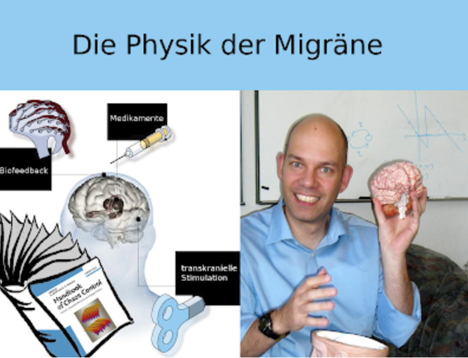

Passend zur am 12. Januar 2010 auf 3sat gezeigten Sendung *nano* mit einem Migräne-Schwerpunkt hier ein Blogpost über die Frage, was Physiker mit Migräne zu tun haben.

Das Tätigkeitsfeld der Physiker hat sich sehr erweitert; viele arbeiten heute interdisziplinär außerhalb der typischen Forschungsfelder der Physik. Ein solches neues Arbeitsfeld — kurz „Die Physik der Migräne" — entsteht an der Technischen Universität Berlin. Der eigentliche Titel meiner Forschergruppe, *Nichtlineare Dynamik in Physiologie und Medizin*, deutet schon an, dass es nicht nur um Migräne geht.

Doch forschen wir zurzeit hauptsächlich an den Ursachen einer Migräne-Attacke. Dazu nutzen wir Konzepte der *Synergetik* — der Lehre vom Zusammenwirken und der Selbstorganisation komplexer Systeme. Im Rahmen des vom BMBF geförderten Bernstein Center wird diese Neurophysik zusätzlich mit einer Nachwuchsgruppe und einem Projekt über Schlaganfall, Migräne und Epilepsie gefördert.

## Das Gehirn von außen steuern

In den neuen Projekten der TU Berlin stehen Fragen im Vordergrund, wie sich krankhafte Prozesse im Gehirn gezielt von außen steuern lassen. Neue Kontrollmethoden sollen dazu untersucht und weiterentwickelt werden. Die *Chaos-Kontrolle* ist ein Beispiel aus dem Gebiet der Synergetik: Sie wird seit vielen Jahren in der Arbeitsgruppe von Prof. Dr. Eckehard Schöll erforscht. Nun sollen klinische Anwendungen in Angriff genommen werden.

So entsteht an der TU Berlin ein Ort, der von der theoretischen Physik eine Brücke zur neurologischen Forschung schlagen soll. Gemeinsam mit Klinikern der Charité Berlin möchten wir ein international sichtbares Zeichen interdisziplinärer Zusammenarbeit setzen.

### Nachtrag

Den Titel meiner Forschergruppe — *Nichtlineare Dynamik in Physiologie und Medizin* — habe ich nachgetragen. Die Gruppe existiert als unabhängige Forschergruppe erst seit Mitte 2010.
