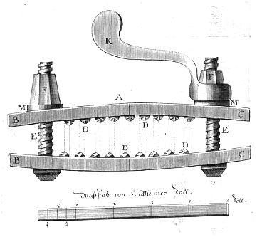
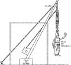
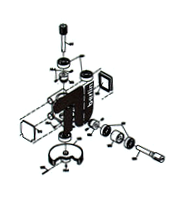

(Erkenntnis ist manchmal die Wahrheit des Daumenschraubenanlegenden. Wissen ist unabhängig vom erkennenden Subjekt. Letzteres meine ich mit Physik des Schmerzes.)

Der Grundgedanke ist simple: wenn Schmerzattacken in zyklischen Intervallen mehrmals pro Tag auftreten, wenn es pocht, pulsiert und hämmert und dies verursacht von Milliarden Gehirnzellen, die im Millisekundentakt feuern – und damit Zeitskalen von über acht Größenordnungen überspannt werden –, dann könnten diese physiologischen Rhythmen als emergente Phänomene verstanden werden. Das heißt, sie sind einer mathematisch-physikalischen Beschreibung zugänglich. Wenn akuter Schmerz chronisch wird, ist dies vielleicht ein Phasenübergang nicht unähnlich der Magnetisierung eines  Ferromagneten. Schmerz als Ordnungsparameter.

Daher die Frage, wie viel Physik steckt im Schmerz?

Es gibt Vorbilder. Wer bei „Physik des Schmerzes“ denkt, dies sei doch arg, ähm, an den Haaren herbeigezogen, vergisst die Geschichte der Naturwissenschaft.

Historisch können wir Bereiche der Physik nach der Sinneswahrnehmung einteilen: die Akustik, die Optik und – schon deutlich später – die Wärmelehre. Es galt *sinn*vollendete  Anwendungen zu entwickeln vom Amphitheater zu optischen Linsen. Oder sinnvolle Anwendungen im übertragenen Sinn, die Dampfmaschine als Ursprung der industriellen Revolution.

Physik der Sinne. Warum entstand demzufolge keine Physik des Schmerzes, etwa eine Algostik (griechisch άλγος, *algos* „Schmerz“)?

## Drehzahlregler und andere Dei Ex Machina

Schmerzen physikalisch vollenden? Das soll ein Anwendungsgebiet der Physik sein? Sicher. In den Folterkammern vielleicht. Jedoch sind Daumenschraube und die Streckbank schlicht Mechanik.

Die Mechanik, das andere große klassische Gebiet der Physik, hatte historisch nicht zum Ziel die Sensorik zu erweitern sondern die Motorik zu „überlisten“. Wir können z.B. nicht fliegen. Hebelwerkzeuge oder Vorrichtungen aller Art, kurz: Maschinen, galten zunächst als künstliche Eingriffe in die Natur. Die Dampfmaschine verbindet in dieser Betrachtung Sensorik1 und Motorik. Vielleicht interessanter noch, es führt von ihrem Drehzahlregler ein direkter Weg zur Physiologie. Ein Weg, der heute in der Medizintechnik weiter beschritten wird.2

Diese Fehlinterpretation einer angeblichen Überlistung bringt es auf den Punkt. Um Schmerzen zu vermindern oder gar vermeiden, muss man zwar nicht verstehen, was die Natur des Schmerzes ist. Wenn wir indes verstünden, was Schmerz auf der neuronalen Ebene ist, dann wird es neue Zugänge zur Schmerztherapie geben. Aus medizinischer Heilperspektive ist Schmerzmanagement sicher eine Überlistung, wissenschaftlich ist diese Wortwahl nichtsdestoweniger ebenso falsch wie die veraltete aristotelische Position, dass Mechanik eine Überlistung der Natur sei.3

Wie aber könnte ein neuronaler Drehzahlregler aussehen? Er wird vielleicht einmal am Anfang einer transhumanistischen Revolution stehen, die ich für nicht ausgeschlossen halte, ja sogar für viel wahrscheinlicher als manch andere ernstzunehmende Zukunftsvision.4

In der aktuellen Fachliteratur wird Schmerz auf neuronaler Ebene seit einigen Jahren nun schon mit dem Begriff Schmerzmartix (pain matrix) umschrieben, was meine Sicht auf Schmerzen unterstreicht: schon heute ist Schmerzforschung auch Netzwerktheorie und als solche mit hoher Sicherheit zugänglich für Methoden, die wir aus der Physik heraus in den letzten Jahrzehnten entwickelt haben.

Die anfangs angesprochenen Rhythmen auf Zeitskalen über acht Größenordnungen und die enorm hohe Zahl funktionell und strukturell gleicher Gehirnzellen, lassen mich bei Schmerz an eine Art Ordnungsparameter denken, eine makroskopische Manifestation neuronaler Netzwerkzustände. Die Magnetisierung eines  Ferromagneten mag als Anschauung dienen, ob es nun gleich Para-, Ferro- und Paläoschmerzen gibt, sei mal dahingestellt. (Für die Experten, statt des Ising-Modells sind Phasenübergänge im Kuramoto-Modell eher zutreffen.)

Da ich sonst meist über Migräne schreibe, will ich diesmal explizit auch Cluster Kopfschmerzen und andere insbesondere sogenannte trigemino-autonome Kopfschmerzerkrankungen (TACs, engl. Trigeminal Autonomic Cephalalgia) anführen, die eine charakteristische Rhythmik aufweisen. Bei Kopfschmerzen spielen physiologische Rhythmen von anderen Organsystemen wahrscheinlich keine so große Rolle. Ob hingegen eine Physik der Schmerzen auch auf Bauchschmerzen zutrifft oder dort die Schmerzen dort Epiphänomen sind, kann ich nicht beurteilen.

Für das kommende Sommersemester bereite ich gerade eine Vorlesung „Physik der Migräne“ an der TU Berlin vor, in der ich einige der heute schon bekannten Aspekte dieses Forschungsfeldes vorstelle. Clusterkopfschmerz und TACs werden in der Vorlesung nur ganz am Rande erwähnte, daher die Beschränkung im Titel.

Themen reichen von [Kipp-Punkten im Gehirnklima](https://scilogs.spektrum.de/blogs/blog/graue-substanz/2011-09-12/kipp-punkte-im-gehirnklima) über [visuelle Trigger und Halluzinationen bei Migräne](https://scilogs.spektrum.de/blogs/blog/graue-substanz/2011-10-01/visuelle-trigger-halluzinationen-und-therapie) bis zur [Gehirnprothese](https://scilogs.spektrum.de/blogs/blog/graue-substanz/2012-01-01/besser-mit-gehirnprothese). Viele dieser Themen habe ich schon im Blog aufgegriffen. Sie standen meist in Verbindung mit Spreading Depression, einer Erregungswelle im der Hirnrinde, aber eine andere verbreitetere Theorie der Migräne, nämlich die eines Migränegenerators im Hirnstamm, ein zentraler Mustergenerator (central pattern generator), werden ebenso in der Vorlesung aufgegriffen und folgen dann hier im Blog.

**Fußnoten**

1 Der Tastsinn hatte zwar einen Einfluss auf das, was wir ursprünglich dachten, was Wärme und Temperatur sei. Aber dies führte zu einen Umweg in der Physik: Temperatur, die wir fühlen können, bekam eine andere Einheit als die Wärmemenge, die wir nicht fühlen können, und so wurde [alles komplizierter als nötig](https://backend1.spektrum.de/blogs/alles%20wurde%20komplizierter%20als%20n%C3%B6tig). Das war irrsinnig. Abgesehen davon ist Wärme auch nur ein Teil des Tastsinns. Das führt zum Schmerz. Aber der genaue Blick auf Rezeptoren und Co. kann hier nicht erfolgen. Ist aber vorbereitet für einen Blogbeitrag.

2 Moderne Reglungstechnik begann mit James Watts Erfindung des Fliehkraftreglers (1788) und James Clerk Maxwells mathematischer Beschreibung achtzig Jahre später (1868). Letztere gilt als Ursprung der Kybernetik. Arbeiten von Norbert Wiener, dem Begründer der Kybernetik, und auch Arturo Rosenblueth führten dann zu den ersten künstlichen neuronalen Netzwerken von Warren McCulloch und Walter Pitts. Die Entwicklung des Fliehkraftregler als differentieller (chronometrischer) Drehzahlregler führten die Brüder Werner und Wilhelm Siemens schon 1843 weiter. Siemens Healthcare ist heute weltweit einer der größten Anbieter im Bereich Medizintechnik. In den 1840er Jahren wurde in Berlin mit Emil du Bois Reymond,  Hermann von Helmholtz, Ernst Wilhelm von Brücke und Carl Ludwig (dieser in Marburg, später Leipzig) die organische Physik begründet, die moderne Physiologie, wie wir sie heute kennen. Die Disziplinen erinnern mich ein wenig an Kontinentalplatten, sie driften auseinander, stoßen dann aber zwangsläufig auch wieder zusammen. An den Plattenrändern wo Physik wieder auf die Physiologie trifft entsteht Neues aus Altem. Die Mathematical Neuroscience ist nur ein aktuelles Beispiel.

3 Eine Überlistung als dauerhafte, ursachenunspezifische Analgesie ist, wenn man an die angebore Schmerzunempfindlichkeit (CIPA-Syndrom) denkt, unsinnig. Dies wäre kein Ziel.

4 Der Transhumanismus, wenn er denn käme, wäre wohl mindestens ähnlich schwer zu kontrollieren, wie die industrielle Revolution. Es braucht dann mehr als nur ein paar [Robotergesetze](https://scilogs.spektrum.de/wblogs/blog/robotergesetze), was ich zum Anlass nehme, um auf gleichnamigen neuen Blog in den SciLogs hinzuweisen. Willkommen!

© 2012, Markus A. Dahlem

**Bildquellen**

Schmerz: [THE CLUSTER HEADACHE](http://en.wikipedia.org/wiki/File:Clusterhead.jpg) Cr*eative Commons Attribution Share Alike 3.0*

Daumenschraube, aus Constitutio Criminalis Theresiana 1768, gemeinfrei

Zeichnungen des Ekkyklema, gemeinfrei
