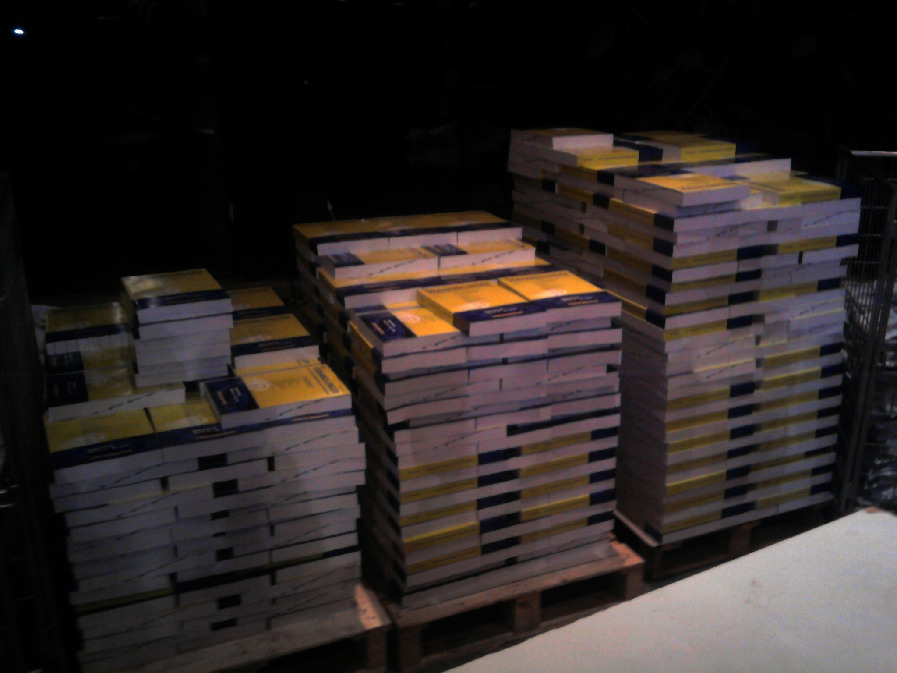
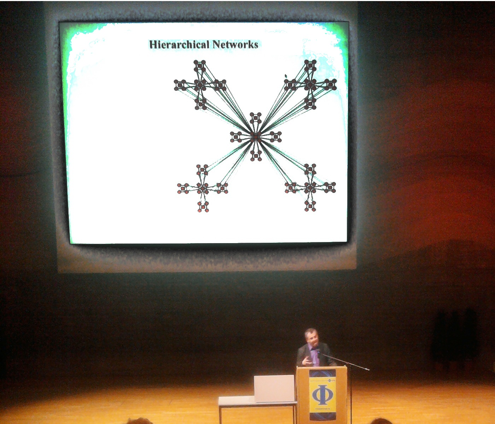
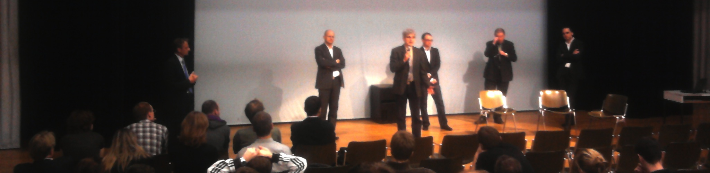
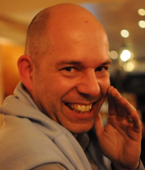

Die Deutsche Physikalische Gesellschaft (DPG) lädt einmal im Jahr zu ihren Frühjahrstagungen ein. Als älteste physikalische Fachgesellschaft ist die DPG auch weltweit die größte physikalische Fachgesellschaft. Die DPG teilt daher meist ihre Frühjahrstagungen ihren zwei Sektionen entsprechend auf. Denn sonst wird es eng. In Regensburg zumindest waren Hotels weit und breit voll belegt. Hier trafen sich diesmal gemeinsam mit der großen Sektion Kondensierte Materie, die einzelnen, kleineren  Fachverbände Kristallographe, Strahlen und Medizinphysik, Physik sozio-ökonomischer Systeme und der Arbeitskreises Industrie und Wirtschaft.

#### Die *Verhandlungen*

 Alles beginnt mit den Verhandlungen. Die "Verhandlungen der Deutschen Physikalischen Gesellschaft", wie es genau heißt, also das Telefonbuch-artige Programm mit über 850 Seiten, das ich und  5000 weitere Physiker zu Beginn der Tagung überreicht bekamen in einer weißen Stofftasche mit dem blauen Aufdruck des griechischen Buchstaben Φ. Diese Stofftasche und nicht etwa Pullunder oder Stoffhose ist für den Eingeweihten das Erkennungszeiches des Physikers, zumindest sechs Tage lang.

Das Buch begleitete mich in Regensburg vom 21. bis 26. März und führte mich durch die 2890 Vorträgen  und 1646 Poster. Auch wenn ich schwer trug, es ging immerhin darum, die vielleicht 10% der für mich interessanten Präsentationen auszumachen. Ohne die Verhandlungen geht das nicht.

#### Netzwerke und netzwerken

Ein Schwerpunkt in Regensburg war das Thema Netzwerke. Darum geht es natürlich immer, nämlich alte Kollegen und Freunde wieder zu treffen und neue kennen zu lernen, ein Netzwerk zu bilden also. Aber diesmal ging es eben auch um Netzwerke als wissenschaftliches Forschungsthema.

Ein Vortrag über Netzwerke hielt Albert-László Barabási, Professor für Physik an der University of Notre Dame (USA). Barabási ist bekannt für seine Arbeit wie Netzwerke wachsen und so skalenfrei werden, d.h. sie weisen keine typische Anzahl von Verbindungen pro Netzwerkknoten auf. Solche Netzwerke und deren Entstehung spielen insbesondere für den Fachverband Physik sozio-ökonomischer Systeme als Forschungsobjekt eine zentrale Rolle. Aber auch andere Fachbereiche forschen über Netzwerke. So stellten aus meiner Arbeitsgruppe zwei Kollegen in Kurzvorträgen ihre Forschung zur nichtlinearen Dynamik auf Netzwerken aus den Bereichen Laser- und Neurophysik vor.

#### Evolution und Revolution in der Medizintechnik

Als ein weiteres Highlight veranstaltete der Arbeitskreis Industrie und Wirtschaft zusammen mit  Siemens einen Industrietag mit dem für mich zentralen Thema: "*Evolution und Revolution in der Medizintechnik — Physik macht’s möglich*".

Leider kam ich nur zum Ende der Veranstaltung und konnte gerade noch der Podiumsdiskussions folgen, die der Moderator, Dr. Eckhard Hempel, Leiter der Innovations- und Patentmanagement Siemns AG, Healthcare Sektor, beendete mit der Aufforderung bei Physik und Medizintechnik nicht nur an Diagnostik zu denken sondern auch an Therapie.

Medizintechnik und Therapie — Physik macht’s möglich, so in etwa hätte auch mein Slogan lauten können. Denn um neuartige Therapieansätze ging es auch in meinen eingeladenen Hauptvortrag des Fachverbandes Dynamik und Statistische Physik. Unter meinem Titel "*Nonlinear dynamics and control of migraine waves*" stellte ich u.a. neue Ergebnisse vor, die aufzeigen, welche Formen einer gekrümmten Hirnrinde besonderes anfällig für Störungen sind, und somit Zielstrukturen bei der Migränetherapie sein könnten.

#### Physik macht Spaß, weiter sagen!

Mir macht meine Forschung meist Spaß. Nicht nur wenn wir gemeinsam abends in Regensburg in einer Kneipe den Tag ausklingen lassen (siehe Foto). Wer aber eigentlich Spaß an  Forschung haben sollte, fragte und beantwortete ein SciLog-Blogger in dem Festvortrag der Tagung.  "*Berühmt oder reich — was denn nun? Über Erfinder, Wissenschaftler, Innovatoren und Unternehmer*" so titelte [Gunter Dueck](http://de.wikipedia.org/wiki/Gunter_Dueck), der bei den WissensLogs im [Wild Dueck Blog](http://www.wissenslogs.de/wblogs/blog/wild-dueck-blog) schreibt.

Eigentlich ist die Antwort naheliegend. Die anderen müssen Spaß haben, sonst verkauft es sich später nicht. Mag sein, aber ohne Spaß — oder besser Zufriedenheit — hätte ich der Wissenschaft vor Jahren den Rücken gekehrt. Denn weder berühmt noch reich scheinen mir in sich erstrebenswerte Ziele zu sein. Wobei ich beides sicher sehr gut nützen könnte und beidem keineswegs ablehnend gegenüber stehe.  So oder so, ich stellte auch in Regensburg wieder fest, dass viele der jungen und hochtalentierten Doktoranden sich eine Karriere in der Wissenschaft gar nicht vorstellen können. Ihnen erscheint eine Hochschulkarriere in Deutschland in der Physik nahezu unmöglich.
