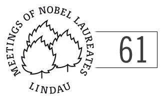

Ich bin nicht in Lindau, treffe dafür aber nächste Woche zwei Nobelpreisträger auf der Tagung [Engineering of Chemical Complexity](http://www.bcsccs.de/conference/Conference.html), auf der ich eingeladen wurde meine Arbeiten zur Migräne vorzustellen. Chemical Complexity? Klingt nicht nach Medizin. Die Nobelpreisträger [Manfred Eigen](http://nobelprize.org/nobel_prizes/chemistry/laureates/1967/eigen-bio.html) und [Gerhard Ertl](http://nobelprize.org/nobel_prizes/chemistry/laureates/2007/ertl.html) haben dementsprechend auch den Nobelpreis für Chemie bekommen, mit 40 Jahren Abstand zueinander! 1967 und 2007.

Wie das Thema [Engineering of Chemical Complexity](http://www.bcsccs.de/conference/Conference.html) nun mit meiner Arbeit zusammenhängt, will ich jetzt gar nicht ausführen. Es zeigt aber, die [Disziplinen wachsen weiter zusammen](http://www.brainlogs.de/blogs/blog/graue-substanz/2011-04-07/interdisziplinaere-forschung).

Im weiteren soll es um den Nobelpreis für Physiologie oder Medizin gehen, der oft gerne als "Medizin-Nobelpreis" knapp zusammengefasst wird. Ist die Physiologie wirklich nur ein Anhängsel, die zwar historisch bedingt zum offiziellen Namen gehört, heute aber keine eigenständige Disziplin mehr ist? Auf diese Idee könnte man kommen. Selbst der englische Wikipedia-Artikel zur Physiologie ist verkümmert.  

   
 *[Physiology](http://en.wikipedia.org/wiki/Physiology), Der englische Wikipedia-Artikel hat so seine Probleme (Version von August 2010)*

Im Rahmen der diesjährigen [61. Lindauer Tagung der Nobelpreisträger](http://lindau.nature.com) können Fragen zu dem Thema der Physiologie und Medizin gestellt werden, die dann an die Nobelpreisträger weitergereicht werden. Hier in meine.

---

There is no Nobel Prize in Medicine. It is the Nobel Prize in Physiology or Medicine. My question is about the "*or*" in the above name of the prize.

Form the viewpoint of both how research is done and the way these disciplines are taught, is this "or" as in

* (1) New York State **or** U.S.

For instance, "*For New York State or U.S. stroke statistics, visit …*", i.e. physiology is part of medicine. Or is it more as in

* (2) Europe **or** U.S.,

that is, Physiology and Medicine are two separate and rather distinct disciplines. Or is it as in

* (3) U.S. **or** Canada,

that is, still two separate and distinct disciplines but covering the main area of the continent North America (Mexico could be Biochemistry and the other seven countries are also easily found). And how do you see this "or" in the future with respect to research and teaching?

---

Es geht also um das Verhältniss sich Physiologie und Medizin. Verhält sich "Physiologie oder Medizin" wie

* (1) Staat New York **oder** USA?

* (2) Europe **oder** USA.,

* (3) USA **oder** Canada?

Auch meine Leser können in den Kommentaren Ihre Meinung äußern oder auch nur kurz abstimmen. Später werde ich dann nochmal ausführlich dazu selber Stellung nehmen.

[Sie können auch Ihre eigene Frage stellen oder eine schon gestellte Frage – zum Beispiel meine – durch Stimmabgabe auswählen](http://lindau.nature.com/lindau/nobel-questions-lindau-answers/)[.](http://lindau.nature.com/lindau/nobel-questions-lindau-answers/)

|  |  |
| --- | --- |
| **"Physiology or Medicine" is like** | |
|  | New York State or U.S. |
|  | Europe or U.S. |
|  | U.S. or Canada |
|  | |
| pollcode.com free polls | |
