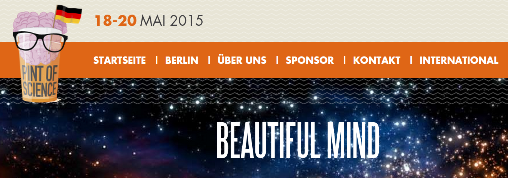

Hinweis auf einen [öffentlichen Abendvortrag – es gibt nur eine begrenzte Zahl von Tickets (kostenfrei)](http://pintofscience.de/event/beautiful-mind/):

Das Nachdenken über das Hebelgesetz mag – im übertragenen Sinn – Kopfschmerzen verursachen; Physik kann aber auch Kopfschmerzen therapieren. Ein modernes Gebiet der angewandten Physik ist die Neuromodulation: eine Therapieform, die krankhafte Aktivität des Nervensystems gezielt mit elektrischen und magnetischen Feldern korrigiert. Da praktisch alle Organe und Körperfunktionen durch neuronale Schaltkreise reguliert werden, sind Anwendungsgebiete entsprechend weitreichend. Kopfschmerzen sind vielleicht die älteste Anwendung, da schon der vor 2000 Jahren römische Arzt Scribonius Largus diese mit dem elektrischen Zitteraal therapierte.

Drüber spreche ich am 19. Mai im Kaschk ([Linienstrasse 40, 10178 Berlin](https://www.google.de/maps/place/Kaschk/@52.528326,13.409988,15z/data=!4m2!3m1!1s0x0:0x29195df9db2b738d)).
