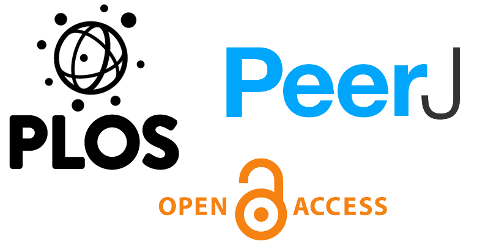
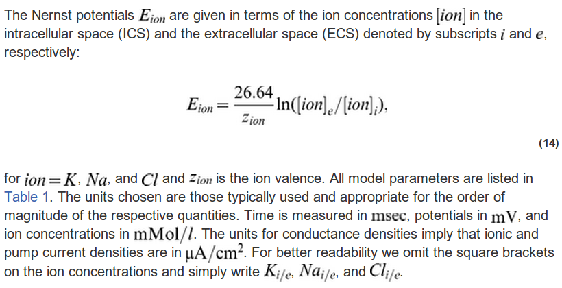
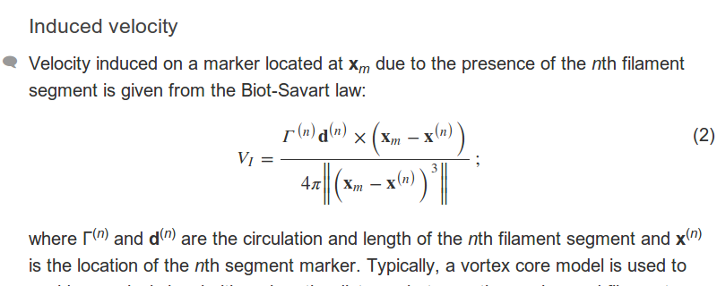

Gestern wurde ein [neues Paper](http://www.ploscompbiol.org/article/info%3Adoi%2F10.1371%2Fjournal.pcbi.1003551) veröffentlicht. Es ist das inzwischen begutachtete und daraufhin überarbeitete Manuskript, das ich am 19. Oktober 2013 hier im Blog vorstellte: „[Wenn Gehirnzellen kein Brot haben, sollen sie doch Kuchen essen“](https://scilogs.spektrum.de/graue-substanz/wenn-gehirnzellen-kein-brot-haben-sollen-sie-doch-kuchen-essen/). Gut ein halbes Jahr später ist es nun in der Zeitschrift PLOS Computational Biology erschienen.

Schneller war die Zeitschrift PeerJ. Aufmerksam wurde ich auf PeerJ vor zwei Jahren durch Beatrice Luggers Blogbeitrag „[Open Access Journal PeerJ vor dem Launch“](https://scilogs.spektrum.de/quantensprung/open-access-journal-peerj-vor-dem-launch/). In PeerJ wird voraussichtlich am 8. Mai ein Paper erscheinen, dass wir am 26. März zunächst auf [arXiv legten](http://arxiv.org/abs/1403.6801), tags darauf bei PeerJ einreichten, wo es dann am 23. April\* akzeptiert wurde. (Beide Paper bauen übrigens aufeinander auf, was aber wenig zur Sache tut.) Das Manuskript bei PLOS haben wir übrigens 11 Tage vor dem Blogbeitrag eingereicht, ein Blogbeitrag zu dem Paper in PeerJ steht noch aus.

Kurz gerechnet: 206 Tage gegenüber 42 Tage – wirklich fair ist dieser Vergleich nicht, denn bei PLOS haben wir zwei umfängliche Überarbeitungen machen müssen. Doch war mein Eindruck das die ganze Handhabung bei PeerJ mehr auf Zügigkeit angelegt ist. Auch im Vergleich zu PLOS ONE, eine Zeitschrift, die mehr noch mit PeerJ vergleichbar ist. Dort dauerte es bei mir einmal genau 200 Tage. Das ist gerade so im Limit.

Und jetzt der Preis.

> If we can set a goal to sequence the Human Genome for \$99,  
> then why shouldn’t we demand the same goal for the publication of research?  
> [*Slogan von PeerJ*]

Eine Anspielung auf 23andme, ein Unternehmen, das für anfangs US\$999 und mittlerweile US\$99 eine Untersuchung genetischer Informationen Privatpersonen anbietet. Klar, das hat genau nichts mit der Veröffentlichung eines Papers zu tun. Klar ist aber auch: ein Paper online zustellen ist weiß der Blogger nicht aufwendig. Die Aufgabe des Editors und Begutachtung übernehmen die Wissenschaftler selber. Lektoren? Das war einmal.

So kann man bei PeerJ für *einmalig* US\$99 jedes Jahr ein Paper open access stellen, für US\$199 zweimal, für 299US\$ so viele man will – oder besser kann. Pro Autor, aber das ist fast schon egal. Uns kostete das Paper also 3\*US\$99†. PLOS Computatinal Biology wollte und bekam US\$2250.

Wofür eigentlich? Nehmen wir PLOS ONE. Denn PeerJ vertritt eine ähnliche Philosophie wie PLOS ONE, nämlich nicht auf erwarteten Impakt zu achten sondern allein auf wissenschaftlich solide Arbeit. Damit nahm im Jahr 2013 PLOS ONE 31500 Artikel zur Veröffentlichung an. Diese sind mit je US\$1350 zwar deutlich billiger als bei dem Schwesterblatt (mit Impaktauswahl) aber die Masse macht’s. Allein die Zeitschrift PLOS ONE generiert also einen zweistelligen Millionenbetrag als Umsatz in einem Jahr. PLOS wird nicht auf die vollen 42 Millionen 525 Tausend US Dollar kommen, da Entwicklungsländer und einige Universitäten Rabatte bekommen. Trotzdem: Jippie-Ya-Yeah. Äh, wofür eigentlich?

Geld und Geschwindigkeit sind nicht alles. Was mir an PeerJ wirklich sehr gut gefällt – eine der vielleicht zwei “Killer-Applikations” – ist, dass die Begutachtung komplett mitveröffentlicht wird. Auf Wunsch zumindest, aber wer würde sich das nicht wünschen? Das kann kein Wissenschaftler sein.

Die zweite großartike Neuerung ist das Kommentarsystems. Jedem Paragraphen hängt eine kleine Sprechblase an, in die man – *Klick* – Fragen und Kommentare schreiben kann. Ich habe dies noch gar nicht live erlebt (angeblich ist die Funktionalität von Stackoverflow abgeguckt, einer Frage- und Antwortplattform). Jedoch wusste ich davon bevor ich den Artikel schrieb. Der Punkt ist, allein die Tatsache, dass hier der Online-Leser nur einen Klick beim Lesen jedes Paragraphen von mir entfernt ist, hat die Art wie ich den Artikel geschrieben habe bereits verändert.

Ästhetik. Vergleichen will ich nur wie mathematische Formeln präsentiert werden. Zuerst PLOS:

PLOS Beispiel

nun PeerJ:

PeerJ Beispiel

Formeln werden bei PLOS als Bild gespeichert, sowohl freistehende als auch im Fließtext. Das sieht schlecht aus. PeerJ rendert Formeln. So sollte es sein, wenn man was auf sich hält.

Als ich dann [dies noch las](http://blog.peerj.com/post/84300442958/blog-about-science-kiss-your-grant-proposal-goodbye), war ich endgültig für PeerJ eingenommen.

Fazit: Probiert [PeerJ](https://peerj.com/) aus!

Fußnoten

\*Wäre ich nicht 7 Tage im Urlaub gewesen, wäre es wohl schon am 17. April akzeptiert gewesen.

†Eigentlich war es sogar umsonst, da es eine Werbeaktion bis Ende März gab.
