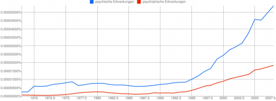
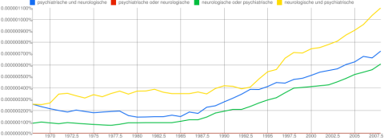

Eigentlich würde ich immer "psychische Erkrankung" sagen, wurde nun aber kurz stutzig, als ich im [Editorial von Carsten Könneker](http://www.wissenschaft-online.de/sixcms/media.php/976/SpektrumExtra.pdf) las\*:

> … neurologische oder psychiatrische Erkrankung…

Ein kurzer Blick in Googles Ngram zeigt, dass beides genutzt wird – und dass diese Erkrankungen seit ca. 1990 stark ansteigend anzutreffen sind.

   
 *"psychisch" (blau), "psychiatrisch" (rot)  von 1968 bis 2008.*

Nun könnte es sein, dass die Bezeichnung "psychiatrisch" vorwiegend genutzt wird, wenn es um eine Gegenüberstellung zu neurologischen Erkrankungen geht. Das Adjektiv "psychiatrisch" bzw. "neurologisch" wird genutzt, weil es nun mal um die Psychiatrie und Neurologie geht, so vermutete ich.

Eine Vergleich aller vier Kombinationen "psychiatrisch/neurologisch  und/oder neurologisch/psychiatrisch" mit dem alleinigen Vorkommen von  "psychiatrisch" zeigt aber, dass jene zusammen [nur einen verschwindenden Bruchteil des Vorkommens von "psychiatrisch" allein erklären](http://ngrams.googlelabs.com/graph?content=psychiatrische+und+neurologische%2Cpsychiatrische+oder+neurologische%2Cneurologische+oder+psychiatrische%2Cneurologische+und+psychiatrische%2C+psychiatrische&year_start=1968&year_end=2008&corpus=8&smoothing=10). Auffallend fand ich dann, dass  "psychiatrische oder neurologische" (rot, in der Graphik unten) gar nicht als Ngram gefunden wird. Aber dies nur nebenbei bemerkt.

Wirklich interessant ist allein die Frage, wann ist eine Erkrankung des Gehirns eigentlich ein Fall für die Neurologie und wann für die Psychiatrie ist?

Bei neurologischen Krankheiten ist immer eine mehr oder weniger bekannte Funktionsstörung gewisser anatomischer Strukturen des Gehirns Nervensystems [s. [Kommentar](https://scilogs.spektrum.de/blogs/blog/graue-substanz/2011-08-25/psychisch-oder-psychiatrisch#comment-14748)] gegeben. Beispiele wären die Parkinson-Krankheit oder Chorea Huntington, bei denen die jeweilige Funktionsstörung in den Basalganglien zu finden ist. Die gestörte neuronale Dynamik in den Basalganglien sowie im – immer noch begrenzten und anatomisch gut definierten – Netzwerk dieser mit dem Cortex und dem Thalamus erklärt die Symptomatik weitestgehend.

Bei psychischen Erkrankungen ist, soweit ich weiß, nie ein bestimmtes neuronales Netzwerk vorwiegend oder gar isoliert betroffen. Psychische Zustände (krankhafte oder auch gesunde, vielleicht sollte ich an dieser Stelle besser mentale Zustände sagen, zumal ich auch im englischen "mental illness" und "mental health" schreiben würde.\*) betreffen nicht isoliert Untereinheiten des Gehirns. Es mag durchaus neuronale Korrelate genannte Gehirnaktivität geben, die mit diesen Zuständen typischerweise einher geht, man kann aber nicht mit der gleichen Berechtigung wie bei neurologischen Erkrankungen sagen, dieses oder jenes (Sub)Netzwerk des Gehirns zeigt eine gestörte Funktion dieser oder jener Art und das hat diese und jene Folgen.

Wenn je ein Anatom direkt oder indirekt etwas zum Verständnis einer Hirnerkrankung beigetragen hat, wird der Neurologe zuständig sein, sonst der Psychiater, so sehe ich die Lage als Physiker. Meine Vermutung ist weiterhin, sollte eine psychische Erkrankung eines Tages auf der Ebene verschalteter Netzwerke im Gehirn verstanden werden, läuft sie Gefahr von den Neurologen ergriffen zu werden. Ob also langfristig eine Trennung zwischen psychisch und neurologisch Bestand haben wird, ist die Frage, ob es Erkrankungen des Gehirns gibt, die sich grundsätzlich nicht anatomisch funktionell lokalisieren lassen.

**Fußnote**

\* Ich schreibe gerade einen Beitrag, in dem ich ebenso neurologische und psychische Erkrankungen erwähne. So war ich sensibilisiert für Carstens Formulierung. Außerdem suchte ich für diesen kommenden Beitrag nach einer Übersetzung für "National Institute of Mental Health" (kurz NIMH), die ich im Wikipedia mit "[US-amerikanisches Forschungszentrum für psychische Störungen](http://de.wikipedia.org/wiki/National_Institute_of_Mental_Health)" fand.

Das erwähnte Editorial gehört zum Spektrum Extra "Die Zukunft des Gehirns" als Teil der [aktuellen Ausgabe von Sprektrum der Wissenschaft, alles kostenfrei zum Download (pdf-Datei)](http://www.spektrum.de/artikel/1115631). Aus der Ankündigung:

> Lesen Sie, wie nah Forscher dem Traum vom Gedankenlesen bereits gekommen sind, ob Neuroimplantate direkten Zugang zum Gehirn bieten, wie Neuronale Schrittmacher funktionieren und vieles mehr.

Bezüglich meines Themas hier ist vor allem das Interview mit dem Psychologen und Mediziner Frank Schneider empfehlenswert. Er erklärt was bildgebende Verfahren über eine plumpe Fleckologie hinaus für die Psychiatrie leisten.
