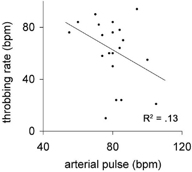

Ist der Ausdruck „Physik des Schmerzes“, der im März-Beitrag „[Was ist Schmerz](https://scilogs.spektrum.de/blogs/blog/graue-substanz/2011-03-23/was-ist-schmerz)“ nur implizit vorkam und dann im zweiten Beitrag vorletzte Woche gleich im Titel erschien, vielleicht unglücklich gewählt?

Zunächst ist Schmerz ein eigener Sinn und da ich diese Eigenständigkeit zwar physiologisch erforschen will aber zunächst anatomisch meine, was liegt da näher, als den Neuroanatomen Helmut Wicht zu zitieren ([Kommentar](https://scilogs.spektrum.de/blogs/blog/graue-substanz/2011-03-23/was-ist-schmerz#comment-11519) zu meinem Beitrag damals):

> Der körperliche Schmerz ist aus Sicht der Anatomen insofern ein eigener „Sinn“, als er spezielle Rezeptoren (freie Nervenendigungen/Capsaicin etc.)und eigene Bahnsysteme/Verarbeitungsstationen im ZNS hat, ganz wie die anderen Sinne. Schmerz resultiert also NICHT, wie man auch mal meinte, einfach aus der massiven Übererregung eines sensorischen Systems, sondern ist mit der Aktivierung eines bestimmten, abgrenzbaren Sinnessystemes verbunden.
>
> Er ist also den anderen Sinnen insofern gleich, als er ein eigenständiges Sinnessystem darstellt, er ist von den anderen Sinnen unterschieden, indem sein spezifischer Reiz die Gewebe(zer)störung ist.

Im letzten Beitrag „[Physik des Schmerzes jenseits der Daumenschraube](https://scilogs.spektrum.de/blogs/blog/graue-substanz/2012-01-16/physik-des-schmerzes-jenseits-der-daumenschraube)“ verglich ich knapp diesen eigenen Sinn mit drei anderen unter Bezug auf die Physik: also Physik des Sehens (Optik), Hörens (Akustik) und Wärmefühlens (Thermodynamik). Dann umschrieb ich ebenso knapp, wie eine Physik des Schmerzes aussehen könnte. Was wären Fragestellungen? Ich zog als Beispiel Analogien zu Phasenübergängen bei der Magnetisierung heran. Alles noch sehr wage, zugegeben.

Es kam in den Kommentaren dann verständlicherweise der subjektive Erlebnisgehalt des Schmerzes zur Sprache. Das, was wir Qualia nennen. Und auch Helmut Wicht im oben zitierte Kommentar kam schon im direkten Anschluss darauf zu sprechen.

> Das Problem der „Qualia“ („wie es sich anfühlt, Qualen zu erleiden“) wird – da bin ich mir, denk‘ ich, mit Stephan [*Stephan Schleim, Anmerkung M.A.D.*] einig – dadurch freilich ebensowenig gelöst, wie die Empfindung der Röte der Rose durch die Entdeckung von Zapfen in der Retina erklärt wird, die auf langwelliges Licht reagieren.

(Das Problem der Qualia gilt analog auch bei der Frage, wie es aussieht, Rot zu sehen.)

Ich stimme da völlig zu. Mir geht es nicht um Qualia, also den subjektiven Erlebnisgehalt des Schmerzes. In diese Richtung habe ich nie argumentiert. Ich freue mich über diese Kommentare, will meine Zielstellung nur nochmal mit diesem Beitrag deutlich abgrenzen.

Ist es nur ein Problem der Wortwahl, wie Helmut Wicht gestern andeutete?

> Das ist aber keine Kritik an Deinem experimentellen Ansatz – es ist eine an der Wortwahl.

Gucken wir auf die Frage, ob ein Schmerz pochend oder pulsierend ist. Da kommt eine Komponente der Qualia ins Spiel, denn wir werden nie wissen, wie es sich für den denjenigen genau anfühlt.

Es gibt aber auch eine objektivierbare Komponente. Ähnlich wie sich Lautstärke und Frequenz beim Tinnitus durch Vergleich des Patienten mit einem von außen erzeugten Ton bestimmen lassen, kann man Schmerzen vergleichen. Man fand so heraus, dass die Frequenz des Migräneschmerzes nicht korreliert mit dem Pulsschlag [1], ist also nicht im wörtlichen Sinne pulsierend. Das ist absolut faszinierend! Als ich das erfuhr, war es wie eine Offenbarung für mich. Denn nun stellt sich die Frage, woher kommt diese Frequenz. Das ist keine Frage nach der Qualia!

Es ist eine Frage der Schmerzentstehung oder -erzeugung. Aber deswegen mich auf „Physik der Schmerzerzeugung“ zu beschränken, wie Helmut Wicht es vorschlägt, hielte ich für falsch. Zumal dies eben wirklich die Konnotation Folterkammer in sich trägt.

Wie entsteht Schmerz? Noch wissen wir es eben nicht. Aber wenn Schmerz unabhängig vom Puls „pulsiert“ und dies wahrscheinlich von Milliarden Gehirnzellen verursacht, die allerdings selbst im Millisekundentakt feuern, dann ist jeder theoretische Physiker sofort hellwach und denkt an Statistische Physik. Das hier nicht schon ein Gewebe (zer)störender Reiz pulsiert gilt insbesondere bei zentralen Schmerzen, z.B. Schmerzen, die im Hirnstamm von einem bisher noch hypothetischen Migränegenerator1 erzeugt werden sollen. Dies nennen wir in der Physik einen zentralen Mustergenerator (central pattern generator). Dessen Funktionsweise zu verstehen, betrifft eine mathematisch-physikalische Fragestellung.

Ich denke also nicht, dass es allein um Querelen der richtigen Wortwahl geht: es wird (hoffentlich) bald eine Physik des Schmerzes geben, die uns aber nichts über die Qualia der Qualen preisgibt.

**PS**

Mein Dank an alle Kommentatoren gerade auch an Dich, Helmut. Ich freue mich, auch Aspekte zur Qualia hier zu diskutieren. Wie ich schon oben schrieb, ich will nur meine Position verdeutlichen.

**Fu****ß****note**

1Wohlgemerkt, ich selber habe jahrelang an einer alternativen Theorie gearbeitet, wie Spreading Depression als Gewebeschädigung Kopfschmerzen peripher auslöst, bin aber nicht minder von der Theorie des Migränegenerators begeistert.

**Literatur**

[1] [Ahn AH. On the temporal relationship between throbbing migraine pain and arterial pulse, *Headache*. 2010 **50**:1507-1510.](http://www.ncbi.nlm.nih.gov/pubmed/20976872)

© 2012, Markus A. Dahlem
