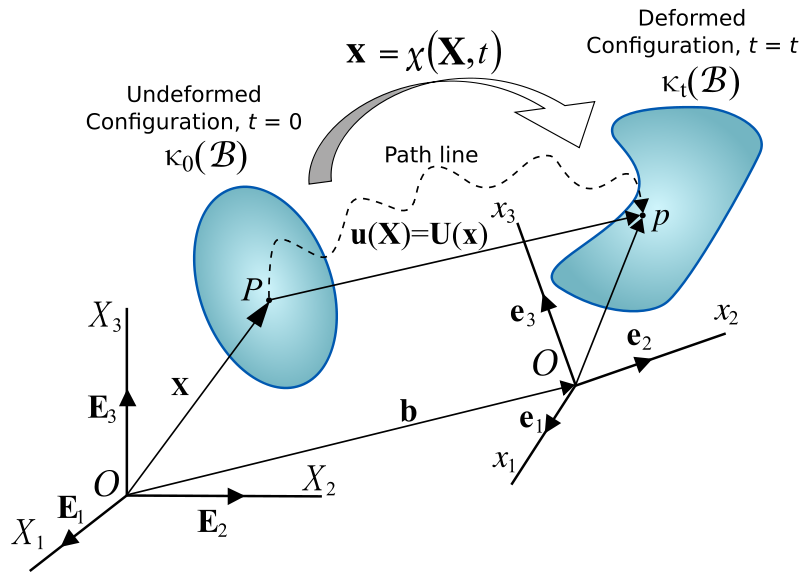
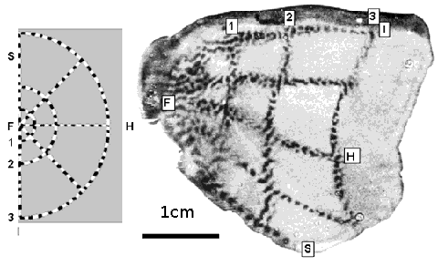
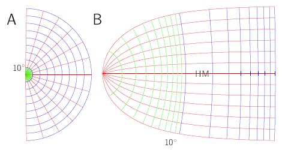
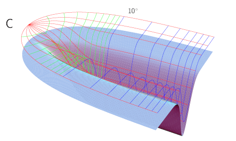

Nein, keine exotische Krankheit, die die Netzhaut befällt, im Gehirn existieren Karten des Gesichtsfeldes, Retinotopie genannt, von Retina, die Netzhaut. Die Retinotopie sollte man sich als solch eine Deformation vorstellen. Warum das?  Immerhin ist das ja nun nicht, was wirklich geschieht. Es wird lediglich eine Abbildung von Netzhaut zum Cortex durch neuronale Verschaltungen erzeugt, ohne das Gewebe deformiert wird.

Meine Antwort lautet, weil uns der mathematische Apparat, der mit der Kontinuumsmechanik elastischer Medien voll ausgearbeitet zur Verfügung steht, die intuitive Beschreibung der Retinotopie liefert, insbesondere die Lagrange’sche Betrachtungsweise.

Keine Sorge, ich werde das nicht weiter mathematisch ausführen. Wer die Kontinuumsmechanik kennt, versteht schnell worum es geht, und wer sie nicht kennt, wird auch durch einen Blogbeitrag nicht dahin gebracht.

Stattdessen will ich die Idee dahinter skizzieren. Ich will diesen mathematische Apparat jenen gegenüberstellen, der die übliche Beschreibung der Retiotopie liefert, die Elektrostatik – ja Elektrostatik, das klingt zunächst noch fremdartiger in diesem Zusammenhang. Mathematik ist halt universell anwendbar. Corticale Karten im Allgemeinen und Retinotopie im Besonderen wird meist von Physikern erforscht. Ideen und Begriffe finden so Einzug, die man im Laufe einer klassischen Ausbildung mitbekommen hat. (Und darum empfehle ich auch jeden ein Physikstudium, wenn das Interesse in den theoretischen Neurowissenschaften liegt.)

Schauen wir zunächst auf die klassische „flache“ Retinotopie, also auf die Abbildung von der Netzhaut zur Sehrinde.  Die klassische Studie, die nahezu in jedem Lehrbuch Eingang fand, stammt von Roger Tootell, der 1982 im Tierexperiment bei Primaten die Retinotopie vermessen hat mit einem blinkenden Polargitter als Reizvorlage (oben, links) aus drei konzentrischen Kreisen (gezeigt sind oben nur die Halbkreise) und fünf radiale Strahlen (Meridiane) [1].  Dazu nutzte er die 2-Deoxyglucose Methode: Radioaktiv markierte Glukose wurde injeziert und wird darauffolgend nur von den durch das blinkende Gitter gereizten Neuronen im visuellen Kortex aufgenommen. Ein Film wird später  —  Affe tot — durch die Radioaktivität des Liganden belichtet (oben, rechts). Heute haben wir nicht-invasive Methoden.

Diese Abbildung wird mathematisch durch den komplexen Logarithmus beschrieben (auch hier gilt, wer komplexe Funktionentheorie kennt, sieht und versteht sofort mehr, nötig ist es nicht, die Bilder sollen ausreichen).

Oben in (A) ist wieder ein Polarkoordinatengitter der halben Netzhaut gezeigt. Innen grün und weiter aussen blau sind nun die Halbkreise mit konstanten Polabstand (Exzentrizität) zum Zentrum des Gesichtsfelds gezeigt. Rot sind die Meridiane dieser rechten Netzhaut, d.h. Gesichtsfeldhälfte. Dieses Gitter ist in (B) so gezeigt, wie es retinotop in der linken Hemisphäre unseres Gehirns, in der primären Sehrinde, durch den komplexen Logarithmus mathematisch abgebildet wird. HM bezeichnet die corticale Repräsentation des horizontalen Meridians.

Dazu braucht man sicher keine Kontinuumsmechanik elastischer Medien. Eher schon die Laplace-Gleichung aus der Elektrostatik, auch Potentialgleichung genannt. Diese Retinotopie ist auch unter dem Namen „monopole mapping“ bekannt. Womit man schlicht meint, dass es so aussieht, wie wenn im Zentrum ein geladenes Teilchen säße (der Monopol). Die retinotope Repräsentation der Halbkreise und radialen Meridianen im Kortex entsprechen den Isopotenziallinien bzw. Feldlinien, wenn eine Gegenladung sich rechts im Unendlichen befindet. Es gibt übrigens auch eine Erweiterung, das „wedge-dipole mapping“.

Dies sind Lösungen der Laplace-Gleichung, als harmonische Funktionen bezeichnet. Sie besitzen nette Eigenschaften, zu vorderst, dass der Lupenfaktor (in der Sprache der Retinotopie, nicht der der Elektrostatik) von Netzhaut zum Cortex nicht von der Richtung abhängt. Man nimmt an, dass retinotope Karten sich selbstorganisiert formen und dieser Musterbildungsprozess harmonische Funktionen erzwingt.

Nun liegt die primäre Sehrinde in einer corticalen Falte, dem Sulucs calcarinus. Schon [im letzten Beitrag „](https://scilogs.spektrum.de/blogs/blog/graue-substanz/2012-03-12/warum-ist-die-grosshirnrinde-krumm)[Warum ist die Großhirnrinde krumm?“](https://scilogs.spektrum.de/blogs/blog/graue-substanz/2012-03-12/warum-ist-die-grosshirnrinde-krumm) bin ich ausführlich darauf eingegangen.

Ich beschränke mich daher nun auf die Frage, was bringt diese Krümmung für die Retinotopie mit sich, wie beschreibe ich die Retinotopie nun mathematisch? Das Bild oben ruft ja geradezu nach der Kontinuumsmechanik elastischer Medien.

Als ich mir überlegt habe, wie nun die Retinotopie in diese Falte kommt, habe ich die Elektrostatik Beiseite geschoben. Harmonische Funktionen haben ein reiche innere Struktur, eine viel zu reiche innere Struktur, von der wir letztlich gar nicht Wissen, ob diese so gegeben ist. Sogar für flache Retinotopie nimmt man manchmal andere Funktionen, es findet sich in dem sehr guten Lehrbuch „Theoretical Neuroscience“ von Dayan und Abbot eine nicht-harmonische Funktion. In einem Kommentar ([Comments concerning pg 57, eqns 2.13-2.171](https://backend1.spektrum.de/blogs/Comments%20concerning%20pg%2057,%20eqns%202.13-2.171)) wurde allerdings zurecht darauf hingewiesen, dass die inneren Struktur fälschlich totzdem angenommen wurde, nämlich, dass der Lupenfaktor von Netzhaut zum Cortex nicht von der Richtung abhängt in dieser nicht-harmonische Funktion. Das geht gar nicht. Oups.

Wie gesagt, das zu verstehen, bedürfte etwas Hintergrund, den ich hier nicht leisten kann. Verkürzt gesagt, in dem Lehrbuch nahm man sich gewisse Freiheiten, die durch die Hintertür wieder eingeschränkt wurde, und hat so schlicht einen mathematisch peinlichen Fehler gemacht. Warum? Weil man nicht den richtigen mathematischen Apparat nutzte. Tensoren.

Folgendes war das Problem: Ich will einerseits die anatomische Falte mathematisch in einem bestimmten Koordinatensystem, nämlich in dem der Netzhaut. Das ist die Definition der Retinotopie. Doch eigentlich suche ich eine mathematische Darstellung des Problems der Abbildung zweier Flächen. Dieses muss selbstverständlich von seiner Koordinatendarstellung unabhängig sein, diese ist letztlich beliebig. Das ist, was wir eine tensorielle Beschreibung nennen. Damit war klar: um beschreiben zu können, wo in der retinotopen Karte ein durch Krümmung erzeugter Überschuss an corticaler Fläche aus Sicht der Netzhaut liegt, helfen nur Verzerrungstensoren, wie der rechte und linke Cauchy-Green Tensor und, wie in ingenieurtechnischen Anwendungen viel und gerne genutzt, die Green-Lagrange und Euler-Almansi-Verzerrungstensoren. Fast so schöne Namen, wie die der Anatomie.

Bei dieser knappen Erklärung, warum Kontinuumsmechanik elastischer Medien hilfreich ist, nämlich der Koordinaten-freien Tensor-Beschreibung des Problems, will ich es belassen. Das Hauptergebnis, eine vorhergesagte Überkompensierung, als virtueller „*visueller streak*“ bezeichnet, eine Art corticale ‚Megapixel‘-Ausflösung des Horizonts, war schon Thema zuvor. Ich greife das Thema „Megapixel im Hirn“ auch sicher nochmal, dann  völlig unmathematisch, in einem eigenen Beitrag auf.

**Quelle**

Abbildung Tootel: Bildzitat aus [1].

Abbildung: Displacement of a continuum, [Wikipedia](http://en.wikipedia.org/wiki/Continuum_mechanics), Creative Commons Attribution-Share Alike 3.0 Unported

**Literatur**

[1] RB Tootell, MS Silverman, E Switkes and RL De Valois, Deoxyglucose analysis of retinotopic organization in primate striate cortex,(1982) Science **218**, 902-904, [DOI:10.1126/science.7134981](https://backend1.spektrum.de/blogs/http:dx.doi.org/DOI:10.1126/science.7134981)

**Eingereichte Arbeit erhältlich auf Anfrage:**

M.A. Dahlem and J. Tusch, Cortical magnification tensor predicts a virtual visual streak in humans.

© 2012, Markus A. Dahlem
