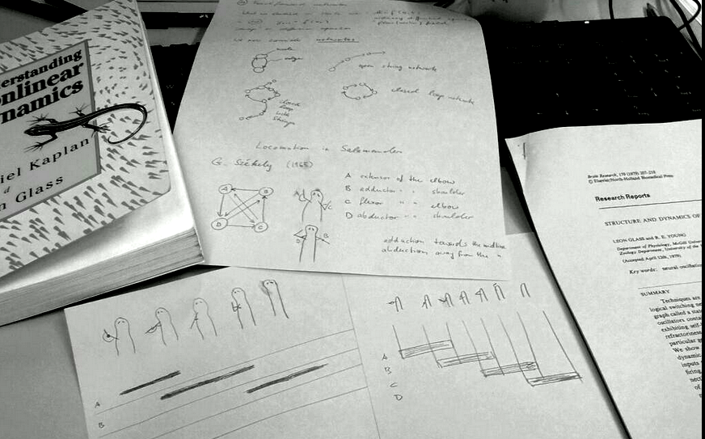

Salamander laufen wie Blutegel schwimmen. Beugung und Streckung (Flexion/Extension) sowie An- und Abspreizung (Adduktion/Abduktion) der Gliedmaßen des Salamaders, und was immer dem beim Blutegel entspricht, werden in einem zentralen Mustergenerator durch asynchron aktualisierte Zustände gesteuert. So die Vorstellung von Menschen, die sich sonst gerne mit boolescher Algebra beschäftigen. Ich dachte zunächst, das würde dann wohl ähnlich aussehen, wie die Bewegungen in [Jonathan Richmans „Egyptian Reggae](http://www.youtube.com/watch?v=gg7WG6tCbrw)„. Der kleine, gezeichnete Salamander in Bild unten tanzt es vor. Modelle in der Hirnforschung approximieren nur das Geschehen.

Ich bereite gerade eine Blockvorlesung an der [Berlin School of Mind and Brain](http://www.mind-and-brain.de/home/) vor. Dabei wird die Steuerung der Bewegungsmuster der Salamander ein Beispiele sein, wie mit einfachen, graphischen Analysemethoden weitgehend die Funktionsweise des Nervensystems nachvollzogen werden kann. Graphisch heißt mit Bleistift und Paper, also ohne dabei gleich auf numerische Methoden in aufwendigen Computersimulationen zurückgreifen zu müssen.

> [T]he techniques provide a complementary approach to full-scale simulation of neural networks and can be used on a routine basis by experimental neurophysiologists as an aid in experimental design.

Dies schreiben die Autoren in ihrem Paper über Salamander und Blutegel Lokomotion (L. Glass, Young, [Structure and dynamics of neural network oscillators](http://www.sciencedirect.com/science/article/pii/0006899379904396), *Brain Research*, **179** 207–218, 1979).

Zentrales Lernziel ist in meiner Blockvorlesung „*Computational Neuroscience & Statistics*“ nicht das Lösen von Gleichungen oder Programmierung von Modellen. Es wird vor allem darum gehen, wie man Probleme in den Lebenswissenschaften übersetzt in eine mathematische Beschreibung, die dann natürlich gelöst werden muss und in der Regel auch kann. Es wird auch nicht darum gehen, wie man Probleme in den Lebenswissenschaften mit Hilfe eines Computers simuliert sondern wie man sie übersetzt in Datenstrukturen und Algorithmen, die dann im Computer simuliert werden können.

Der Schritt bevor man Gleichungen löst oder Programme simuliert ist oft der schwierigste und zugleich der lehrreichste auf dem Weg, Mathematik in den Lebenswissenschaften wertzuschätzen. Dafür verwende ich also die Salamander-Methode. So wie der Salamander nicht zwei Schritte machen kann (in den Zuständen seines neuronalen Netzwerkes, also im Kopf nicht mit Gliedmaßen oder Muskeln – das ist nicht das selbe), so sollten Studierende auch separat sich zunächst einmal intensiv allein mit der Übersetzung ihrer wissenschaftlichen Fragestellung in eine formale Sprache beschäftigen. Oft genug findet man dabei schon Antworten.

Viel zu häufig erlebe ich es dagegen, dass Studierende wie Wissenschaftler etablierte Computermodelle als für ihre Fragestellung schon im wesentlichen vorgegeben ansehen. Sie lernen allein, wie sie Parameter ändern können und wie sie diese dann im Computer lösen können. Das eigentliche Problem in den interdisziplinären Wissenschaften ist aber ein völlig anders. Es geht nicht darum, die Methoden der anderen zu erlernen. Das können per Definition die anderen ja schon – und meist besser. Es geht darum, Probleme zu übersetzen. Das allein ist mit interdisziplinären Arbeiten gemeint. Hat man die Übersetzung nicht ganz genau verstanden, kann man keine auch noch so kleine Änderung durchführen, ohne Gefahr zu laufen, den Gültigkeitsbereich des Models zu verlassen.

Wenn Salamader laufen wie Blutegel schwimmen, dann bestimmt nicht, weil sie sich die Methoden des anderen abgeguckt haben.
