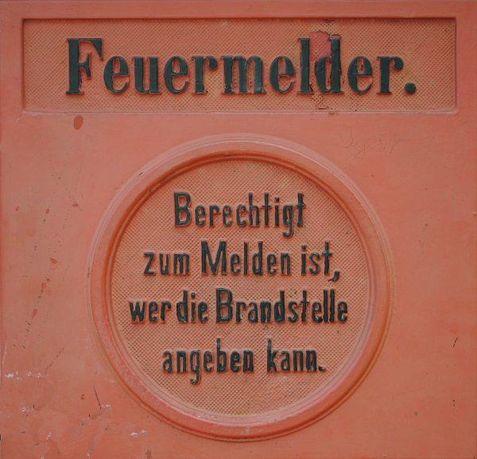

Joachim Gauck darf als gesetzt gelten. Nicht nur für Wulffs Rede am 3. Oktober zum 20. Jahrestag der Einheit kann Gauck Impulse geben. Auch langfristig würde Gauck im Think Tank Schloss Bellevue Aufgaben finden, ohne gleich den Voltaire am Hofe Christian Wulffs geben zu müssen.

   
 *"Berechtigt zum Melden ist, wer die Brandstelle angeben kann."* steht auf dem Feuermelder vor Schloss Bellevue. Ein Motto für die Suche nach Mitgliedern des Think Tanks.

**Wer hat was zu melden?**

Gauck ist als Theologe eine Bereicherung für einen Think Tank. Es braucht nicht nur Volks-, Rechts-, Wirtschafts- und Politikwissenschaftler, um die Brandstellen in Deutschland zu melden. Auch werden z.B. Unternehmer und Gewerkschaftler gesucht für eine Runde, die sich dann vielleicht drei bis vier mal im Jahr trifft, diskutiert und mit ihrem Fachwissen Konzepte für ein modernes und zukunftsfestes Deutschland vorgibt.

So stelle ich es mir zumindest vor, denn so ungefähr muss es bei den *Future Minds* gewesen sein, ein Think Tank der angeblich maßgeblich zur Wahl Wulffs zum niedersächsischen Ministerpräsidenten beitrug [1].

**Ein bildungspolitischer Brandherd**

Ein unerträgliches Problem Deutschlands kann bei der Suche kompetenter Kandidaten nicht unbeachtet bleiben. Bildung hängt bei uns nach wie vor viel zu stark von der sozialen Herkunft ab. Die Lösung dieses Problems betrifft sowohl eine zukünftige Schulreform, Kindergarten inklusive – Stichwort: früher vs. länger gemeinsam Lernen. Auch eine Reform in der Hochschulpolitik könnte dieser Diskriminierung entgegenwirken – Stichwort: Studiengebühr. Also wird Fachwissen für diese Bereiche gebraucht.

Klar ist, ein Bundespräsident darf nicht in die Tagespolitik eingreifen und sich etwa, nur um eine Beispiel zu nennen, für oder gegen Studiengebühren aussprechen. Sehr wohl kann er aber darauf hinweisen, dass obwohl wir in Deutschland weitgehend kostenlos studieren können, die Diskriminierung bei uns viel höher ist, als in Ländern, die teils hohe Studiengebühren erheben. Es gibt keine einfachen Antworten. Weder für dieses Beispiel noch bei anderen bildungspolitischen Themen.

Den Reformdruck wirkungsvoll zu erhöhen, weniger indem konkrete Lösungswege gezeigt werden als das kompetent Probleme in ihrer nötigen Komplixität erklärt werden, ist die zentrale Aufgabe des Think Tank Schloss Bellevues. Um im Bild zu bleiben, der Druck in den Hydranden wird erhöht, worauf der Schlauchtrupp zielt, ist Sache der Regierung.

**Wer liefert in der Lehr-Lern-Forschung Erkenntnisse?**

Es meldeten sich immer wieder Neurowissenschaftler öffentlich zu Wort und leiten aus ihrer Grundlagenforschung Konsequenzen für die Bildungspraxis ab [2]. Manfred Spitzer und Henning Scheich tun dies z.B. in einer klaren Sprache und mit hohen Renommee. Sie wären eine Bereicherung, wobei ich nicht verschweigen will, dass vor allem aus Pädagogik, Didaktik und Psychologie Erkenntnisse für die Lehr-Lern-Forschung gewonnen werden – "*Rezepte statt Rezeptoren*", so fasst Elsbeth Stern nicht minder eloquent ihrer Kritik an diesem Erkenntnistransfer aus der neurowissenschaftlichen Grundlagenforschung zusammen [3].

**Ethik und Strafrecht**

Aber auch von diesem bildungspolitische Brandherd abgesehen sollten Neurowissenschaftler gehört werden.

> Die Hirnforschung und die Neurowissenschaften allgemein repräsentieren Forschungsfelder, die in den letzten Jahren enorme Fortschritte in der Grundlagenforschung zu verzeichnen haben und hinsichtlich möglicher Anwendungen z.B. im medizinischen Bereich ein großes Potenzial aufweisen. Die Fortschritte im Verständnis von Hirnfunktionen wie auch die Anwendungspotenziale resultieren aus der Verknüpfung von Erkenntnissen und Verfahren aus einer Vielzahl wissenschaftlicher Disziplinen und Technologiefelder.

Das Zitat trifft das Kernthema meines Blogs und stammt aus einen [Bericht des Ausschusses für Bildung, Forschung und Technikfolgenabschätzung, TA Hirnforschung,  2008](http://dip21.bundestag.de/dip21/btd/16/078/1607821.pdf). Anwendungspotenziale schaffen nicht nur Arbeitsplätze. Die ethischen und (straf)rechtlichen Fragestellungen zum Beispiel zu den Themen freier Wille [4] und Neuro-Enhancement (s.a. [Bloggewitter](https://scilogs.spektrum.de/memorandum) und diesen [Blogpost](http://www.brainlogs.de/blogs/blog/graue-substanz/2009-11-18/moderne_therapeutische_neurotechnologie)) können nur mit Hilfe von Fachleuten aus den Neurowissenschaften erörtert werden.

Fazit: Auch die Hirnforschung stellt enorme Herausforderungen an ein modernes und zukunftsfestes Deutschland.

**Literatur**

[1] T.-G. Schultz und K. Schöneberg, *Wulff und sein Think Tank*, [Artikel in der FTD](http://www.ftd.de/politik/deutschland/:nach-der-wahl-wulff-und-sein-think-tank/50137536.html) [1.7.2010](http://www.ftd.de/politik/deutschland/:nach-der-wahl-wulff-und-sein-think-tank/50137536.html)

[2] Nicole Becker, *Von der Hirnforschung lernen?* Zeitschrift für Erziehungswissenschaften (2009)

[3] Elsbeth Stern, *Rezepte statt Rezeptoren* [Die Zeit 25.9. 2003](http://www.zeit.de/2003/40/Neurodidaktik2)

[4] Anthony R. Cashmore, *The Lucretian swerve: The biological basis of human behavior and the criminal justice system*, [PNAS **107**, 2010](http://www.pnas.org/content/107/10/4499.abstract)
