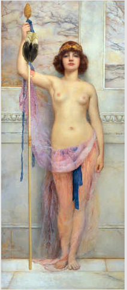
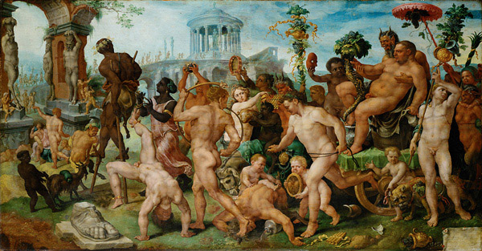

---

 **Prolog** 

Nachdem Philipp Rösler in einem Interview bekundete, dass er mehr Verantwortung übernehmen wolle, wurde nachgefragt:

> **F.A.Z.**: Wenn das alles so wichtig für Sie ist, warum machen Sie dann die Ansage, mit 45 mit der Politik Schluss zu machen?
>
> **Rösler**: Als ich das gesagt habe, war ich gerade 30 und sah vor mir eine Karriere als Landespolitiker. Politik verändert die Menschen.   
>  10. April 2011 F.A.Z. [Im Gespräch: Philipp Rösler „Es war nicht mein Traum, Vorsitzender zu werden“](http://www.faz.net/s/Rub594835B672714A1DB1A121534F010EE1/Doc~E0DD6BA39A9EA402BAA78BB0EB3C39E5E~ATpl~Ecommon~Scontent.html)

Aha, Wissenschaft funktioniert anders. Auch Wissenschaftler würden gerne mehr Verantwortung übernehmen und auch wissenschaftliches Arbeiten verändert den Menschen. Jedoch wollte ich mit 30 Jahren 15 Jahre später nicht aussteigen. Als Wissenschaftler in Deutschland habe ich außerdem nur einen einzigen Karriereweg vor mir. Den Landespolitiker der Wissenschaft, sprich [eine akademische Juniorposition](http://www.soziologie.uni-halle.de/kreckel/docs/kre-junpos-q.pdf), gibt es nicht. Wenn es sie aber gäbe, wäre dies kein Grund, diesen Weg nicht auch langfristig einzuschlagen, ganz im Gegenteil. Denn es geht um die Wissenschaft und nicht um die Position in der man sie betreibt. Wissenschaft funktioniert anders.

Wie aber funktioniert die akademische Welt? Dies ist aus verschiedenen Gründen nicht immer leicht zu beschreiben.

---

**Mit einem Fuß im Grabe stehen**

Wer meine Beiträge regelmäßig liest, weiß, dass ich vereinzelt auf Missstände gerne hinweise. Ich will kein Blatt vor dem Mund nehmen. Jedoch dabei nicht meine Haut leichtfertig zu Markte tragen. Das ist ein bekannter Konflikt des Wissenschaftlers – im  Mittelalter. Erasmus von Rotterdam zum Beispiel hat mit seiner Adagia …

> … Angriffe auf die kirchliche und weltliche Hierarchie … mit einer immer noch vollendeteren Technik des literarisches Versteckspiels und beziehungsreichen Andeutungen, der Ironie und des Sarkasmus getarnt. Sie machen deutlich, daß der Autor kein Blatt vor den Mund nehmen will und doch seine Haut nicht leichtfertig zu Markte tragen kann. Umschreibungen, Verallgemeinerungen, Projektionen in die Vergangenheit, die Technik des angeblichen Verhütens für die Zukunft und des möglichen und wünschenswerten Irrtums (*Ich möchte wünschen, es wäre unwahr, daß …*) – dies alles macht das stilistisch so äußerst schillernde und reizvolle Gewand der Adagia aus.  
>  [1, Seite 18f]

Das wäre etwa so, als wenn ich heute schriebe: *Ich möchte wünschen, es wäre unwahr, dass meine Gastdozentur eine gesetzeswidrige Beschäftigung ist.* Warum fehlt heute immer noch so vielen der Mut Missstände offen anzusprechen – nicht mehr direkt wissenschaftliche Missstände, sondern die im System, in dem wir Wissenschaft betreiben? In der Rubrik Klartext der Zeitschrift "[Forschung und Lehre](http://www.forschung-und-lehre.de/wordpress/)" werden z.B. intransparente oder schlicht verlogene Berufungsverfahren aus guten Grund anonym veröffentlicht.

Erklärungen für das generelle Versteckspiel finden sich in der "Zeit":

> Forscher der Hochschul-Informations-System GmbH (HIS) attestieren in ihrer Studie *Wissenschaftliche Karrieren* von 2010 den Lehrbeauftragten generell einen **starken Eigenantrieb**. Problematisch, so die Forscher, sei allerdings, dass dadurch soziale Aspekte in den Hintergrund treten. "Es herrscht eine **defensive Bereitschaft vor, sich irgendwie mit den Gegebenheiten abzufinden**", sagt Olaf Jann. "Es ist tatsächlich so, **dass man gegen die Etikette verstößt**, wenn man über die Situation redet. Soziale Probleme gibt es vielleicht draußen in der richtigen Welt, aber in der akademischen ist man selbst dafür verantwortlich." Jede prekäre Beschäftigung in Deutschland würde ernster genommen als die vor der eigenen akademischen Haustür, findet Jann.  
>  8. März, 2011, Die Zeit, [Prekär im Hörsaal](http://www.zeit.de/studium/hochschule/2011-03/lehrbeauftragte-prekariat), [Hervorhebung durch mich].

Dies ist eine indirekte, mitnichten aber gringe Gefahr für die Wissenschaft selbst. Wie man heimlich gegen die Etikette verstößt, hat mir Erasmus ja nun vorgegeben. Nehme ich mir also ein Sprichwort aus seiner Adagia.

**Multi Thyrsigeri, pauci Bacchi**   
 *(Thyrsosträger sind viele, doch echte Begeisterte wenig*)

Zur Erklärung: Der Thyrsos ist ein langer Rohrstarb, dessen Spitze ein Knauf aus Efeu- oder Weinlaub ziert, in späteren Zeiten auch ein Pinienzapfen und in einer moderen Mythologie würde man wohl den vermeintlichen Zeigefinger des argentisch-amerikanischen Hirschs (Cervus jorgee [2]) nehmen, in der scholastischen Annahme diese Gattung der Paarhufer kämpfe mit eben jenen Hufen statt mit ihrer Stirnwaffe.

Mit dem Thyrsos schlägt sein Träger auf allzu aufdringliche Satyrn ein, die mit ihrem Geschrei der Esel Furcht und Schrecken verbreiten. Der Schlag mit ihm unter seinesgleichen geführt, bewirkt eher Raserei und Ekstase.

Als Ehrenschmuck des Thyrsos gelten Binden (Taenia, wobei ich mit einigem Recht folgere, das Etymon des Wortes "tenure" hier gefunden zu haben, dafür aber bisher noch keinen Beleg vorweisen kann).  Dieser besondere Ehrenschmuck ziert ausschließlich den wahren, die heiligen Träger des Thyrsos, Dionysos (Bacchus) und Ariadne.

Die Thyrsosträger, die da viele sind, wie uns das Sprichwort lehrt, sind nur die Teilnehmer des Dionysoskultes, die Bakchanten, die wir neben Thyrsos oft auch am Hirschkalbfell als Bekleidung erkennen. Kälber, so ist anzunehmen, haben auch die kleineren Zeigefinger.

  
 *Maarten van Heemskerck, Triumph des Bacchus (ca. 1536-1537)*

Der Thyrsosträger ist nicht wirklich in der heiligen Bewegung integriert, worauf zuvor schon Olaf Jann, oder [Matthias Neis](http://www.heise.de/tp/artikel/34/34587/1.html) und nicht zuletzt auch die Kunsthistorikerin [Caecilie Weissert](http://www.uni-stuttgart.de/kg1/mitarbeiter/people/cv/weissert.html) in Ihrer Schrift "Satire im hohen Stil" hinweist.

> Die friesartige Anlage und die Rhythmisierung der Komposition durch Reihung betonen die Bewegung des zielgerichteten Personenzugs zum Heiligtum. Der Thyrsosträger am rechten Bildrand ist dagegen nicht in die Bewegung des Zuges integriert. Statuengleich verharrt er an seinem Platz, Kopf und Blick versonnen nach rechts gewandt. Er bildet zusammen mit dem Bocksführer links eine kompositorische Klammer […]. Die so entstandene Zweiteilung des Gemäldes in eine gerichtete und Bewegung suggerierende und eine statisch verharrende Schicht ist, wie im Folgenden gezeigt werden wird, grundlegend für das Verständnis des Gemäldes.   
>  [3]

  
 *Gemälde des personellen Ungleichgewichts zwischen Reformdruck und Verharrung [4]*

Nun ist weder das personelle Ungleichgewicht der Zweiteilung noch die verharrende Schicht der Thyrsosträger und Bocksführer die eigentliche Aussage des Sprichwortes: *Thyrsosträger sind viele, doch echte Begeisterte wenig*. Erasmus interpretiert es so, "daß viele Menschen die äußeren Zeichen oder auch den Ruf von Größe haben, denen in Wirklichkeit echte Größe fehlt."

Das erinnert mich nun wiederum an das Dilemma Erasmus‘ kein Blatt vor den Mund nehmen zu wollen, doch dabei seine Haut nicht leichtfertig zu Markte zu tragen. Anton J Gail schreibt:

> Das Dilemma ist keineswegs zwischen Kirche und Welt, sondern jene feine Grenze zwischen der Rücksicht auf die schlichte Aufnahmefähigkeit der Ungebildeten und der Verwerflichkeit krasser religiöser Äußerlichkeiten, zwischen einer Religion der Innerlichkeit und den Ansprüchen einer lebendigen «sinn»-erfüllten Religiosität […]  
>  [1, Seite 33]

Das Dilemma zwischen äußeren Zeichen und echter Größe ist ebenso nur vermeintlich zwischen der akademischen Welt, mit Ihren Titeln, und der Wissenschaft, die eben dies tut: Wissen schafft. Es betrifft die feine Grenze zwischen der Rücksicht auf eine notwendige Bewertungsfähigkeit der Wissenschaftler und ihren Institutionen und jener geradezu scholastischen Barbarei, wissenschaftliche Inhalte durch Äußerlichkeiten zu messen, die weder die Exzellenz der Institutionen noch die "Stirnwaffen" der Wissenschaftler wahrhaft erfassen. Letztere und ihre [prekären Arbeitsbedingungen an deutschen Hochschulen](http://www.heise.de/tp/artikel/34/34587/1.html) sollen heute, am 1. Mai, im Zentrum stehen.

Nur wenige Thyrsosträger erlangen Eintritt und dürfen mit dem Taenia geschmückten, heiligen Zug des Dionysos mitziehen. Am Knauf und Stängel des Thyrsos wird meist die Entscheidung festgemacht. Je mehr Efeu-, Weinlaub und dritte Mittel, je länger der Zeigefinger des *Cervus jorgee*, desto besser. Der Stängel, meist aus dem Steckenkraut *Ferula narthex*, birgt ein weiteres für den Eintritt wichtiges Geheimnis. Es dient als zylindrischer Drogenbehälter mit abgetrennten Fächern nach Richtung der Wirkung. Ein Thyrsosträger hat meist nur ein Fach gefüllt, das *facultas docendi,* und er heilt mit dem darin befindlichen Gift, dem *venenum* *legendi.* Wessen Gift groß ist, so dass es in kein *facultas docendi* passen mag, weil es über viele hinweg ragt, wird zwar gerne mit Efeu-, Weinlaub und dritten Mittel bedacht, bleibt am Ende doch meist ungeschmückt.

Für viele Thyrsosträger, darunter oft echt Begeisterte, ist dann meist Schluss mit 45.

---

**Epilog**

Die Antwort von  Philipp Rösler ist oben nur zur Hälfte wiedergegeben. Er schließt mit

> **Rösler**: […] Sie [*die Politik, s.o.*] macht misstrauischer. Und mein Papa hat immer gesagt: Gute Politiker und gute Schauspieler haben eins gemeinsam. Sie gehen, solange noch applaudiert wird.   
>  10. April 2011 F.A.Z. [Im Gespräch: Philipp Rösler „Es war nicht mein Traum, Vorsitzender zu werden“](http://www.faz.net/s/Rub594835B672714A1DB1A121534F010EE1/Doc%7EE0DD6BA39A9EA402BAA78BB0EB3C39E5E%7EATpl%7EEcommon%7EScontent.html)

Da haben wir dann doch noch eine Gemeinsamkeit. Auch gute Wissenschaftler gehen obwohl applaudiert wird, weil sie immer misstrauischer in ihre Zukunft blicken.

**Literatur**

[1] Erasmus von Rotterdam: Mit Selbstzeugnissen und Bilddokumenten, Anton J. Gail, rororo; Auflage: 7

[2] J. E. Hirsch, [An index to quantify an individual’s scientific research output](http://www.pnas.org/content/102/46/16569.full), *PNAS*, **102**, 16569-16572 (2005).

[3] C. Weissert, [Satire im hohen Stil: Dialog und Dialogizität in Maarten van Heemskercks Triumph des Bacchus](http://edoc.hu-berlin.de/docviews/abstract.php?lang=ger&id=37570),  Herausgeber: Angela Dressen und Susanne Gramatzki

[4] Die Grafik bezieht sich auf das hauptberufliche wissenschaftliche Personal, also z.B. nicht auf oben erwähnte Lehrbeauftragte und HiWis. Und auch nur auf solche an Universitäten und nicht auch auf Fachhochschulen u.ä.. Genauere Informationen sind in "[Die akademische Juniorposition zwischen Beharrung und Reformdruck](http://www.soziologie.uni-halle.de/kreckel/docs/kre-junpos-q.pdf)" von Prof. Reinhard Kreckel. Die Farbabbildung hier stammt aus "Zur Kooperation verpflichtet" von Prof. Reinhard Kreckel, *Forschung und Lehre*, 2009 Heft 5, Seite 331)

Die Information über die Antike, insbesondere zu den Stichwörtern Thyrsos und Narthex stammen aus:  
 Der Kleine Pauly, Lexikon der Antike in fünf Bänden, Konrat Ziegler und Walther Sontheimer (Hrsg), Deutscher Taschenbuch Verlag

**Bildquellen**

Inset: Godward, John William 1861-1922. "A Bacchante Dancer Holding a Thyrsos" (Bacchantische Tänzerin mit Thyrsos), 1893

**Link**

Kurze URL zu diesem Beitrag:

<http://goo.gl/Vyylg>
