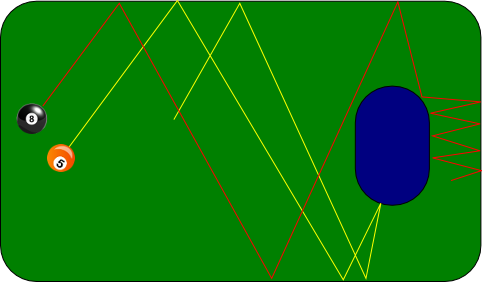

„Vorsintflutliche Symptomtherapie“ sei das Stechen spitzer Elektroden ins Gehirn. Wenn selbst der gütige Gott die Sintflut schickt, sollte vielleicht ich und mit mir gleich die gesamte Forschungsgemeinschaft  – der en passant eine gänzlich falsche Zielsetzung vorgeworfen wurde\* – diese „Bastlermentalität“, mit der die zunehmenden Möglichkeiten einer gezielten technischen Manipulation des Gehirns verfolgt werden, fallen lassen, um mich der Ursachenforschung zu widmen.

Diesen Kommentar zum letzten Beitrag „[Zukunft der Kopfschmerzen](https://scilogs.spektrum.de/blogs/blog/graue-substanz/2012-07-12/zukunft-der-kopfschmerzen)“ will ich dankend aufgreifen (siehe [Diskussion](https://scilogs.spektrum.de/blogs/blog/graue-substanz/2012-07-12/zukunft-der-kopfschmerzen#comment-19452) – über das folgende wollte ich ohnehin schreiben, da kam die Kritik gerade recht).

## Wo entsteht Schmerz?

Die normale Schmerzleitung beginnt bei den Schmerzrezeptoren (Nozizeptoren) und läuft weiter über periphere Nerven ins zentrale Nervesystem (ZNS). Das ist nozizeptiver Schmerz. Zentrale neuropathische Schmerzen entstehen dagegen allein im ZNS durch Schädigungen (Läsionen) oder neuronale Funktionsstörungen (Dysfunktionen). Dass Elektroden im Hirn dort die Ursache für zentrale Schmerzen heimsuchen, wäre daher eigentlich nicht abwegig zu denken, oder? Bei Bauchschmerzen würde ich den oben genannten Vorwurf verstehen. Damit ist die Kritik gleichwohl nicht vom Tisch.

Vielleicht wird der zentrale Schmerz im Hirn von einem anderen Organsystem verursacht. Bei rheumatischen Gelenkschmerzen (Arthrose) zum Beispiel entsteht der Schmerz wohl nicht allein durch entzündungshemmende Mediatoren (nozizeptiver Schmerz) sondern kann sich auch als zentraler Schmerz manifestieren [1].  Oder vielleicht wird der zentrale Schmerz durch Läsionen oder Dysfunktionen des Nervensystems genetisch verursacht oder durch Schlaganfall. Man könnte also vermuten, dass der eigentlichen Ursache mit Elektroden im Gehirn selbst bei zentralen Schmerz so oder so nicht beizukommen ist. Der Vorwurf ist also durchaus berechtigt.

## Ursache ist keine Sache.

Schmerz immer nur als Folge sehen zu wollen, ist das eigentliche Problem. Dem liegt oberflächlich eine Descartes’sche Vorstellung zu Grunde, Schmerz als Reaktion auf eine tatsächliche oder potenzielle Gewebeschädigung zu begreifen. Tiefer betrachtet ist das Problem daher eine eingeschränkte Vorstellung der Bedeutung von „Ursache“ als eine dingliche Ur-Sache am Anfang einer Kausalkette, die man wie einen Schmetterling greifen kann.

**Schmerz: Strafe, Reaktion, Dynamik.**

Descartes vertrieb gottesfürchtige Vorstellungen des Schmerzes als Strafe mit der Spezifitätshypothese (specificity theory), die Schmerz als das Produkt eines einfachen Reiz-Reaktions-Mechanismus sah. Er schüttete damit das Kind mit dem heißen Bade aus, um im Bild zu bleiben. Seine Theorie bröckelte Mitte des 20ten Jahrhundert. Aktuell erklärt die „Neuromatrix Theorie“ von Melzack [2] (eine Variante wird auch als [Schmerzmatrix](https://scilogs.spektrum.de/blogs/blog/graue-substanz/2012-02-05/die-schmerzmatrix) bezeichnet) den einfachen Zusammenhang zwischen Schädigung und Schmerz als alleinige Erklärung für nichtig. Natürlich ohne wieder Gott oder andere übernatürliche Mächte in Spiel zubringen.

## Immanente Ursache, äußere Auslöser.

Schmerz ohne Ursache? Nicht ganz. Wer wissen will, was die Ursache einer Krankheit ist, der muss den Mechanismus kennen. Bei Mechanismus denke ich gleich an Mechanik und deren Bewegungsgleichungen, die ich natürlich nicht nur für mechanische sondern auch organische Systeme aufstellen kann. Da Bewegungsgleichungen in den Lebenswissenschaften so ungefähr das Gleiche wie übernatürliche Mächte sind, hebe ich mir das für einen folgenden Beitrag auf.

Wie das Bild oben suggeriert, spielen „Auslöser“ eine Rolle, in diesem Beispiel durch eine hohe Sensibilität gegenüber den Anfangsbedingungen gegeben. Es geht in die Richtung, die Alex in der [Diskussion](https://scilogs.spektrum.de/blogs/blog/graue-substanz/2012-07-12/zukunft-der-kopfschmerzen#comment-19458) zu den obigen Einwänden lyrisch einschlägt:

> Ich glaube, Migräne ist etwas, das erst auf dem Weg zwischen Brasilien und der Westküste entsteht.

Das etwas auf dem Weg entsteht, trifft es sehr gut. Ursachen können systemimmanent sein. Äußere Einflüsse können zwar Auslöser eines bestimmten Ablaufs von Ereignissen sein, doch dieser Ablauf selbst ist durch die Dynamik des Systems vorgegeben mit innewohnenden Eigenschaften, die auch pathologisch sein können (wie der rote Pfad). Solch ein Verhalten ist folglich „pathologischer“ Schmerz und nicht der oben erwähnte normale nozizeptive Schmerz.

Inwiefern dieses Konzept der pathologischen Schmerzen zutrifft auf primäre Kopfschmerzen, insbesondere auf Migräne, Cluster-Kopfschmerz oder auf trigeminoautonome Kopfschmerzen, bei denen in der ein oder anderen Form invasive und nicht-invasive neuromodulierende Verfahren (also eine technische Manipulation des Gehirns) eingesetzt werden, ist unklar. Insofern darf man diese Techniken heute zumindest in einem Sinne noch als vorsintflutlich bezeichnen. Es ist aber nicht die Hardware. Es ist das Stimulationsverfahren, die Software der Hirnschrittmacher, die bisher rein empirisch bestimmt wird und nicht modellbasiert optimiert auf Basis einer mathematischen Kontrolltheorie.

Neuromodulierende Verfahren können folglich Ursachentherapie sein. Um diese für dynamische Hirnkrankheiten zu entwicklen, brauchen wir neben der klinischen Forschung weitere Impulse aus den theoretischen Disziplinen wie der Mathematik – und auch aus der Philosophie, denn ethtische Fragen werden hier unweigerlich mit eröffnet.

**Fußnote**

\* Vgl. Bericht des Ausschusses für Bildung, Forschung und Technikfolgenabschätzung, *TA Hirnforschung* (2008) [[pdf](http://dipbt.bundestag.de/dip21/btd/16/078/1607821.pdf)]. Dort wird die Einschätzung des Deutschen Bundestag über die technischen Manipulationen des Gehirns wiedergegeben.

**Literatur**

[1] Sofat N, Ejindu V, Kiely P. What makes osteoarthritis painful? The evidence for local and central pain processing. *Rheumatology*.  **50**:2157-65. Review. (2011)

[2] Melzack R. Pain–an overview. *Acta Anaesthesiol Scand.* **43**(9):880-4. Review.(1999) und Melzack R. Pain and the neuromatrix in the brain. *J Dent Educ.*  **65**:1378-82. (2001)

**tl;dr** Schmerz nur als Folge einer tatsächlichen oder potenziellen Gewebeschädigung zu sehen, liegt eine veraltete Descartes’sche Vorstellung zu Grunde. Tiefer betrachtet ist das Problem eine eingeschränkte Vorstellung der Bedeutung von „Ursache“ als eine dingliche Ur-Sache am Anfangs einer Kausalkette. Bei Schmerzen können Ursachen systemimmanent sein und sind zwar durch kurzfristige äußere Einflüssen ausgelöst aber nicht verursacht. Neuromodulierende Verfahren (kurz: Hirnschrittmacher) könnten in Zukunft bei solch dynamischen Krankheiten Schmerzen unterbinden.

© 2012, Markus A. Dahlem
