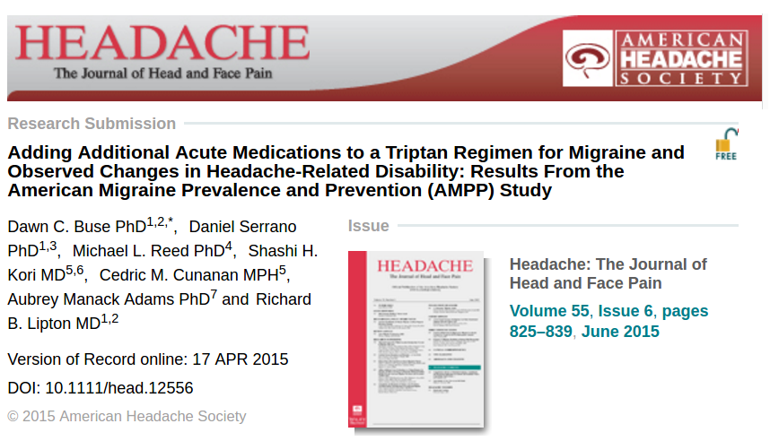

Das 58. Jahrestreffen der amerikanischen Headache Society (AHS) geht heute zu Ende. Unter dem Hashtag [#AHS16SD](https://twitter.com/search?q=%23AHS16SD) konnte man auf Twitter in den vergangenen vier Tagen Informationen aus der aktuellen Kopfschmerzforschung verfolgen. Auch ein Hinweis auf eine neue Studie, die eine Antwort auf oben genannte Frage gibt, wurde gleich zu Beginn getwittert.

## Ausgezeichnete Studie zum Outcome

Bei der Eröffnung des Jahrestreffen am vergangenen Donnerstag wurde eine Studie zum Gebrauch von Schmerzmitteln gegen Migräne ausgezeichnet. Es ging um den »*award for the best article 2015*«.

Ziel dieser Studie war es, die Behandlungsergebnisse zu beurteilen, wenn zusätzlich zu einer akuten Behandlung mit einem sog. Triptan ein weiteres Schmerzmittel eingenommen wurde, beispielsweise ein Triptan und ein Paracetamol, ein Triptan und ein Opiat, ein Triptan und ein Beruhigungsmittel oder auch ein Triptan und noch ein anderes Triptan.

## Viele Möglichkeiten und …

Triptane sind speziell entwickelte Migränemittel. Es gibt sieben verschiedene. Zwei Triptane kann man bereits rezeptfrei in der Apotheke kaufen, allerdings nur in kleinen Packungsgrößen. Neben den Triptanen kommen in der medikamentösen Migränetherapie auch andere Schmerzmittel zum Einsatz.

In den deutschen [Leitlinien für Diagnostik und Therapie in der Neurologie](http://dmkg.de/sites/default/files/ll_55_2012_therapie_der_migraene.pdf) (Georg Thieme Verlag) heißt es unter anderem: „*die Kombination eines Triptans mit einem NSAR* [nicht-steroidalen Antirheumatika, s.u.] *ist der jeweiligen Monotherapie überlegen*“. Wobei die Triptane überhaupt nur die „*Therapie erster Wahl bei mittelschweren und schweren Migräneattacken* [sind]*, die nicht oder nicht ausreichend auf eine Therapie mit Analgetika* [Schmerzmittel] *oder nicht steroidalen Antirheumatika ansprechen*“. Man stutzt vielleicht kurz über den Begriff „erste Wahl“ bei dieser Empfehlung, da man offensichtlich immer erstmal mit NSAR anfängt.

## … ein langer Weg zur Therapie

Erste Wahl hin oder her, fast alle Patienten haben einen langen Weg mit einer Reihe verschiedener medikamentöser Behandlungen hinter sich, bevor sie – hoffentlich – eine adequate Therapie finden. Das Deutsche Ärzteblatt schätzt, dass [3,7 Milliarden Schmerztabletten](http://www.aerzteblatt.de/archiv/26693) in Deutschlands Apotheken jährlich zur Linderung der Migräne verkauft werden. Da sollte es nicht verwundern, dass Schmerzmittel öfter auch mal kombiniert werden. Diesem Problem nehmen sich die Autoren der Studie nun an.

Wenn die Kopfschmerzen nicht auf ein bestimmtes Medikament in gewünschter Weise ansprechen, stehen natürlich mehrere Optionen zur Verfügung, schreiben die Autoren. Die Entscheidungen umfassen den Wechsel zu einem anderen Medikament und auch die Änderung der Dosis, des Zeitpunktes, oder der Art der Verabreichung (oral, nasal, rektal, subkutan) der anfangs gewählten Medikation – oder eben auch das Hinzufügen weiterer Schmerzmittel. Die Möglichkeiten sind nur durch die Geduld der Patienten begrenzt.

## Geübte Praxis kaum validiert

Ein wenig Ordnung schaffen vorgefertigte Kombinationspräparate, die mehrere Wirkstoffe enthalten, beispielsweise ASS (Acetylsalicylsäure), Paracetamol und Koffein oder eine Fixkombination von einen Triptan mit einem NSAR (Sumatriptan und Naproxen) in einer Tablette. Zu solchen Fixkombination sind klinische Studien vorhanden. Darauf verweist die nun ausgezeichnete Studie auch. Die Autoren sehen allerdings einen hohen Bedarf in der Untersuchung der bisher oft geübten Praxis, einen weiteren Wirkstoff durch eine weitere Tablette der Therapie hinzuzufügen. Viel zu wenig weiß man darüber. Dass die Studie nun ausgezeichnet wurde, zeigt, dass die Vertreter der amerikanischen Headache Society dem zustimmen.

Es geht um bestimmte Kombinationen. Folgende drei Arzneimittelgruppen und deren Kombination mit einem Triptan wurden untersucht:

1. **NSAR (NSAID)**sind sehr vielfältig. Sie wirken nicht nur schmerzstillend, sondern auch fiebersenkend und entzündungshemmend. Unter ihnen befinden sich auch bekannte Klassiker: ASS oder Acetylsalicylsäure, Paracetamol, Ibuprofen und vielleicht weniger bekannte Wirkstoffe, wie Metaminzol, Naproxen, Diclofenac, Ketoprofen, Ketorolac, Flurbiprofen, und einige weitere. Zur Abgrenzung zu den Opioiden (s. nächste Gruppe) wird diese Gruppe auch zu den Nicht-Opioid-Analgetika eingeordnet. Die nichtsteroidalen Antirheumatika (NSAR, engl. non-steroidal anti-inflammatory drugs, NSAID) bilden eine Untergruppe, die auch antiphlogistische Analgetika genannt wird (antiphlogistische=entzündungshemmend; Analgetika=Schmerzmittel).
2. **Opioide** ist ein Sammelbegriff für Substanzen mit morphinartigen Eigenschaften. Morphin, auch als Morphium bekannt, ist ein Bestandteil des Opiums, was wiederum namensgebend für diese Klasse ist. Morphium ist somit quasi eine Referenzsubstanz. Opiate stammen dabei chemisch direkt vom Morphin ab, während Opioide alle Stoffe bezeichnet, die über die Opioidrezeptoren ihre Wirkungen vermitteln. Es gibt auch körpereigene Opioide, wie z.B. die Endorphine.
3. **Barbiturate** sind, je nach Dosierung, Beruhigungsmittel und wirken auch antikonvulsiv, d.h. der Entstehung von nervösen Krämpfen entgegen, indem sie die neuronalen Erregbarkeit bzw. die Erregungsweiterleitung im zentralen Nervensystem hemmen.

Die Studie schaute auf eine Stichprobe mit 2.128 Migräneerkrankten, die alle mit einem Triptan medikamentös behandelt wurden. 111 Personen kombinierten dieses noch mit einem anderen Triptan, 118 fügten ihrer Therapie ein Opioid oder Barbiturat hinzu und 69 ein NSAID. Eine Referenzgruppe von etwa 1800 Fälle blieben bei dem konsequenten Behandlungskonzept mit nur einem Triptan.

## Nach Anzahl der Kofschmerztagen unterteilt

Die Probanden in der Stichprobe wurden in drei Gruppen unterteilt, die über die Anzahl der Kopfschmerztage definiert wurden, nämlich als episodisch seltene, moderate und häufige Formen mit Kopfschmerztagen pro Monat zu 0-4 (selten), 5-9 (moderat) und ≥10 (häufig). Dabei wurde sich an der üblichen klinischen Einteilung zwar orientiert. Doch aufgrund zu kleiner Probandenzahlen wurde beschlossen, die übliche Einteilung nicht exakt einzuhalten, was die Interpretation der Ergebnisse erschwert.

Die übliche Einteilung hätte die Gruppe der episodisch-häufigen Migränepatienten unterteilt und ab >15 Kopfschmerztagen pro Monat nicht mehr von einer episodischen, sondern chronischen Form der Migräne gesprochen. Diese Zusammenführung ist nicht wirklich neu und als modifiziertes Silberstein-Lipton-Kriterium in der US-amerikanischen Kopfschmerzliteratur bekannt. Es sprechen also nicht allein niedrige Probandenzahlen für ein Zusammenlegen der chronischen Migräne mit der episodisch-häufigen Form.

## Allgemein keine Verbesserung – NSAID Outcome gespalten

Um die Behandlungsergebnisse zu beurteilen, wurde der MIDAS-Fragebogen genutzt (Migraine Disability Assessment). Dieser Fragebogen wird vom Patienten selbst ausgefüllt. Er ermittelt die Beeinträchtigungen durch Migräne in den vorausgehenden 3 Monaten und erfasst verschiedene Bereiche des Lebens, wozu insbesondere Arbeit, Haushalt und/oder Schule sowie Freizeit gehören.

Die Autoren fanden heraus, dass die Monotherapie mit einem Triptan in der Regel nicht nochmal verbessert wurde, wenn andere Schmerzmittel hinzufügt wurden. Diese Ergebnisse legen insbesondere nahe, dass Menschen mit häufiger Migräne nicht geholfen wird und sich die Behandlungsergebnisse dann eher verschlechtern. In der Gruppe der episodisch-moderaten Form mit fünf bis neun Kopfschmerztagen pro Monat zeigte nur der zusätzliche Gebrauch von NSAID eine Verbesserung der Behandlungsergebnisse.

## Keine persönliche Therapieempfehlung

Letztlich muss man sich dennoch jeden Fall individuell anschauen. Deswegen soll hier im Blog nicht der Eindruck entstehen, man könnte auf Basis dieser Ergebnisse eine persönliche Therapieempfehlung abgeben. Der Therapieerfolg hängt immer auch von lebensgeschichtlichen Aspekten ab, die nur eine Ärztin oder ein Arzt beurteilen kann. Beispielsweise könnten Begleiterkrankungen, besondere Risiken und andere Faktoren, die die Möglichkeit einer Prophylaxe einschränken, eine Rolle spielen. Hohe sportliche Aktivität oder Stress, schließen z.B. Beta-Blocker bzw. Antidepressiva in der Prophylaxe aus. Bei der Studie ging es aber nur um die Akuttherapie.

## Nichtmedikamentöse Behandlungsstrategien noch zu wenig bekannt

Eine Aussage kann man mitnehmen: Die Autoren sehen in den Triptanen die tragende Säule einer Migränebehandlung, auch wenn Triptane nicht immer ausreichend ansprechen. Dass die Studie kaum Belege findet, dass andere akute Schmerzmittel eine Monotherapie mit Triptanen ergänzen können, zeigt laut den Autoren vor allem eins: den medizinischen Bedarf nach nichtmedikamentösen Behandlungsstrategien – dann hat man auch an den 20 Tagen, an denen man ohnehin keine Schmerzmittel einnehmen darf, eine Alternative. Bisher bieten vor allem klinische Spezialeinrichtungen gezielt solche Ansätze. Ein in der Niederlassung tätiger Arzt oder Neurologe kennt oft nicht die Gesamtbreite der Verhaltenstherapien und Neuromodulatoren gegen Migräne.

https://twitter.com/ahsheadache/status/741080216445943808

## Literatur

Buse, Dawn C., et al. „Adding Additional Acute Medications to a Triptan Regimen for Migraine and Observed Changes in Headache‐Related Disability: Results From the American Migraine Prevalence and Prevention (AMPP) Study.“ *Headache: The Journal of Head and Face Pain* 55.6 (2015): 825-839. ([open access](http://onlinelibrary.wiley.com/doi/10.1111/head.12556/abstract))
