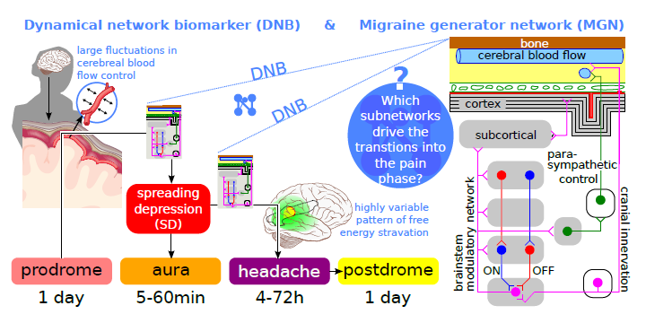

In [a new paper](http://www.ncbi.nlm.nih.gov/pubmed/24288590), we suggest how to integrate methods form computational neuroscience with neuromodulation (i.e., electrical and magnetic stimulation of the brain) for the next generation of non-drug treatment in migraine. In particular, we propose a strategy to employ the new theoretical concept of dynamical network biomarkers as early-warning signals being utilized for neuromodulation.

What is a dynamical network biomarker? It is a specific signal that occurs during transitions.

Migraine is mainly characterized by sudden and recurrent transitions into episodes of head pain. In fact, the imminent transition into the pain phase can manifest in two separate and distinct phases, namely the prodromal phase and the aura phase.

The prodromal phase with subtle symptoms, e.g. extreme yawning, precedes the pain phase by 1 day; the aura phase with various sensory hallucinations lasts from 5 minutes to up to 1 hour and directly precedes or overlaps with the pain phase. The pain phase can, in turn, last up to 3 days.

These transitions into the pain phase could generate signals termed dynamical network biomarkers.

The neural correlates that cause the transition into the pain phase are still poorly understood and we continue to work on these transitions in terms of nonlinear dynamics, in particular, tipping point behavior. If we can specifically predict and hence find these dynamical network biomarkers (remember, they are specific signals, we may be able to monitor), we hope we will also be able to identify the role of putative subnetworks by their specific ability to generate early-warning signals which lead into the attack. These would then be the target areas in the brain for neuromodulation.

Our new paper „Towards dynamical network biomarkers in neuromodulation of episodic migraine“ is the road map to this approach.

(left) The migraine cycle of recurrent episodes. (middle) Three companies among others develop neuromodulation devices (a)-(c); we expect the first two could exploit our proposed DNB framework for model-based control. (right) The migraine generator network is partly accessible for neuromodulation, the dual concepts of observability and controllability from control engineering have to be investigated.
