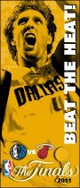
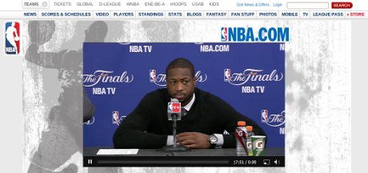

 **Suchen Sie sich mal ein Handicap aus: eine gerissene Sehne im Mittelfinger der linken Hand und 38.9° Fieber oder doch lieber Migräne? Ihre Aufgabe ist Basketball auf Weltniveau zu spielen. Nicht leicht.**

+++ Update: [Dirk Yeswinzki! Hörten Sie ihn husten?](#NBA-6) +++

Sehnenriss, Fieber und Migräne, das sind die Einschränkungen mit denen die zwei Hauptakteure Dirk Nowitzki (Sehnenriss und Fieber) und Dwyane Wade (Migräne) in den Spielen der Playoffs der NBA zu kämfen haben. Noch nichts davon gehört? Geht vielen so. Von Dwyane Wade und seiner Migräne schon gleich gar nicht. Dazu am Ende mehr.

> *Was Dirk Nowitzki derzeit in den Playoffs der amerikanischen Basketball-Profiliga NBA leistet, lässt sich mit nur ganz wenigen Momenten der deutschen Sportgeschichte vergleichen. Aber leider bekommt es kaum jemand mit.*

kommentiert [Christian Zaschke in der Süddeutschen Zeitung](http://www.sueddeutsche.de/sport/nba-dirk-nowitzki-dramatik-wenn-alles-schlaeft-1.1105072). Wenn Dirk Nowitzki Steffi Graf wäre, dann ist Dwyane Wade Martina Navratilova. In etwa. Sie gehören zur Weltspitze und mögen sich nicht sonderlich. Nach den Playoffs 2006, welche nach sechs Spielen Wade mit seinem Team *Miami Heat* gewann und von denen Nowitzkii sagte, sie hätten diese Meisterschaft damals verschenkt, [kam es fast zu einem Zickenkrieg](http://basketbawful.blogspot.com/2007/02/mark-cuban-dwyane-wade-is-poopyhead.html), um im Bild zu bleiben.

Nach dem heutigen Spiel – ich habe mich heute früh um fünf an den Rechner gesetzt, um wenigstes das Ende dieses vierten Spiels live mitzubekommen – ist klar, es wird mindestens wieder sechs Spiele geben und verschenkt wird diesmal gar nichts! Nowitzki, der sich schon im ersten Spiel einen Sehnenriss in seinem linke Mittelfinger zuzog spielte heute trotz 38.9° Fieber. Nun, der Mannschaftsarzt wird schon wissen, wie er das unterdrückt hat.

Über Dwyane Wade und dessen [Empfindlichkeit gegen visuellen Stress habe ich im letzten Beitrag geschrieben](http://www.brainlogs.de/blogs/blog/graue-substanz/2011-06-01/visueller-stress). Dort fasse ich im Nachtrag die NBA Spiele der Finals kurz zusammen. Dies kopiere ich nun auch unter diesen Beitrag.

Mit geht es natürlich nicht darum Verletzungen und Fieber gegen eine Migräneerkrankung aufzuwägen. Die Aufmerksamkeit, die Dwyane Wade der Krankheit Migräne in den USA verschafft, ist das bemerkens- und beobachtungswerte. Ich schaue schon aus beruflichen Interesse genau hin, wenn prominente Beispiele in der Presse erscheinen (s.a. [Kauderwelsch im Fernsehen: Schlaganfall der keiner war](http://www.brainlogs.de/blogs/blog/graue-substanz/2011-02-21/schlaganfall-der-keiner-war)). Was man daraus lernen kann ist zweierlei. Migräne ist eine Erkrankung, die die Betroffenen auch zwischen den eigentlichen Attacken einschränken kann. Zweitens, selbst mit diesen Einschränkungen sind absolute Höchstleistungen möglich.

Ähnlich dem getapten Finger von Nowitzki und was immer er gegen sein Fieber nahm, kann Migräne behandelt werden. Auch hier reicht das Spektrum weit, von der Sonnenbrille bis zu Medikamenten. Am Anfang steht oft zunächst die Aufklärung. Die Dunkelziffer bei Migräne ist hoch, [zumal nicht mal Kopfschmerzen bei dieser Erkrankung auftreten müssen](http://www.brainlogs.de/blogs/blog/graue-substanz/2011-04-01/migraene-sind-kopfschmerzen-auch-wenn-man-gar-keine-hat).

Sportler sind Vorbilder. Auch und gerade im offenen Umgang mit Krankheiten. Zum Beispiel haben Robert Enke, Sebastian Deisler und  Andreas Biermann Depression als Erkrankung weit ins öffentliche Licht gerückt. Biermann zum Beispiel hat"[durch das öffentliche Bekenntnis vielen Betroffenen und Angehörigen Mut gemacht](http://www.theeuropean.de/andreas-biermann/6093-depressionen-im-fussball-geschaeft)". In diesem Sinne fehlt in Deutschland ein Dwyane Wade.

**Ticker zu dem bisherigen Verlauf der NBA Finals 2011**

Wer die kommenden Spiele live sehen will, kann [NBA league pass](https://ilp.nba.com/nbalp/secure/registerform) für €19.99 erwerben.

*+++ Dirk Nowitzki verliert mit seinen Mavericks (1. Juni 7:19) +++*

[Spielzusammenfassung](http://www.nba.de/) von der NBA.de Webseite:

> *Dwyane Wade erzielte 22 Punkte und holte 10 Rebounds, LeBron James lieferte 24 Punkte und die Heat gewinnen Spiel eins mit 92:84 in American Airlines Arena. Dirk Nowitzki war Topscorer der Mavs mit 27 Punkten.*

Der Spielbericht "[Dwyane Wade’s big finish in Game 1 could be his needed spark](http://www.miamiherald.com/2011/05/31/2244710/dwyane-wades-big-finish-in-game.html)" vom Miami Herald geht insbesondere auf die Bedeutung des Spielers Wade und seine unstete Leistung ein.

Auszug vom [Spielbericht der F.A.Z.](http://www.faz.net/artikel/C31105/nowitzkis-27-punkte-reichen-nicht-dallas-mavericks-verlieren-final-auftakt-in-miami-30428751.html):

> *Wie der Deutsche* [Dirk Nowitzki, Anmerkung M.A.D.] *wirkten auch Miamis Stars LeBron James (24 Punkte) und Dwyane Wade (22) lange Zeit nervös und brachten nicht ihre gewohnten Top-Leistungen.*

Nun, das ist wohl eher auf den psychischen Stress auf beiden Seiten zurückzuführen. Dass Dwyane Wade Kontaktlinsen trug, las ich nicht. Nach diesem durchwachsenen Anfang freue ich mich auf das nächste Spiel am Donnerstag.

*+++ Dirk Nowitzki gewinnt in letzter Sekunde  (3. Juni 6:49) +++*

[

Spielzusammenfassung](http://www.nba.de/) von der NBA.de Webseite:

> Die Mavericks machten einen 15-Punkte-Rückstand wett in den letzten sieben Minuten des Spiels und gewannen mit 95:93! Dirk Nowitzki versenkte den Siegtreffer 3,6 Sekunden vor Schluss und die Mavs gehen jetzt mit 1:1 in der Serie nach Dallas!

Und Dwyane Wade? Er und Nowitzki standen beide 42 Minuten auf dem Platz. Wade machte 36 Punkten und war der beste Schütze bei den Miami Heat. Nowitzki war bester Mann  bei den Mavs aber mit "nur" 24. Das Spiel kann [hier auf 6 Minuten zusammengefasst gesehen](http://www.nba.com/games/20110602/DALMIA/gameinfo.html) werden. Ab Minute 4:30 beginnt die Aufholjagt. Hier macht Wade keine gute Figure.

Dallas hat nun drei Heimspiele und sie werden ihre Stadionscheinwerfer sicher nicht abdunkeln …

Das nächste Spiel ist am Sonntag den 5. Juni um 20:00 Ortszeit. Da Dallas sieben Stunden Zeitverschiebung hat, ist es bei uns wieder 3:00 früh am Montag.

*+++ Dirk im Pech  (6. Juni 5:44) +++*

Am Anfang ging das Spiel verloren. Die Mavs gewinnen jedes Viertel bis eben auf das Erste. Nowitzki verpasst am Ende die Chance zum Ausgleich mit seinem letzen Wurf. So steht es dann 86:88 Mavericks – Heat, oder 1:2 in Spielen.

[Spielzusammenfassung](http://www.nba.de/) von der NBA.de Webseite:

> Dwyane Wade brachte einen Double-Double (29 Punkte, 11 Rebounds) und Chris Bosh (18 Pkt) versenkte den Siegtreffer 39,6 Sekunden vor Schluss, als die Heat mit 88:86 Spiel drei gewannen. Dirk war Topscorer der Mavs mit 34 Punkten

Wade wieder der wichtigste Spieler für Miami Heat – von seiner Migräne zum Glück keine Spur oder kurz zusammengefasst: Migräne schlägt Sehnenriss. Und das ist auch gut so.

*+++ Das Comeback (8. Juni 5:50) +++*

Spannend, Spannend, Spannend.

1. Spielzusammenfassung von der NBA.de Webseite:

> Miami führt mit 47:45 nach der ersten Hälfte. Chris Bosh — der Held vom Spiel drei — hat 16 Punkte erzielt. DeShawn Stevenson traf drei Dreier und ist der Topscorer der Mavs mit 11 Punkten.

2. Spielzusammenfassung von der NBA.de Webseite:

> Dirk Nowitzki traf nur 6 von 19 Würfen vom Feld, aber das Wunderkind versenkte den größten Wurf des Spiels 14,4 Sekunden vor Schluss, um die Mavs zum 86:83 (und 2:2 in der Serie) zu führen!

Nowitzki (21 Punte) wird kaum erwähnt und Wade fehlt völlig. Aber das täuscht. Wade war mit 32 Punten bester Werfer, er holte wichtige Rebounds und blockte, kurz: er dominierte bei Heat zumindest das letzte Viertel, das ich sah. Migräne? No. Aber Nowitzki hatte anscheinend Fieber, konnte kaum reden ohne zu husten, sagte ein Mitspieler im Interview. Er wurde 6.7 Sekunden vor Ende ausgewechselt und verschwand mit Abpfiff in der Kabine.

Das nächste Spiel ist Donnerstag 21:00 Ortszeit, d.h. ab ca. 5:00 Freitags in der Früh kann man noch das letzte Viertel in Deutschland verfolgen. Die [NBA Webseite](http://www.nba.de/) bringt zumindest kurze Schnippsel und einen Ticker.

*+++* *"This is our time" – Jason Terry im Interview* *(10. Juni 5:51) +++*

Jason E. Terrys Zeit ist klar das letze Viertel. Nowitzki lobt ihn, Spitzname *Jet*, in der Postgame News Conference und ebenso *JJ* (Barea).

Spielzusammenfassung von der NBA.de Webseite:

> Dirk Nowitzki erzielte 29 Punkte. Jason Terry erzielte 21. JJ Barea brachte 17, Jason Terry lieferte 13 Punkte und Tyson Chandler hatte 13 mehr. Was bedeutet das? Die Mavs sind 3-2 in Führung und gehen jetzt nach Miami!

Diesmal verletzt sich Wade an seiner linken Hüfte im ersten Viertel bei einem Zusammenstoß mit Brian Cardinal, mußte lange behandelt werden, wurde nach der Halbzeit von Mike Miller ersetzt und kam erst gegen Ende des dritten Viertels zurück.

Chris Bosh kommentiert in der Postgame News Conference die Frage nach Wades Zustand "*I don’t know, I am not a doktor*". Das ist richtig. Es scheint eine Prellung der Hüfte gewesen zu sein. Ich bin aber auch kein Doktor.

Danach kommt Jet. Über Wades Verletzung und ob sie ihn nach seiner Rückkehr beeinträchtigt hat: "*If he is out there, he is a threat.*"

LeBron James und Wade dann zusammen. Wade: "*I don’t talk about injuries*" und später "*No problem at all, I’ll be good for game 6*".

Und zum Ende Jason Kidd der clever kommentiert und ebenso souverän beim Abgang ist: "[Still a lot of basketball left.](http://www.twitvid.com/BEISJ)"

In diesem Sinne bis Sonntag.

*+++ Nowitzki am Ziel* *(13. Juni 4:08) +++*

Spielzusammenfassung zu Halbzeit von der NBA.de Webseite:

> Dirk Nowitzki hat nur 1 von 12 vom Feld getroffen, aber die Mavs sind mit 53:51 in Führung dank 19 Punkten von Jason Terry! Schaut euch live und in HD per League Pass an, wie die Mavericks versuchen, die NBA Finals in Miami zu beenden.

Ohoh. Den Cough-gate ([Video](http://www.youtube.com/watch?v=rb1a0DTJDZQ&feature=player_embedded#at=23) und [hier die richtige Antwort darauf](http://mavericks.scout.com/2/1079093.html)) habe ich schon vor dem Spiel unten in den Kommentaren erwähnt. Das hat schon was. Migräne? Nein Husten vorgetäuscht. Dirk Nowitzki kommt nicht so recht in Spiel. Das wird wohl in wenigen Minuten niemanden mehr interesieren. Time out Miami – 89-77 liegen sie hinten, 8:12min zu spielen. Und Nowitzki, nun bald aka Yes-Win-Ski, punktet im letzen Viertel wieder.

105:95 – The END.

P.S. Nowitzki ist am Ziel. Damit ist er in Deutschland nun wohl zumindest bekannter als Ute Lemper.

**Bildquelle**

Anpfiff des ersten Finalspiels, Thumbnail zur Illustration von visullem Stress (NBA.de)

Logo der NBA Finals 2011 ([Creative Commons](http://en.wikipedia.org/wiki/en:Creative_Commons "w:en:Creative Commons") [Attribution-Share Alike 3.0 Unported](http://creativecommons.org/licenses/by-sa/3.0/deed.en))

"Beat the Heat" [Dallas Mavericks](http://www.facebook.com/home.php?#%21/dallasmavs) [Bild auf Facebook](http://www.facebook.com/home.php?#%21/dallasmavs).
