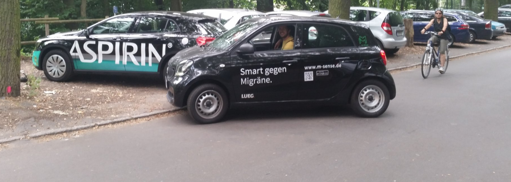

Genau einen Monat ist es her. Am 5. September, dem internationalen Kopfschmerztag, haben wir die erste zertifizierte Migräne-App für die Vorsorge und Behandlung von Migräne in den App-Store gestellt. Seitdem kann jeder umsonst die Migräne-App [»M-sense« herunterladen](https://play.google.com/store/apps/details?id=com.newsenselab.android.msense) und nutzen. Das haben auch schon viele gemacht. Zeit für ein Zwischenfazit.

## Wie es anfing mit unserer Migräne-App

Mit einem Innovations- und Technologietransfer-Projekt wurden wir staatlich gefördert. Das Bundesministeriums für Wirtschaft und Energie gab uns über das Förderprogramm EXIST an der Humboldt-Universität zu Berlin die Möglichkeit, die Migräne-App M-sense ein Jahr lang unabhängig und vom Grunde auf zu entwickeln. Basierend auf dem ersten Ideenpapier haben wir einen Businessplan erstellt, diesen bei einem nationalen [Wettbewerb für Medizinwirtschaft](https://scilogs.spektrum.de/graue-substanz/migraene-app-m-businessplan-wettbewerb/) eingereicht – und den ersten Platz gewonnen. Seitdem fahren wir mit einem gesponserten Smart forfour durch Berlin und treffen schon mal auf die klassische Konkurrenz.

Die eigentliche Migränetherapie ist auf dem Foto natürlich rechts zu sehen und im Hintergrund: Ausdauersport per Fahrrad und Entspannung am See. M-sense vereint alles: es trackt körperliche Aktivität, bietet Entspannungsübungen und man kann auch seinen Medikamentenkonsum im Auge behalten.

Ein Jahr Entwicklung ist nicht lang. Gerade genug Zeit für eine [Gebrauchstauglichkeitsstudie](https://scilogs.spektrum.de/graue-substanz/migraene-app-konzipieren-entwickeln-und-testen/) und eine [Feldstudie](https://scilogs.spektrum.de/graue-substanz/testzugang-fuer-migraeneapp/). Am internationalen Kopfschmerztag haben wir M-sense dann frei verfügbar gemacht für die dritte Studie, eine Citizen-Science-Studie.

## Die größte Migräne-Studie der Welt per App

Punktgenauer Start. Ist die App jetzt fertig? Nein, jetzt beginnt eine dritte Phase der Entwicklungsarbeit, die wir nicht allein durch Gebrauchstauglichkeits- und Feldstudien begleiten können, sondern im großen Rahmen die Nutzer fragen wollen. Es ist ein Citizen-Science-Ansatz.

M-sense genügte den Anforderungen und hatte die wesentlichen Eigenschaften, die wir für die erste öffentliche App sahen. Sie ist beispielsweise sehr gut getestet und als Medizinprodukt zugelassen. Wir haben genau auf die Anforderungen des Bundesministeriums für Gesundheit geachtet, die in der Studie „Chancen und Risiken von Gesundheits-Apps – CHARISMHA“ erarbeitet wurden. Schnell war klar, dass wir die Zulassung als Medizin-Produkt gemeinsam mit einem Partner vorantreiben und wurden deswegen Mitglied im Bundesverband Internetmedizin. Mit dem [Flying Health Incubator](https://flyinghealth.com/) haben wir einen weiteren perfekten Netzwerkpartner, der uns mit anderen hochinnovativen Startups zusammenbringt. Mit den Helios-Kliniken sind wir als Mitglied im [helios.hub](http://www.helios-hub.com/) vernetzt und mit der Kopfschmerzambulanz der Charité sowie dem Institut für Public Health der Charité haben wir weitere hervorragende medizinische Partner.

Doch der wichtigste Partner ist für uns der Nutzer. Oder besser die Nutzerin. Denn die meisten Nutzer sind Frauen. Jetzt beginnt die im Prinzip größte Migräne-Studie der Welt. Jede Nutzerin und jeder Nutzer kann uns über die App, ähnlich wie bei WhatsApp, Verbesserungen vorschlagen. Mit dieser Hilfe sind wir jetzt dabei, in kurzen Zyklen M-sense weiterzuentwickeln. Gleichzeitig analysiert M-sense im Hintergrund die ersten Migränemuster unserer Nutzer. Individuell werten wir für jeden ein Profil aus. Neben diesem Citizen-Science-Ansatz sind für 2017 klinische Studien geplant, in denen kontrolliert M-sense auf den Prüfstand kommt.

Wer mitmachen möchte: hier [geht’s zum Download](https://play.google.com/store/apps/details?id=com.newsenselab.android.msense).

##
