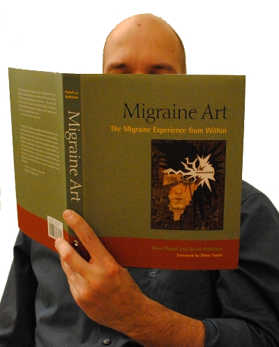
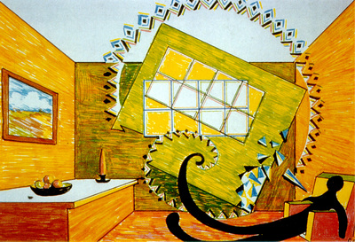
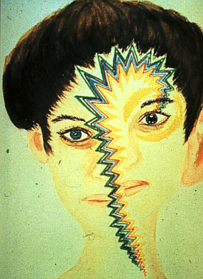
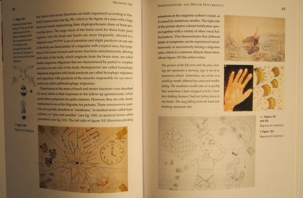
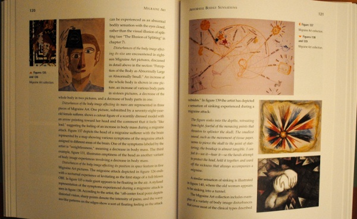
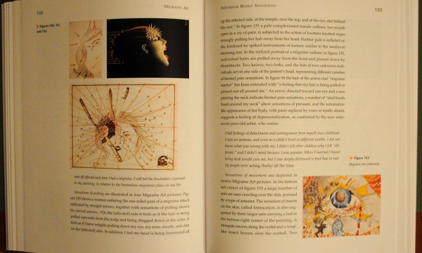

Meine letzter Beitrag "[Spiralwellen im Gehirn](http://www.brainlogs.de/blogs/blog/graue-substanz/2011-07-06/spiralwellen-im-gehirn)" konnte leicht missverstanden werden: Die dort gezeigte Spiralform einer Erregungswelle hat nichts mit den Spiralformen zu tun, die manchmal bei visuellen Halluzination während einer Migräne "gesehen" werden.

Das mögliche Missverständnis1 ist zwar leicht erklärt: die Abbildung der Welt durch unseren Sehapparat auf unserer Hirnrinde ist nicht wie die Projektion bei einem Fotoapparat. Doch das spezielle Problem der Herkunft der Spiralen – die übrigens nicht so häufig sind, wer so etwas sieht, mag sich bitte melden – also die Herkunft dieser Spiralen als Trugwahrnehmung hat eine mathematische Erklärung, die ich jetzt nicht (verständlich erklärt) aus dem Ärmel schütteln kann.2

**Migränekunst: Zugang zu einer anderen Welt**

Es gibt auch eine künstlerische Seite, die die Formenvielfalt im Sinnesraum thematisiert. Ich spreche von der [Migränekunst](http://www.migraine-aura.org/de/Migraenekunst.html) und deren Sammlung. Noch nie was davon gehört? Dann wird es Zeit.

Ich will hier nur mit ein paar Bildern auf ein ganz wunderbares Buch aufmerksam machen. Jeder, der meine Beiträge mit Interesse verfolgt, wird dieses Buch lieben, da bin ich sicher.

Ein kurzer Auszug von einer Website2 über das Migränekunst-Konzept, erklärt von Dr. med. Klaus Podoll, Mitautor des Buches:

> Auch wenn die Ursprünge des Konzepts sich bis auf die Neurologie des 19. Jahrhunderts zurückführen lassen, bedurfte es doch erst des inspirierenden Beispiels der Migränedarstellungen einer Kunstlehrerin, bevor Derek Robinson in den 1970er Jahren das Migränekunst-Konzept entwickelte, das als Grundlage der vier nationalen Migränekunst-Wettbewerbe und ähnlicher Wettbewerbe in Großbritannien und den USA diente. Die Ergebnisse dieser Wettbewerbe wurden der Öffentlichkeit in einer Reihe von Ausstellungen und Publikationen aus der Laien- und der medizinischen Fachpresse vorgestellt.

(Das Buch ist übrigens in Englisch verfasst.)

   
 Derek Robinson (links) mit Oliver Sacks (rechts) in Bracknell bei Boehringer Ingelheim Limited, November 1991. © 2011 Migraine Aura Foundation

Auf einigen Bildern sind nun auch die Spiralen zu sehen. Dieses Bild z.B. fand auch Einzug in das Buch von Oliver Sacks über Migräne.

  
 Migraine Art: Macrosomatognosia. © 2011 Migraine Action Association and Boehringer Ingelheim Limited

Hier ein anderes Beispiel.

  
 Entry to art contest Migraine Images, 1992. © 2011 GlaxoSmithKline

Es folgen noch ein paar Schnappschüsse des Buches. Schon nach kurzem Blättern wird mir klar, die Formenvielfalt der visuellen Halluzinationen bei Migräne ist unendliche viel reicher als die Formen der pathologischen Erregung in der Hirnrinde.

Ich denke Sie sehen, dass dieses Buch nicht nur reich illustriert ist sondern auch mit erklärenden Texten die Bilder begleitet. Und nun festhalten: ein Kunstbuch, 400 Seiten, immer mit hochwertigen Farbabbildungen und wissenschaftlicher Begleitung für ca. 26 Euro. Ohne Förderung durch die Pharmaindustrie. Kein Witz. Ein Wunder. [Hier Bestellen](http://www.amazon.de/Migraine-Art-Experience-Within/dp/1556436726/ref=sr_1_1?ie=UTF8&qid=1310187622&sr=1-1).

**Fußnoten**

1 Die Spiralwelle im [vorangegangen Beitrag](http://www.brainlogs.de/blogs/blog/graue-substanz/2011-07-06/spiralwellen-im-gehirn) war noch dazu in der Netzhaut nicht in der Hirnrinde. Allerdings diente die Netzhaut, wie der aufmerksame Leser wohl merkte, als Modell der Hirnrinde. In beiden sollten im Prinzip – Sie kennen Radio Eriwan? – gleiche neuronale Muster sich ausbilden. Würde ein Spirale in der Netzhaut bei Migräne entstehen (was gar nicht auszuschließen ist!), würden wir diese Störung auch als Spirale sehen. Kurzum, die Sache ist kompliziert.

2 Oder sind Sie vertraut mit der komplexen Darstellung der Cauchy-Riemannschen Differentialgleichungen? Nun gut, Sie haben bis hierher gelesen, dann also weiter: Bei einer konformen Abbildung vom Gesichtsfeld zum Cortex würde unsere kortikale Sehstärke, also die Anzahl der kortikalen Zellen, die visuelle Information von einen Bereich des Gesichtsfeldes bearbeiten, nicht von der Richtung abhängen, was eine vernünftige Annahme ist, genau wie die, dass alle Meridiane im Gesichtsfeld gleichberechtigt sind. Das sind zwei Symmetrieannahmen (konforme Abbildung und azimutale Symmetrie): so kommen wir nahtlos zum Logarithmus ergo Spiralen … ein anderes mal.

3 Diese Website betreibe ich gemeinsam mit Klaus Podoll, an seinem Projekt zur Migränekunst bin ich aber nicht weiter beteiligt, verfolge es jedoch mit großem Interesse.

**Link**

Kurze URL zum Beitrag

http://goo.gl/WOBSb
