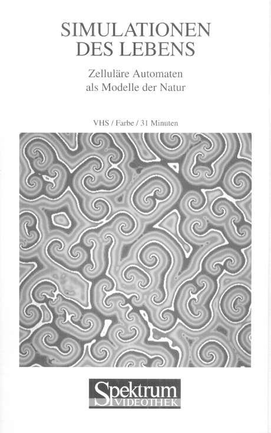
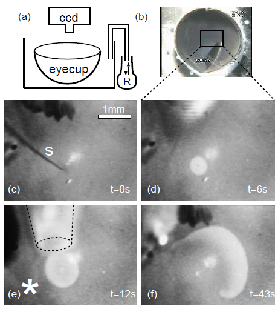
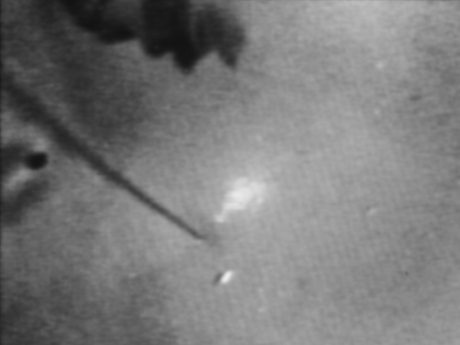
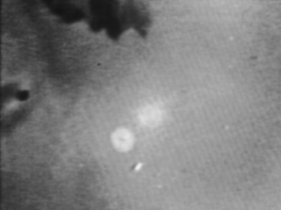
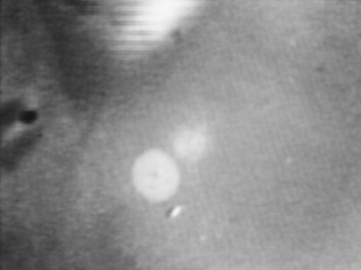
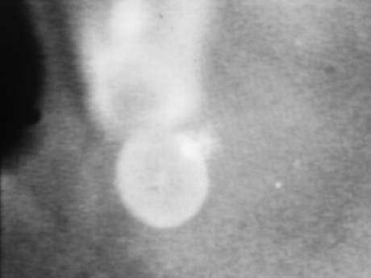
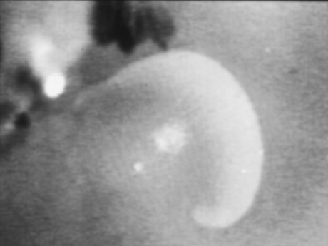

Heute Nachmittag auf der Konferenz [*Engineering of Chemical Complexity*](http://www.bcsccs.de/conference/), zeige ich zur Einleitung meines Vortrages diesen Film.

Was genau in diesem Film zu sehen ist, beschreibe ich unten. Zunächst zu seiner Geschichte. Dieser Film wurde 1993 von mir aufgenommen und stellt die Verbindung her zwischen meiner Forschung über Migräne und der Musterbildung in chemischen Systemen. Spiralwellen kennt man dort vor allem von der [Belousov-Zhabotinskii-Reaktion](http://de.wikipedia.org/wiki/Belousov-Zhabotinsky-Reaktion) in der Petrischale.

Dass Spiralwellen etwas mit Migräne zu tun haben, vermutete 1993 eigentlich kaum jemand, so dass es vier Jahre dauerte, den dazugehörigen Artikel 1997 in einem medizinischen Fachjournal zu veröffentlichen [1]. Wieder und wieder wurde er abgelehnt. Die Ironie ist, dass dieser Film dann zunächst 1995 in die Spektrum Videothek kam, in das Video "Simulationen des Lebens" (leider heute nicht mehr erhältlich). Aus dem Off kam zu diesem Filmausschnitt folgender Kommentar:

> Hier vermutet man einen Zusammenhang zwischen der Entstehung von Spiralen und dem Auftreten von Migräneanfällen.

Das war damals durchaus eine gewagte These. Aber es ist auch Aufgabe der Wissenschaftler, überprüfbare Vermutungen zu äußern, insbesondere wenn eine Vermutung gut begründet wird. Die Betonung im Zitat oben sollte übrigens auf dem Wort "Entstehung" liegen, heute würde ich es als "Keimbildung" bezeichnen, dazu später mehr.

Nun zum Film. Wer einmal live diese Erregungswelle im neuronalen Gewebe majestätisch langsam laufen sieht – der Film ist sogar in Zeitraffer, ca. viermal schneller als in Echtzeit gezeigt – der ist von diesem Phänomen gebannt: die *Spreading Depression*. Eine Erregungswelle gefolgt von einer zeitweisen Unterdrückung (Depression) aller Nervenaktivität, die etwa 10 000 langsamer fortschreitet als normale Kommunikation im Gehirn durch sogenannte Aktionspotentiale. Die Geschwindigkeit allein ist eine Besonderheit. Hinzu kommt die Spiralform.

Was also sieht man da so langsam und in ungewohnt geometrischer Form im Gehirn? In dem Film wird eine Spreading Depression-Welle in Spiralform in der Netzhaut eines Kükens gezeigt. Die Netzhaut gehört zum zentralen Nervensystem und ist neben der Groß- und Kleinhirnrinde die einzige in Schichten aufgebaute graue Substanz. Wobei grau ist sie gar nicht, sie ist durchsichtig. Das muss sie sein, denn die Rezeptoren liegen auf der Außenseite, so dass das Licht durch die ca. 0.3 Millimeter dicke Netzhaut hindurch muss und dies auch ungehindert kann.1

Teile der Rezeptoren sind in einer nahezu schwarzen Haut eingebettet, so dass der Hintergrund des Filmes dunkel ist. Wir gucken direkt auf, also eigentlich durch die Netzhaut hindurch mit einer CCD-Kamera. Dazu wurde vorab am Äquator der Augapfel geteilt, der Glaskörper entfernt und diese "eyecup"-Präparation in eine Nährlösung getaucht (s.u. (a)-(b)).

Im Film unten links bzw. in den folgenden Bildern (c)-(f) oben, fällt ein schwarzer länglicher Fleck auf, das Pecten oculi, eine Besonderheit der Vogelnetzhaut.2 Die Spreading Depression-Welle ist weiß, denn die Netzhaut verliert vorübergehend ihre Transparenz unter Einfluss dieser Erregungswelle und wird milchig. Das genau war der Grund warum diese Netzhaut-Präparation erfunden wurde – in Brasilien, wo die technischen Mittel in den Laboren begrenzt waren.

Um dieses Phänomen zu studieren kann man schlicht hingucken. Ein nicht zu unterschätzender Vorteil, den kaum ein anderes neuronales Phänomen bietet. Ein intrinsisches optisches Signal liefert genaue Aussagen über die langsame räumliche Ausbreitung, ob nun mit bloßen Auge oder eben einer Kamera beobachtet. Als ich damals Spreading Depression in meiner Diplomarbeit untersuchen wollte, lag die Entscheidung für diese Netzhaut-Präparation daher auf der Hand. Auch meine technischen Mittel und Fähigkeiten waren begrenzt, eigentlich Null, denn mehr als einen 2-tägigen Präparationskurs in einem anderen Labor und Geräte zur Beobachtung der oben erwähnten Belousov-Zhabotinskii-Reaktion in der Petrischale hatte ich nicht. Brasilianische Verhältnisse: es wird schon werden, dachte ich mir – "amanhã", wie man in Brasilien sagt; "morgen" kam nach zweieinhalb Jahren.

In der Bildsequenz oben ist nun gezeigt, wie die Spirale aus einer anfangs kreisrunden Welle erzeugt wird: (c) mechanische Stimulation mit einer spitzen Glasnadel, gekennzeichnet mit "S", (d) 6 Sekunden später sehen wir die kreisrunde Welle, die (e) nun aufgebrochen wird indem Mg2+ mittels einer Pipette am mit "\*" gekennzeichneten Ort appliziert wird. (f) Voilà.

Versuchen Sie mal ähnliches, also den Schritt (e), mit einer Wasser-, Schall- oder Lichtwelle. Es geht nicht. Das ist phänomenologisch der wesentliche Unterschied zu *Erregungs*wellen, die typischerweise Spiralen erzeugen, wenn sie aufgebrochen werden.

Hier die Bilder nochmal in groß und ohne Kennzeichnung.

Und warum untersuche ich diese Spiralen im Gehirn? Bei der Migräne, so meine Vermutung (s.o.), läuft eine Spreading Depression-Welle mit zwei offenen Enden, die sich aber – seltsamerweise – nicht zur Spirale aufwickeln. Verkürzt gesagt, erstickt die Erregungswelle im Keim durch eine Flaschenhals-Situation. Das, der Flaschenhals, war Thema meines [Eröffnungspost](http://www.brainlogs.de/blogs/blog/graue-substanz/2009-11-02/geist-einer-sattel-knoten-verzweigung), und die [abgewürgte Keimbildung im vorvorletzen Beitrag "Haben Mäuse Migräne?"](http://www.brainlogs.de/blogs/blog/graue-substanz/2011-06-21/haben-maeuse-migraene).

**Fußnoten**

1 Diese seltsame anmutende Konstruktion der Netzhaut macht auch den Blinden Fleck notwendig. Der Oktopus hat diesen angeblichen Designfehler nicht. Siehe auch "Lichtleiter in der Netzhaut" von Kristian Franz, Spektrum der Wissenschaft Oktober 2007.

2 Das Pecten ist wieder eine Besonderheit, die auch im Zusammenhang mit dem angeblichen Designfehler spannend zu diskutieren wäre.

**Literatur**

[1]  Dahlem MA, Müller SC. Self-induced splitting of spiral-shaped spreading depression waves in chicken retina. *Exp Brain Res.* **115**,319-324 (1997).

**Link**

Kurze URL zum Beitrag

http://goo.gl/o6tyO
