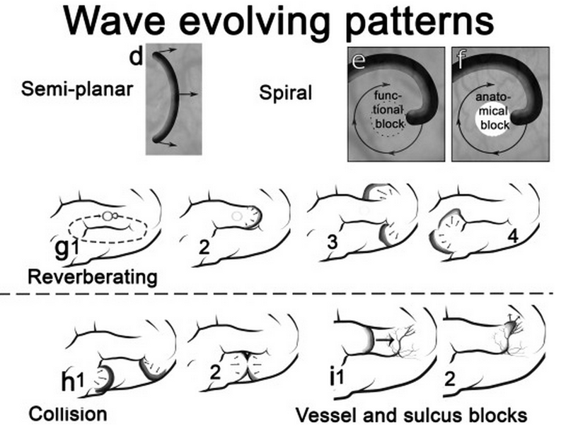

Wir haben eine [neue Veröffentlichung in *NeuroImage*](http://www.sciencedirect.com/science/article/pii/S1053811914003863). Wir beobachten erstmals Kreiswellen, Spiralwellen und nachhallende Wellen in der gekrümmten Großhirnrinde, eine Zusammenarbeit, die an der Universitätsklinik für Neurochirurgie Heidelberg durchgeführt wurde. Parallel dazu veröffentlichten wir Anfang Mai die [mathematische Beschreibung solcher Wellen in der gekrümmten Großhirnrinde](https://scilogs.spektrum.de/graue-substanz/das-gehirn-ist-ein-schwimmreifen/) im *New Journal of Physics*.

Vor genau 70 Jahren wurden sie entdeckt. Mit einem der allerersten Mehrkanal-Elektroenzephalografen und im ungekrümmten Hirn von Nagetieren beobachtete man majestetisch langsame Wellen. Bis heute blieb die Existenz und Form dieser Wellen in der gekrümmten äußeren Rinde des menschlichen Großhirns (Kortex) unklar.†

Die Schwierigkeit diese Wellen insbesondere beim Menschen zu beobachten rührt daher, dass sie langsam sind, sehr langsam. Um allein eine kleine Hirnwindung von nur 3 Zentimeter zu durchlaufen braucht sie 10 Minuten – viel zu langsam, um elektroenzephalographisch durch die Schädeldecke hindurch überhaupt messbar zu sein.\*

Der menschliche Kortex ist ca. einen viertel Quadratmeter groß. Diese langsamen Wellen können über eine Stunde brauchen um hindurchzuwandern. Schlimmer noch, die Wellen können wiederkehren, wie wir jetzt in der Zeitschrift NeuoImage zeigen (Santos et al., Radial, spiral and reverberating waves of spreading depolarization occur in the gyrencephalic brain. NeuroImage, Epub ahead of print) und so sich im Prinzip auch stundenlang aufhalten.

Die Existenz solcher Muster im Gehirn wurde immer wieder in Frage gestellt. Bei Schlaganfallpatienten konnten zwar ähnliche Muster als kurze einzelne Wellenpusle indirekt nachgewiesen werden. Es konnten Teils mehrer Dutzend solcher Wellenpulse über Tage und Wochen gemessen werden. Dessen genaue räumliche Wellenform insbesondere der Zusammenhang einzelner Wellenpulse in Form wiedergekehrter Wellenzüge in der gefalteten Rinde des Großhirns blieb jedoch völlig unklar.

Diese Wellen spielen nicht nur bei Schlaganfall eine bedeutende klinische Rolle sondern auch bei Migräne mit Aura, z.Z. arbeiten wir an einer Theorie, wie die [Wellenform mit dem Kopfschmerz zusammenhängen könnte](https://scilogs.spektrum.de/graue-substanz/kurzzeitige-muster-auf-der-grosshirnrinde/).

Im Juli veranstalten wir am [Fields Institute](https://de.wikipedia.org/wiki/Fields_Institute) (Toronto, Canada) eine [Serie von vier einwöchigen Workshops](http://www.fields.utoronto.ca/programs/scientific/14-15/neurovascular/index.html) über die verschiedenen Aspekte dieser langsamen Wellen im Gehirn.

## Fußnoten

† Spiralwellen in der Netzhaut ([hier](https://scilogs.spektrum.de/graue-substanz/spiralwellen-im-gehirn/)) sind schon länger bekannt.

\*Die Welle verursacht im Prinzip reine Gleichstrom-Potenziale (Frequenzen < 0.1Hz) die durch Störsignale aus den Hirnhäuten in diesem Frequenzbereich verdeckt bleiben.
