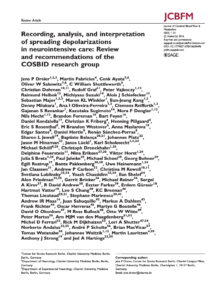
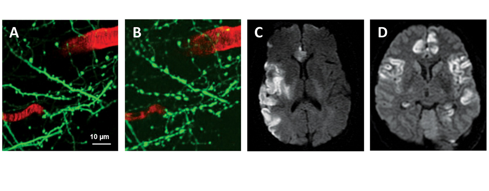
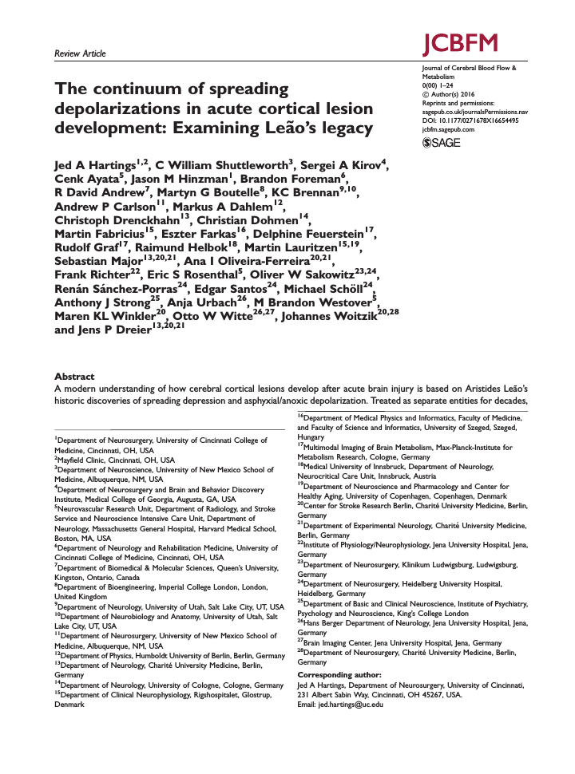
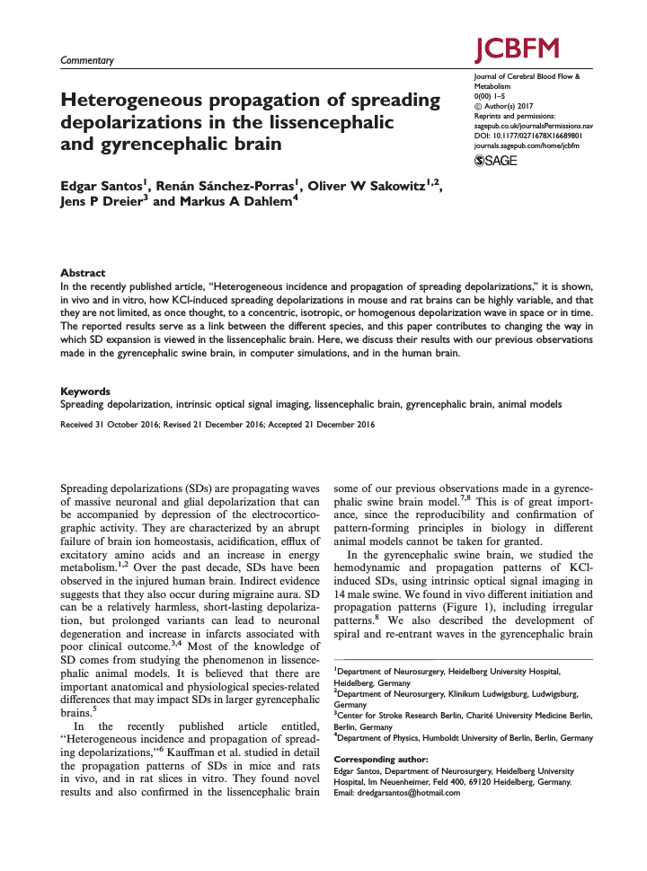
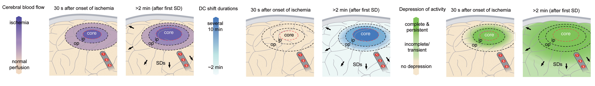
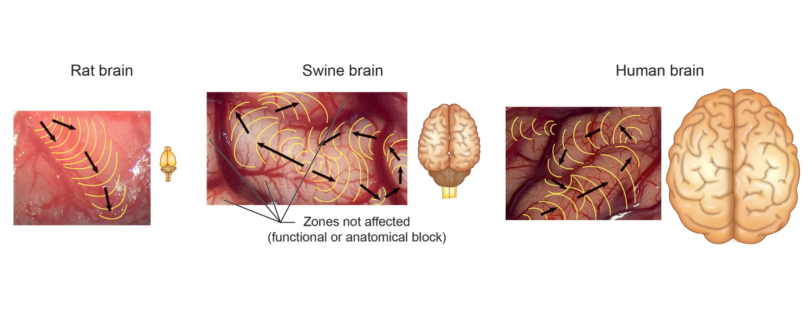

**Die *Spreading Depression* gilt als der wichtigste krankhafte Vorgang des Gehirns. Sie tritt bei Migräne genauso auf wie bei Schlaganfall oder einem Schädel-Hirn-Trauma. Lange blieb eine Frage offen: schützt das Phänomen das Nervengewebe oder ist es seine letzte Aktivität bevor es endgültig abstirbt? Zusammen mit fast hundert Kollegen haben wir drei aktuelle Fachpublikationen dieser Frage gewidmet.**

Unser Nervensystem hat zwei Arten von Erregungswellen hervorgebracht, eine mit der unser Gehirn seiner Tätigkeit nachgeht und eine, die die erste Art unterdrückt.

Aus der Schulbiologie ist weithin die erste Art bekannt: das »Aktionspotential«. Es ist ein schneller, elektrischer Nervenimpuls, der milliardenfach kreuz und quer durch unser Gehirn rast. Dazu nutzt er die länglichen Fortsätze der Zellkörper, die Nervenfasern, die Nervenzellen untereinander verbindet. So überträgt sich in steter Folge Aktivität von einer Zelle zur anderen. Das Aktionspotential gilt als die Grundlage aller vom Nervensystem gesteuerten und hervorgerufenen physiologischen und psychischen Prozesse, einschließlich unseres Denkens.

Die zweite Art einer laufenden Erregungswelle im Gehirn ist eine massive, elektrochemische Entladungswelle: die »Spreading Depression«. Im Vergleich zum Aktionspotential schreitet diese Welle extrem langsam voran, nur wenige Millimeter in einer Minute. Sie braucht dazu keine Fasern, sondern läuft einfach über die Zellkörper hinweg [durch den Raum zwischen den Gehirnzellen](https://scilogs.spektrum.de/graue-substanz/der-extrazellulaere-raum-die-letzte-grenze/).

## Rennwagen gegen Fußgänger: der Fußgänger gewinnt

Wäre das Aktionspotenzial ein Rennwagen, der mit über 200 Stundenkilometern eine Nervenfaser-Autobahn entlang rast, dann ist die Spreading Depression ein Fußgänger, der für jeden bedächtigen Schritt mehrere Sekunden braucht. Das ist majestätisch langsam. Und wie wenn ein König mit seinem Gefolge so langsam durch die Stadt schreitet und jeder andere Verkehr zum erliegen kommt, so ist auch im Gehirn jede andere Aktivität unterdrückt: Wo die Spreading Depression entlang schreitet, kann für Minuten kein Aktionspotential hindurchrasen. Es wird vollkommen still. Der Fußgänger hat den Rennwagen zum Stillstand gebracht.

So erklärt sich auch der Name des Phänomens. Die Art der Ausbreitung durch den Zwischenraum der Gehirnzellen und die Form der Unterdrückung anderer Aktivität sind einmalig. Zusammen führte es zu der Bezeichnung »Spreading Depression« – was direkt übersetzt in etwa »sich ausbreitende Unterdrückung« heißt aber als »Streudepolarisierung« übersetzt wird.

## Der Dominoeffekt beschreibt das wichtigste pathophysiologische Phänomen des Hirns

Um Spreading Depression zu verstehen, müssen wir zunächst die Gehirnmasse in ihre zwei Gewebeformen aufteilen: in die weiße und graue Substanz. Besteht die Gehirnmasse mehrheitlich aus den länglichen Fortsätzen, nennen wir das Gewebe weiße Substanz. Überwiegen die Zellkörper, ist es graue Substanz. Nur in der grauen Substanz kann sich die Spreading Depression ausbreiten. Sie braucht den Raum zwischen den Zellen. Wir können uns diesen Raum wie einen Schaum vorstellen mit den eingeschlossenen Luftblasen als die Zellkörper. In der weißen Substanz ohne die Zellkörper liegen die Fasern dich an dicht ohne größere Zwischenräume durch die hindurch die Spreading Depression sich fortpflanzen könnte.

Was geschieht nun in der grauen Substanz? Wir haben dieses Phänomen eingangs als massive, elektrochemische Entladung bezeichnet. Wir können uns diese Entladung wie einen aufrecht stehenden Dominostein vorstellen, der umfällt. Ob er umfällt, hängt natürlich davon ab, ob er Platz dazu hat. Steht ein Stein ganz dicht an dem nächsten und dieser wiederum dicht an seinem Nachbarn, dann steht das Ensemble stabil. Wir kennen natürlich auch den Dominoeffekt. Mit genau dem richtigen Zwischenraum kommt es zur Welle: ein Stein, der kippt, kippt den nächsten.

## Eine Störung im Milieu

Excitotoxizität: der Tod einer Nervenzelle durch Reizüberflutung.

Was entspricht der Lageenergie des aufrecht stehenden Dominosteins in der grauen Substanz? Eine Entladung in der grauen Substanz ist wie der kippende Dominostein ein Prozess, in dem sich ein Ungleichgewicht ausgleicht. Denn ganz ähnlich dem aufrecht stehenden Dominostein ist eine Gehirnzelle in einem Zustand, den wir in der Physik »metastabil« nennen. Stabil ist ein Dominostein nur, wenn er flach liegt. Metastabil heißt hingegen, störanfällig zu sein. Sehr kleine Änderungen werden gerade noch toleriert. Größere Änderungen führen schnell in ein Ungleichgewicht, aus dem es nur einen Weg gibt, nämlich das Umfallen in einen stabileren Zustand als den zuvor.

  
Welches Ungleichgewicht gleicht sich also bei Gehirnzellen aus? Im Inneren der Nervenzellen gibt es eine charakteristische  Zusammensetzung chemischer Stoffe; außen existiert eine andere chemische Stoffumgebung – das innere und äußere »Milieu«. Das Nervengewebe ist sehr darauf bedacht, die unterschiedliche Zusammensetzung außen und innen aufrechtzuerhalten.  Der Fachbegriff für die Aufrechterhaltung der ungleichen Stoffzusammensetzung heißt »Ionenhomöostase«. Im ersten unserer drei aktuellen Artikel1 schauen wir genauer auf diesen Prozess. Durch eine Reizüberflutung und andere Prozesse kann die Ionenhomöostase zusammenbrechen. Die wichtige Frage ist dabei, unter welchen Bedingungen erholt sich das Gewebe wieder und wann nicht mehr – werden die Dominostein wieder aufgebaut oder bleiben sie liegen?

## Von der Migräne über Schlaganfall zum Schädel-Hirn-Trauma, überall spielt die Spreading Depression eine Rolle

Bekannt ist das Phänomen schon seit über 70 Jahren. Doch die ersten 50 Jahre wurde es wenig beachtet. Als ich 1993 mein erstes Paper über die [experimentelle Beobachtung](https://scilogs.spektrum.de/graue-substanz/spiralwellen-im-gehirn/) spiralförmiger Spreading Depression-Wellen im zentralen Nervensystem zur Veröffentlichung einreichte, war der Kommentar eines Gutachters, dass Spreading Depression ein komplett künstliches Phänomen sei ohne klinische Relevanz. Heute sieht der Neurologe Jens Dreier das völlig anders. Er sieht die Spreading Depression als „[das mit weitem Abstand wichtigste pathophysiologische Phänomen des Hirns](http://nwg.glia.mdc-berlin.de/de/neuroforum/2009/4/)“ und es wird daher auch schon mal als „[Tsunami im Kopf](http://www.wissenschaft.de/archiv/-/journal_content/56/12054/1612813/Tsunami-im-Kopf/)“ beschrieben.

Im zweiten unserer drei neuen Fachartikel, der ebenso wie der oben schon erwähnte in der Fachzeitschrift “*Journal of Cerebral Blood Flow & Metabolism*” erschien, berichtet Jens Dreier zusammen mit insgesamt 90 Ko-Autoren als internationales Konsortium verschiedener klinischer, experimenteller und theoretischer Forschergruppen über das Auftreten und die Auswirkungen der Spreading Depression.2

## Spreading Depression: Fluch oder Segen für gefährdetes Hirngewebe?

Als wichtiges pathophysiologisches Phänomen des Gehirn wird die Spreading Depression angesehen, weil sie sowohl bei Migräneattacken auftritt, als auch bei Schlaganfall oder Hirnblutungen. Immer startet sie mit einer massiven Aktivität, eine Form der Reizüberflutung, die in einer absoluten Stille endet.

Die Migränewelle: Spreading Depression ist eine Welle, von der man lange dachte, sie umfließt den ganzen Hinterhauptpol des Gehirns. Neuste Forschungsergebnisse zeigen ein anderes Bild und bestätigen unsere Vorhersagen aus Computermodellen.

Bei Migräne beginnen wir gerade zu verstehen, wie es zu der anfänglichen Reizüberflutung kommt, die eine Spreading Depression auslöst. Das Migränegehirn scheint zyklisch in Phasen niedriger Widerstandskraft zu geraten, in denen das Milieu der Nervenzellen leichter umkippt. Kurz bevor des geschieht, ist das Gehirn äußerst empfindlich. Jeder Reiz wird verstärkt wahrgenommen. Betroffene werden licht-, lärm- und geruchsempfindlich sowie auch extrem wetterfühlig. Das sind mögliche Vorboten einer Spreading Depression, die im Zusammenhang mit Kopfschmerzen auch einfach [Migränewelle](http://www.spektrum.de/magazin/wie-migraeneauren-im-gehirn-entstehen/1369938) genannt wird.

## Teufelskreis durchbrechen

Die Existenz der Migränewelle stellt alte verhaltenstherapeutische Regeln in Frage. Lange galt es, Auslöser grundsätzlich zu vermeiden und ein regelmäßiges Leben zu führen. Für diesen Ansatz sind vermutlich weniger empirische Belege als die Freude an preußisch-protestantischen Tugenden verantwortlich. Heute wird in der Fachliteratur zurecht darauf hingewiesen, dass eine strikte Vermeidungsstrategie und die Aufforderung, nach der Uhr zu leben, selbst zum wesentlichen Stressfaktor wird, der bei Zeiten eine Überreaktion des Gehirns begünstigt. Wer sich hingegen in den Phasen hoher Widerstandsfähigkeit auch mal bewußt vermeintlichen Auslösern aussetzt, durchbricht den Teulfelskreis aus Schonung und zunehmender Überempfindlichkeit und es besteht die Hoffnung, so das Milieu der Nervenzellen stabiler zu halten.

Bei Schlaganfall und Hirnblutungen wird auch das Milieu der Zellen massiv gestört, wobei allerdings kein Teufelskreis die Ursache ist. Schlaganfall ist eine akute Durchblutungsstörung im Gehirn und Hirnblutungen entstehen durch das Einreißen einer Hirngefäßerweiterung oder durch eine schwere Schädel-Hirn-Verletzung infolge eines Unfalls.

Letztlich ist die Ursache der Störung im Milieu der Nervenzellen egal: immer entsteht eine Spreading Depression. Sie läuft los von der Störstelle und unterdrückt weitere Aktivität, was einem Schutz gleichkommt. Bei einem eingebluteten Infarkt umkreist sie allerdings das geschädigte Gewebe oft. Lange war unklar, ob sie dabei das umliegende, noch gesunde jedoch gefährdete Gewebe – das »*tissue at risk«* – nur schützt oder auch in den Infarkt treiben kann.

## Die Spreading Depression entzieht sich einer einfachen Beobachtung, Elektroden müssen direkt auf dem menschlichen Gehirn platziert werden

Das diese entscheidende Frage solange offen blieb, liegt daran, dass die Spreading Depression und ihre Auswirkung schwer nachzuweisen ist. Das sollte zunächst erstaunen, handelt es sich doch um die massivste Form einer Erregungswelle im Gehirn. Wellen im Gehirn werden eigentlich ganz leicht mittels der Elektroenzephalografie (EEG) nachgewiesen. Doch die Spreading Depression ist viel zu langsam, um sie mit einem konventionellen EEG nachzuweisen. Ähnlich wie eine Radarfalle den Rennwagen automatisch blitzt den Fußgänger aber übersieht.∗

Durch neue Ansätze in der neurochirurgischen und neurologischen Intensivmedizin konnte zunehmend und auf vielfältige Weise die Spreading Depression mit Elektroden, die direkt auf dem menschlichen Gehirn platziert werden, vermessen werden. Bei Migräne ist dieses invasive Vorgehen natürlich nicht möglich. Nur als ein Betroffener einmal vor einem Migräneanfall, während der sogenannten Auraphase, in einem Kernspintomographen lag, sahen wir sie – und eigentlich auch nur ihren Schatten.

Durch die neuen aufwendigen Messverfahren zeigte sich, dass die Spreading Depression für weit vom Infarkt entferntes Gewebe durchaus eine schützende Erholungszone bietet, nahe am Infarkt kann die massive, elektrochemische Entladungswelle jedoch auch ein letzter Aktivitätsaufschrei sein, bevor das schon beeinträchtigte Gewebe endgültig abstirbt.

## Entscheidend sind raumzeitliche Muster

In dem dritten Fachartikel beschreiben wir die experimentelle Methoden und die mathematische Modellbildung als Grundlage für die Interpretation der Erregungsmuster der Spreading Depression und illustrieren die Bedeutung unterschiedlicher Ausbreitungsmuster für die vielfältigen Erkrankungen, mit denen sie verbunden ist.

Ob die Spreading Depression also Fluch oder Segen ist, kommt darauf wo sie entlang läuft, welche Wege sie durch die graue Substanz des Gehirns nimmt und wie lange sie an einem Ort verweilt. Dieser raumzeitliche Verlauf der Spreading Depression erlaubt, wie wir heute wissen, eine Prognose über die Form des Versagens des Stoffwechsels des Gehirns sowie über den Tod der Nervenzellen durch andauernde Reizüberflutung aufgrund einer Hirnverletzung oder anderweitige Störung. Es gibt harmlose Formen der Spreading Depression bei einem nur begrenzt erhöhten Ernergiebedarf durch Reizüberflutung oder einer begrenzten Minderdurchblutung, wo sie innerhalb von Minuten auftritt und bis zu einer Stunde gegrenzt laufen kann ohne dabei Schaden anzurichten. Andere Formen entstehen und bestehen für viele Stunden bis Tage aufgrund von einer anhaltenden Fehlanpassung von Energiebedarf und Energieversorgung im Nervengewebe und dort kann es sowohl eine schützende als auch ein schädigende Wirkung geben.

Die zwei Arten von Gehirnwellen, das Aktionspotenzial und die Spreading Depression, in eine physiologische und eine pathologische Art einzuteilen wird also dem Phänomen der Spreading Depression nicht gerecht. Wir stehen erst am Anfang das therapeutische Potenzial dieser Gehirnwelle zu begreifen.

## Fußnoten und Literatur

1 Hartings, Jed A., et al. „The continuum of spreading depolarizations in acute cortical lesion development: examining Leao’s legacy.“ JCBFM (2016): 0271678X16654495.

2 Dreier, Jens P., et al. „Recording, analysis, and interpretation of spreading depolarizations in neurointensive care: review and recommendations of the COSBID research group.“ JCBFM (2016): 0271678X16654496.

3 Santos, Edgar, et al. „Heterogeneous propagation of spreading depolarizations in the lissencephalic and gyrencephalic brain.“ JCBFM (2017): 0271678X16689801.

∗ Sind elektrische Veränderungen sehr langsam, werden sie elektroenzephalographisch noch nicht erfasst. Hirnelektrische DC-(Gleichstrom)-Potenziale mit Frequenzen unter 0,5 Hz werden aus gutem Grund nicht aufgezeichnet. Sie sind kaum zu fassen wegen großer Störsignale in diesem Frequenzbereich. Spreading Depression würde etwa 0.05Hz im konventionellen EEG entsprechen. Eine Herausforderung für das Neuromonitoring.
