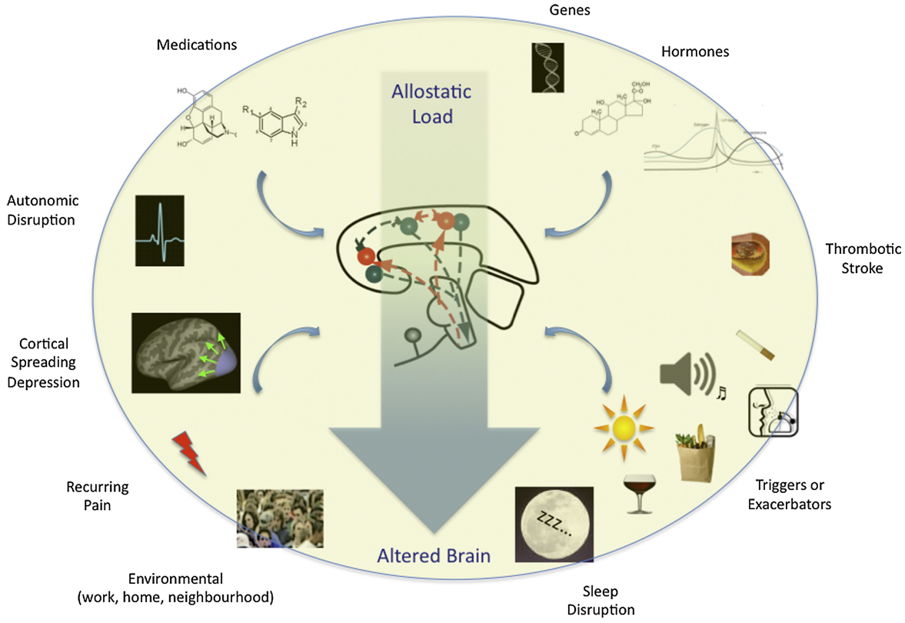

Hans Selye, der „Vater der Stressforschung“, erkannte vor fast 80 Jahren das Paradox: Unser Köper aktiviert durch Stress nicht nur physiologische Systeme, die ihn schützen, sondern auch solche, die ihn schädigen.

Um dem auf den Grund zu gehen, haben Forscher vor 30 Jahren ein Konzept entwickelt, das heute die moderne Stressforschung dominiert. Im Raum stand damals die Frage, wie der Mensch sich aufrecht hält, im wahrsten wie im übertragenen Sinne des Wortes. Wie hält sich der Körper trotz wechselnder Situationen, von stressigen zu entspannenden, in einem körperlich-mentalen Gleichgewicht? Peter Sterling und Joseph Eyer [1] sahen die Lösung in einer Analogie zur Homöostase und nannten dies Allostase. Dieses Konzept der Allostase wurde dann von Bruce McEwen in den letzten 30 Jahren prägend weiterentwickelt. Gestern berichtete McEwen auf dem 57. Jahrestreffen der amerikanischen Headache Society von seiner neusten Forschung [2-3].

## Ruhig Blut

Für mich bezeichnen Allostase und Homöostase im wesentliche das gleiche. Zumindest in der mathematischen Modellbildung solcher dynamischen Systeme bräuchte man kein neues Wort. Die Homöostase beschreibt beispielsweise, wie der Körper seine Temperatur recht konstant bei 36°C hält, trotz wechselnder Umweltbedingungen. Die Allostase beschreibt, wie der Körper sein Verhalten reguliert, wie er zum Beispiel immer eine adäquate Handlungsbereitschaft entwickelt, trotz wechselnden Problemsituationen.

Während sich also die Homöostase allein auf biologische Zustandsgrößen bezieht, die man Zellen, Organen und dem ganzen Körper zuschreiben kann (Beispiele wären das Membranpotential, der Blutdruck bzw. die Körpertemperatur), berücksichtigt man in der Allostase zusätzlich zu all diesen physiologischen Zuständen noch das Mentale. Denn das Gehirn – nein der Mensch muss Stress ja erstmal als solchen wahrnehmen. Hier liegt die Crux. Diese Wahrnehmung wird nicht allein durch physiologische Faktoren beeinflusst, sondern auch durch die eigene Erfahrungen und das eigene Verhalten.

## Stress verschleißt das Gehirn bei Migräne

Ein Beispiel: ob wir mit erhöhten Herzschlag und Blutdruck auf ein Problem reagieren, ist eine Frage der Allostase nicht der Homöostase – wenn man denn diese Unterscheidung formal einführen will. Neben der physiologischen Reaktion nimmt auch die Verhaltensreaktion Einfluss. Bei wiederholten Stress kommt es zur Anpassung. Diese Anpassung kann, wie der Vater der Stressforschung erkannte, den Körper schützen oder schädigen. Eine chronische Überbelastung schädigt den Köper und diese Art der Verschleißerscheinung nennt McEwen die allostatische Last [4].

McEwen hat nun die allostatische Last bei Migräne untersucht [2,3] und seine Forschung auf dem 57. Jahrestreffen der amerikanischen Headache Society vorgestellt. Das allein ist bemerkenswert. McEwen wendet sich mit Mitte 70 am Ende seiner wissenschaftlichen Karriere, die er wie zuvor Hans Selye ganz der Stressforschung widmete, der Migräneforschung zu.

## Was trägt zum Verschleiß bei?

Im Laufe der Zeit sammelt sich bei Migräne die allostatische Last nicht allein durch wiederkehrende Schmerzattacken an. Viele weitere Faktoren spielen zusammen. Die Lichtblitze, Sehstörungen und andere Wahrnehmungsstörungen während der Migräneaura, verursacht durch die Migränewelle (Cortical Spreading Depression genannt), erhöhen die allostatische Last genau wie Störungen im Schlafverhalten oder Licht-, Geruchs- und Lärmempfindlichkeit in der Vorbotenphase, die Medikation und weitere Faktoren.

Entnommen aus Ref. [2] (open access). Copyright © 2012 Elsevier Inc.

Die allostatische Last verändert langfrisitig Gehirnstrukturen über verschiedene neuronale Mediatoren, Hormone und [neuerdings auch über das Immunsystem](https://scilogs.spektrum.de/graue-substanz/immunsystem-gehirn-und-kopfschmerzen/). Damit verringert sich die Widerstandsfähigheit (“Resilienz”) und das Migränegehirn nähert sich einem Kipppunkt. In diesem Rahmen lässt sich zumindest eine Theorie präzise mathematisch formulieren und damit [Vorhersagen ableiten](https://scilogs.spektrum.de/graue-substanz/was-bedeutet-ein-migraenegehirn-kippt/).

Bei Migräne zeigt McEwen konkret, dass der Hippocampus mit zunehmender Anzahl der Attacken schrumpft und es im Zusammenspiel mit anderen Hirnregionen zu einer Fehlregulierung kommt. Der Hippocampus ist eine zentrale Schaltstation des limbischen Systems und beteiligt an der emotionalen Einfärbung von Schmerz und Stress.

## Was hilft?

Die entscheidende Frage ist, ob diese Vorgänge rückgängig gemacht werden können?

Soll man jeden Stress nun meiden? Das hieße ja, allein zu viel Stress ist schlecht für den Verlauf der Migräneerkrankung. Das scheint aber falsch zu sein. Auch zu wenig Stress kann schlecht sein und Bruce McEwen bezieht sich bei seinem Vortag auf das [Yerkes-Dodson-Gesetz](https://de.wikipedia.org/wiki/Yerkes-Dodson-Gesetz). Bei Unterforderung fällt das nervöse Erregungsniveau so weit ab, dass ein „Leistungsleck“ wieder schädigend sein kann. Damit erklärt er, dass der „Sweet Spot“ in der Mitte liegt.

https://twitter.com/ahsheadache/status/611991186442711040

Auf einer weiteren Folie seines Vortrages (unten gezeigt) gibt er auch drei konkrete Handlungsweisen:

* regelmäßiger Sport treiben,
* Achtsamkeitsbasierte Stressreduktion, (Mindfulness-Based Stress Reduction – MBSR) und
* soziale Unterstützung und Integration suchen, die einen ausgeglichenen Gemütszustand ermöglichen,

sind für McEwen die richtigen Wege der Intervention. Das heißt, Stress nicht einfach passiv meiden, sondern aktiv begegnen.

https://twitter.com/ihs\_official/status/611998627855245313

## Literatur

[1] Sterling, P., & Eyer, J. (1988). Allostasis: a new paradigm to explain arousal pathology. In Fisher, S.; Reason, J. T. Handbook of life stress, cognition, and health. John Wiley & Sons.

[2] Borsook, D., Maleki, N., Becerra, L., & McEwen, B. (2012). Understanding migraine through the lens of maladaptive stress responses: a model disease of allostatic load. Neuron, 73(2), 219-234. ([open access](http://dx.doi.org/10.1016/j.neuron.2012.01.001))

[3] Maleki, N., Becerra, L., Brawn, J., McEwen, B., Burstein, R., & Borsook, D. (2013). Common hippocampal structural and functional changes in migraine. Brain Structure and Function, 218(4), 903-912. ([open access](http://www.ncbi.nlm.nih.gov/pmc/articles/PMC3711530/))

[4] McEwen, B. S., & Stellar, E. (1993). Stress and the individual: mechanisms leading to disease. Archives of internal medicine, 153(18), 2093-2101.

## Bildquelle

Vorschaubild: [Images on Pixabay, Creative Commons Deed CC0](https://pixabay.com/en/stress-relaxation-relax-voltage-391654/).
