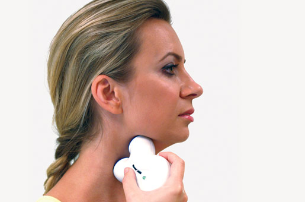

Neuromodulation ist eine Therapieform, die krankhafte Aktivität des Nervensystems gezielt  
korrigiert und dazu neurotechnologische Verfahren einsetzt. Da praktisch alle Organe und Körperfunktionen durch neuronale Schaltkreise reguliert werden, sind Anwendungsgebiete entsprechend weitreichend. Man spricht auch von Elektrozeutika.

Aktuell entnehmen wir diese Woche dem Internet, dass zwei Elektrozeutika gegen Migräne auf dem Vormarsch sind. Der GammaCore-Stimulator hat bisher nur für klinische Studien eine Zulassung. Aktuell gibt es ein interessantes Interview über diese [nichtinvasive Vagusnervstimulation im Deutschlandfunk](http://www.deutschlandfunk.de/schmerztherapie-stromimpulse-gegen-migraene.709.de.html?dram:article_id=316349).

Bild: der GammaCore-Stimulator, über den im DLF geredet wird (mit freundlicher Genehmigung, © electroCore LLC).

Der Hersteller des Spring-TMS™, ein weiterer tragbarer Neurostimulator, der magnetische Felder durch die Schädeldecke sendet, bekommt eine [Finanzspritze von knapp 15 Millionen Euro, verbunden mit einer Kaufoption für etwas über 60 Millionen Euro](http://www.baltimoresun.com/business/bs-bz-eneura-20150406-story.html).

Diese beiden Geräte liegen an den entgegengesetzten Enden des Spektrums nichtinvasiver Stimulationsverfahren. Einmal wird das periphere Nervensystem beeinflusst, einmal das zentrale. Einmal wird Strom genutzt, einmal Magnetfelder. Zur Zeit werden vier bis fünf ernst zunehmende nichtinvasive Neurostimulatoren gegen Migräne in klinischen Studien getestet und sind teilweise auch schon auf dem Markt erhältlich. Hinzu kommen Implantate. Oft gelten die nichtinvasiven Neurostimulatoren als Testverfahren, um besser abzuschätzen, ob später ein Implantat helfen könnte.

Neuromodulation ist ein [erstaunlich rasant wachsender Markt](https://scilogs.spektrum.de/graue-substanz/von-elektrozeutika-electrx/). Noch 2011 kam die Deutsche Migräne- und Kopfschmerz-Gesellschaft in ihren Therapieempfehlungen über den Einsatz neuromodulierender Verfahren bei primären Kopfschmerzen zu dem Fazit, dass für die meisten Kopfschmerzarten und Stimulationsverfahren derzeit überzeugende Daten, die auf einen Therapieerfolg hinweisen, fehlen1. Die Lage ist heute noch nicht wirklich überzeugender. Immer noch fehlen Daten. Gleichzeitig wird an immer neuen Verfahren gearbeitet und viel Geld investiert.

## Offenlegung

Ich war 2013 beratend für eNeura Therapeutics LLC, die Herstellerfirma des Spring-TMS™, tätig. Aktuell forsche ich an [personalisierten Stimulationsverfahren](https://scilogs.spektrum.de/graue-substanz/fingerabdruck-der-migraenewelle/) und stehe mit beiden, im Beitrag genannten Firmen in Kontakt über mögliche Forschungskooperationen.

## Literatur

1Jürgens, T., Paulus, W., Tronnier, V., Gaul, C., Lampl, C., Gantenbein, A., … & Diener, H. C. (2011). Einsatz neuromodulierender Verfahren bei primären Kopfschmerzen. Nervenheilkunde, 30, 47-58.
