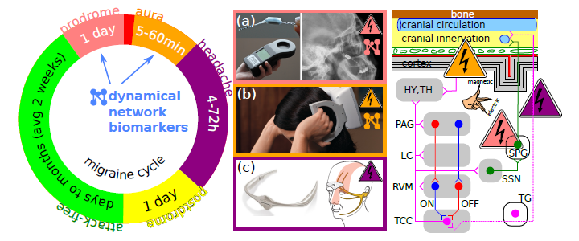

Die elektrische und magnetische Stimulation des Gehirns (Neuromodulation) muss weg von der auf Zufall basierenden Suche nach geeigneten Stimulationsprotokollen hin zu einem systemischen Ansatz, der Methoden aus drei Bereichen integriet: Computational Neuroscience, Kontrolltheorie und nichtlineare Dynamik.  Wir entwarfen eine Road Map für die nächste Generation nicht-medikamentöser Behandlung der Migräne in einer neuen Veröffentlichung ([*Translational Neuroscience* 2013, open access](http://www.ncbi.nlm.nih.gov/pubmed/24288590)).

Konkret schlagen wir zur Umsetzung dieser Road Map vor, das neue Konzept der dynamischen Netzwerk-Biomarker als Frühwarnsystem auf episodische Erkrankungen zu Übertragen und dann für eine neue Generation der Neuromodulation zu nutzen.

Road Map der dynamischen Netzwerk-Biomarker als Frühwarnsystem für Migräne und zur Identifikation anfallsgenerierender Mechanismen in Subnetzwerken.

## Was ist ein dynamischer Netzwerk-Biomarker (DNB)?

Ein DNB ist ähnlich zu traditionellen Biomarkern ein spezifisches und messbares Signal von unserem Körper, das als Indikator einer bestimmten Erkrankung herangezogen werden kann. Im Unterschied zu den traditionellen, statischen Biomarkern treten DNB allerdings nur vorübergehend während bestimmter Übergänge auf. Die Übergänge müssen durch [Kipp-Punkte](https://scilogs.spektrum.de/graue-substanz/kipp-punkte-im-gehirnklima/) verursacht werden.

Folgender Auszug aus einem Abstract ([Med Res Rev. 2013](http://www.ncbi.nlm.nih.gov/pubmed/23775602)) beschreibt die Anwendung von DNB:

> Based on nonlinear dynamical theory and complex network theory, a new concept of dynamical network biomarkers (DNBs, or a dynamical network of biomarkers) has been developed, which is different from traditional static approaches, and the DNB is able to distinguish a predisease state from normal and disease states by even a small number of samples, and therefore has great potential to achieve “real” early diagnosis of complex diseases. In this paper, we comprehensively review the recent advances and developments on molecular biomarkers, network biomarkers, and DNBs in particular, focusing on the biomarkers for early diagnosis of complex diseases considering a small number of samples and high-throughput data (or big data).

Zusammengefasst übersetzt: Basierend auf nichtlinearer Dynamik und komplexer Netzwerktheorie wurde ein neues Konzept der dynamischen Netzwerk-Biomarker (DBN) entwickelt. Diese DNB heben sich von traditionell statischen Ansätzen ab, weil sie in der Lage sind, einen Zustand der Vorerkrankung von Normal-und Krankheitszuständen zu unterscheiden, und das sogar mit einer kleinen Anzahl von Proben, worin ein großes Potenzial für „echte“ Frühdiagnose komplexer Erkrankungen gesehen wird.

Das Konzept der dynamischen Netzwerk-Biomarker kann auf episodische Erkrankungen übertragen werden. Statt der Frühdiagnose einer Vorerkrankung sollen in diesem Fall die Anfälle im Migränezyklus vorhersagt werden. Und nicht nur das, die DNB liefern dabei evtl. auch entscheidende Informationen über die anfallsgenerierenden Mechanismen. Soweit die Road Map.

## Der Migränezykuls

Das Krankheitsbild der Migräne ist gekennzeichnet durch plötzliche und wiederkehrenden Episoden mit Kopfschmerzen. Ein bevorstehender Übergang in eine solche Episode wird sich dabei oft durch ein oder sogar zwei zweitlich getrennte Phasen ankündigen, nämlich der Vorbotenphase (Prodrom) und der Auraphase.

In der Vorbotenphase treten recht subtile Symptome auf, z. B. extremes Gähnen, und diese Phase geht der Schmerzphase etwa 1 Tag voraus. In der Auraphase treten verschiedenen [sensorischen und kognitive Störungen](https://scilogs.spektrum.de/graue-substanz/vielfalt-trotz-einheit-fehlfunktionen-des-gehirns/) auf, die 5 Minuten bis zu 1 Stunde dauern und direkt vor oder auch überlappend mit der Kopfschmerzphase verlaufen. Die eigentliche Kopfschmerzphase kann wiederum in der Regel bis zu 3 Tage dauern und löst sich in einer Rückbildungphase (Postdrom) auf.

Die neuronalen Korrelate, die an diesen Übergängen in die Kopfschmerzphase beteiligt sind und die sehr wahrscheinlich die anfallsgenerierenden Mechanismen sind, sind bisher noch schlecht verstanden. Hier kann uns nun zu Gute kommen, das bestimmte Übergänge charakteristische Signale in Teil- oder Subnetzwerken erzeugen. Diese Signale sind genau das, was wir als dynamischen Netzwerk-Biomarker bezeichnen. Mit bestimmten Übergängen sind solche durch [Kipp-Punkte](https://scilogs.spektrum.de/graue-substanz/kipp-punkte-im-gehirnklima/) gemeint. In der Tat fanden wir in früheren Arbeiten solch ein Kipp-Punkt-Verhalten, sowohl [mit nichtinvasiver Bildgebung](https://scilogs.spektrum.de/graue-substanz/migraenewellen/) als auch im [mathematischen Modell](https://scilogs.spektrum.de/graue-substanz/mathematische-modellierung/).

Die Umsetzung unserer Road Map sieht dementsprechend zweierlei vor: das Konzept der dynamischen Netzwerk-Biomarker wird nicht allein als Frühwarnsystem auf episodische Erkrankungen übertragen sondern soll helfen, die anfallsgenerierenden Subnetzwerke zu identifizieren. Vereint kann beides zu einer neue Generation der Neuromodulation führen.

