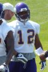
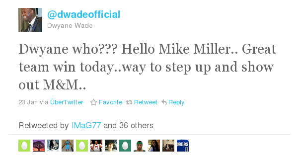
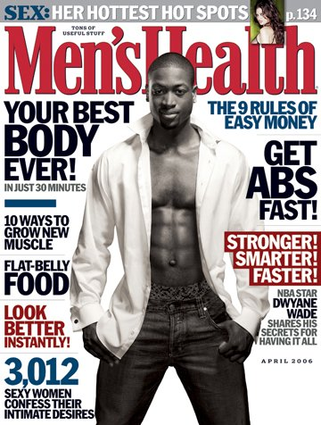

Was taugen eigentlich kostenlose Online-Übersetzungsprogramme wie [*Google Translate*](http://translate.google.com/)? Gerade veröffentlichte ich in [Gray Matters](http://www.scilogs.eu/en/blog/gray-matters/2011-01-28/superheros-fight-migraines-wearing-dark-goggles-and-calvin-klein-underwear) einen Beitrag, den ich gerne auch hier veröffentlichen würde. Leider ist die Übersetzung viel Arbeit. Also versuchte ich mein Glück – ingesamt mit mäßigem Erfolg. Jedoch sind einige Passagen gelungen und im ganzen ist der Text wahrscheinlich sogar verständlich. Aber in erster Linie überwiegt der Spaß des Vergleichens. Die getönte Brille und Unterwäsche von Calvin Klein sind übrigens keine Übersetzungsfehler. Ich empfehle aber zum besseren Verständis und natürlich auch für die Bewertung des Übersetzungsprogramms den englischen [Originaltext](http://www.scilogs.eu/en/blog/gray-matters/2011-01-28/superheros-fight-migraines-wearing-dark-goggles-and-calvin-klein-underwear).

**  *Fighting Migräne beginnt mit Bewusstsein*

Los gehts:

### Superheros Kampf Migräne mit getönter Brille und Unterwäsche von Calvin Klein

**Migräne in den USA Sportnachrichten-eine gute Gelegenheit, das Bewusstsein über diese Volkskrankheit.** **Eine Chance verpasst für deutsche Spieler, die peinlich wirken zu gestehen, dass sie leiden unter dieser Erkrankung.**  

Jede zweite Woche las ich in der Sport-Nachrichten über Spieler fehlen ein Spiel wegen einer Migräne.

 Zum Beispiel November letzten Jahres die NYT berichtet in seinem Sportteil, dass Percy Harvin, ein American Football-Empfänger (Minnesota Vikings) [Praxis verpasste](http://translate.googleusercontent.com/translate_c?hl=en&sl=en&tl=de&u=http://www.nytimes.com/2010/11/12/sports/football/12nfl.html%3Fsrc%3Dtptw&rurl=translate.google.com&twu=1&usg=ALkJrhjTVkP-H9MrpoMwt8l0aQ2-N3w4sQ) zwei Tage lang wegen einer Migräne. Im gleichen Monat, las ich, dass ein anderer Spieler nicht nur Migräne, aber auch andere Symptome Migräne bekam als Folge einer Sportverletzung. Eric Shelton, eine American Football Laufen zurück, erlitt eine [Helm-zu-Helm Kollision](http://translate.googleusercontent.com/translate_c?hl=en&sl=en&tl=de&u=http://www.nytimes.com/2010/11/30/sports/football/30helmets.html&rurl=translate.google.com&twu=1&usg=ALkJrhipREK1_BrMWVmZ-IuUnDDXR8MoKg) und verlor jegliches Gefühl in den Extremitäten eine Minute lang, eine mögliche Migräne Symptom. Am nächsten Tag war er taub von der Taille abwärts. Dies könnte eine der möglichen Symptome auftreten in der Auflösung und Wiederherstellung Stufe einer Migräne-Attacke werden. Weiterhin als Folge dieser Verletzung hat Shelton nicht gelungen, für einige Zeit wegen der Migräne-Kopfschmerzen, die Arbeit fort.

Vor ein paar Tagen lass ich, dass Dwyane Wade, ein Basketballspieler (Miami Heat), [Spiel verpasst](http://translate.googleusercontent.com/translate_c?hl=en&sl=en&tl=de&u=http://www.nytimes.com/2011/01/24/sports/basketball/24heat.html%3Fsrc%3Dtptw&rurl=translate.google.com&twu=1&usg=ALkJrhj4fSUC86G1vfNa3okYAUuBuzhdlw) zu Hause mit einer Migräne. Sein Teamkollege Mike Miller könnte ausnutzen und erzielte 32 Punkte. Wade [zwitscherte](http://translate.googleusercontent.com/translate_c?hl=en&sl=en&tl=de&u=http://twitter.com/&rurl=translate.google.com&twu=1&usg=ALkJrhgAEZENvekIWiZzQLE8DTO7Kj8dCA#%21/dwadeofficial/status/29038294884950016):

   
 [Übersetzt wird das mit Google Translate als: "Dwyane wer?? Hallo Mike Miller .. Große Team gewinnen heute .. Weise zu intensivieren und zu zeigen, die M & M.."]

Dwyane Wade zu sein scheint offen über seine Krankheit und kann Witze über fehlen ein Spiel zu machen. Dies wirft geraumer Sensibilisierung der Öffentlichkeit für Migräne. Es gibt viele Zugriffe auf Twitter, wenn Sie nach "[Dwyane Wade Migräne](http://translate.googleusercontent.com/translate_c?hl=en&sl=auto&tl=de&u=http://twitter.com/&rurl=translate.google.com&twu=1&usg=ALkJrhgIYA9yGla463hqmQZTm8IEbHUXhA#%21/search/Dwyane%20Wade%20migraine)" mit verschiedenen Links zu den vollständigen Geschichte (mehr zu diesem Thema lesen Sie unten). Google findet 283 000 Treffer für "[Dwyane Wade und Migräne](http://translate.googleusercontent.com/translate_c?hl=en&sl=auto&tl=de&u=http://www.google.com/webhp%3Fhl%3Den&rurl=translate.google.com&twu=1&usg=ALkJrhhyb8NBPCUgDGDNPK2jRW3-zenaDQ#hl=en&sugexp=ldymls&xhr=t&q=+Dwyane+Wade+migraine&cp=21&qe=IER3eWFuZSBXYWRlIG1pZ3JhaW5l&qesig=-_ZUJNN_ZrqSNevd82spMA&pkc=AFgZ2tn8HuroOi5Fdsj43deIYws1GqLpq5wu_d96TkVFJqH8HoJIMAl-4fyuIvNuHwTyGN_EjLdQkmuX047Q3ZLC8D6b6dxbjQ&pf=p&sclient=psy&site=webhp&source=hp&aq=f&aqi=&aql=&oq=+Dwyane+Wade+migraine&pbx=1&fp=4cbc8d205de993a2)".

Warum muss ich noch nie gelesen Migräne in der deutschen Sportnachrichten? Wo sind die deutschen Fußball (Fußball, das ist) Spieler unter Migräne leiden?  Sind sie verstecken ihre Krankheit?  Eigentlich machte Freddie Ljungberg, ein schwedischer Fußballspieler und-auch ein Modell für Calvin Klein Unterwäsche-it in den deutschen Nachrichten mit seiner Migräne. Ljungberg [musste der Bereich durchgeführt werden aus](http://translate.googleusercontent.com/translate_c?hl=en&sl=en&tl=de&u=http://www.spiegel.de/sport/fussball/0,1518,639295,00.html&rurl=translate.google.com&twu=1&usg=ALkJrhhK5IUK0u44UCF2mX0sR8tMYdGLWQ) nach einer Migräne-Attacke, *Spiegel* berichtete im Jahr 2009. Er klagte über einen Verlust der Sehkraft und wurde in ein örtliches Krankenhaus zur Auswertung transportiert.  Doch bei dieser Veranstaltung Ljungberg war Kapitän der 2009 All-Star-Team der US Major League Soccer. Er spielte nicht mehr in Europa. Erst im vergangenen Dezember zurück Ljungberg und schloss sich dem schottischen Premier League-Klub Celtic.

Nicht ein einziger Spieler aus der deutschen Bundesliga (Deutschland die höchste Fußball-Liga Verein) leidet offiziell an Migräne, soweit ich weiß. Bitte korrigieren Sie mich, wenn ich mich irre.

Während in den USA, endlich einige Spieler der Praxis eine eher offene Politik in Deutschland scheint es eine Mauer des Schweigens werden.

**Die Migräne Superhelden**

  
 *Dwyane Wade ist der erste NBA-Spieler, der auf dem Cover der* Men’s Health *(April-Ausgabe 2006)*

Dwyane Wade [spielte ein Spiel gestern](http://translate.googleusercontent.com/translate_c?hl=en&sl=en&tl=de&u=http://www.nytimes.com/2011/01/28/sports/basketball/28knick.html%3Fsrc%3Dtptw&rurl=translate.google.com&twu=1&usg=ALkJrhga21pKxor04t1GbJyyxyK3-gir2w). Er trug eine Schutzbrille, um das Licht in der Arena zu begegnen. Für viele Migränepatienten Licht kann ein Auslöser sein.

"Er wie ein Superheld für mich sah", seinem Teamkollegen Landry Fields sagte. Und für die ersten drei Viertel spielte er wie einer. Erst im vierten Quartal verfehlte er alle seine sieben Schüsse. Aber es gab [ein weiteres Problem](http://translate.googleusercontent.com/translate_c?hl=en&sl=en&tl=de&u=http://www.nytimes.com/2011/01/28/sports/basketball/28allstar.html%3Fsrc%3Dtptw&rurl=translate.google.com&twu=1&usg=ALkJrhirKWjeCIlM0VqzPE9Fgr5jLwnkrg) mit getönten Brille Wade.  Die Verteidiger haben nicht vermocht, Wade Augen sehen, weil die Linsen waren zu dunkel. "Es goggle-Tor, der" seinem Trainer Erik Spoelstra kommentierte scherzhaft.

Ich rufe all diese Geschichten auch eine gute Nachricht und gute Wissenschaft Geschichten. Überlegen Sie, was Sie gerade gelernt, über Migräne als Krankheit. Die Menschen können sich Taubheit, akute Verlust des Sehvermögens und sie sind sehr lichtempfindlich sogar nach einem Angriff. Und die Menschen verlieren Arbeit Tage, egal was passiert. Sie werden sich erinnern, dass. Es gibt jetzt weniger Raum für Vorurteile, wie Migräne Darstellung Fälschung. So *Dwyane wer??* Ja, Dwyane ist ein Superheld kämpft Migräne, einer Krankheit, die Kopfschmerzen ist bei weitem nicht alle über. 

Wenn wir lesen solche Geschichten in den Sportteil einer deutschen Zeitung oder seiner Wissenschaft Abschnitt für diese Angelegenheit?

**Nachtrag**

Die NBA gab Wade für das All-Star Team zum siebten Mal in seinen acht Spielzeiten bei Miami. Er hat einen Dankeschön-Nachricht an die 2 Millionen Fans, die Spiel wählten ihn in die NBA All-Star über [facebook](http://www.facebook.com/dwyanewade). Mein Glückwunsch!

**Bilder**

Percy Harvin aus Wikipedia: CC-BY-SA-2.5

Freddie Ljungberg aus Wikipedia: CC-BY-2.0.

**Link** 

Kurze URL zu diesem Beitrag:

[http://goo.gl/4JdKY](http://translate.googleusercontent.com/translate_c?hl=en&sl=en&tl=de&u=http://goo.gl/4JdKY&rurl=translate.google.com&twu=1&usg=ALkJrhg94reQhwxXd4F9FTELC8iEgLHSVg) 

---

**Noch einige Bemerkungen**

Den Titel dieses Beitrages habe ich selber übersetzt, aber nach meiner Einleitung dann  die "Google Translate"-Version des Originaltitels dem übersetzten Text wieder vorangestellt.

Es geht in diesem Beitrag, wie vielleicht doch herausgelesen werden kann, um US-amerikanische Sportnachrichten und Migräne. Migräne ist eine Krankheit, die den Spielbetrieb für Betroffene einschränkt. Ähnliche Nachrichten habe ich in deutschen Medien noch nicht gelesen. Schade. Indirekt lernt man erstaunlich viel über Migräne durch diese Sportnachrichten. Der teils sehr lockere Umgang einiger Spieler mit ihrer Erkrankung verdient meinen vollen Respekt.

Zur Ehrenrettung von *Google Translate* möchte ich noch anführen, dass hier ein englischer Text übersetzt wurde, der selber sicher nicht fehlerfrei ist und die ein oder andere grammatisch unübliche Konstruktion enthält oder Wörter falsch verwendet. Ich habe durch einige inkorrekte Übersetzungen sogar erst meinen Fehler im Originaltext entdeckt und nachträglich geändert.
