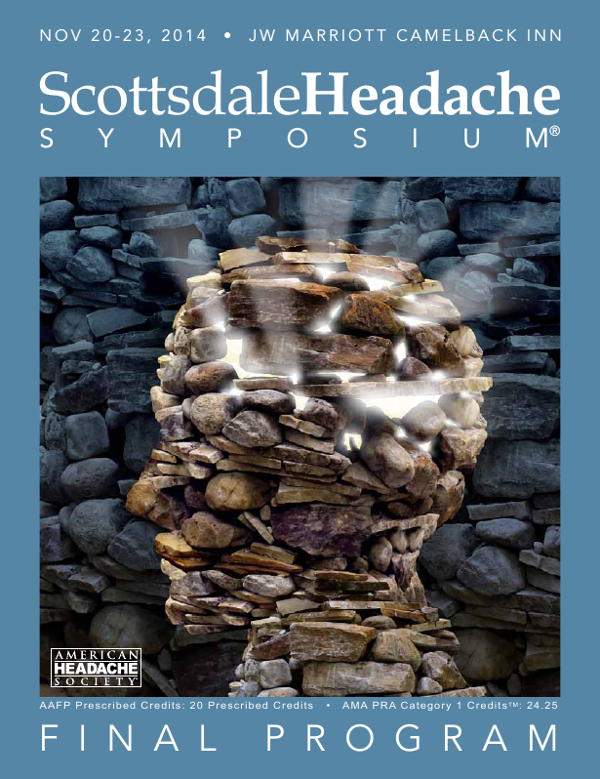

Heute eröffnet das Scottsdale Headache Symposium und schon gestern gab es einen halbtägigen „Advanced Pre-Course“ zum Thema „Neuromodulation gegen Kopfschmerzen – Biologische Begründung und klinische Wirksamkeit.“

Unter dem Hashtag [#AHS14AZ](https://twitter.com/hashtag/AHS14AZ) kann man auf Twitter den Tag gestern nachvollziehen und bis Sonntag weitere Infos zur aktuellen Kopfschmerzforschung  verfolgen.

