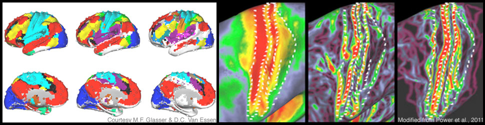

Ich bin gerade auf einem [Projektleitertreffen](https://www.confmanager.com/main.cfm?cid=2626) in den USA. Das Programm nennt sich „*[CRCNS – Collaborative Research in Computational Neuroscience](http://crcns.org/)*  *[– Data sharing](http://crcns.org/)*„. Es wird seit 2002 von der National Science Foundation und dem National Institutes of Health gefördert und seit drei Jahren auch deutsch-US-amerikanische Kooperationsprojekte vom BMBF.

Ziele und Förderrahmen des Programms sind in einem Artikel beschrieben:

> Computational neuroscience is a subfield of neuroscience that develops models to integrate complex experimental data in order to understand brain function. To constrain and test computational models, researchers need access to a wide variety of experimental data. Much of those data are not readily accessible because neuroscientists fall into separate communities that study the brain at different levels and have not been motivated to provide data to researchers outside their community. [[weiter zum pdf](http://crcns.org/files/news/crcns-neuroinformatics-article.pdf)]

Oh ja, „neuroscientists fall into separate communities“, das sieht man auch in den BrainLogs, wobei die Vielfalt nicht mal annähernd abgebildet ist. So ist z.B. der Blog [Robotorgesetzte](https://scilogs.spektrum.de/wblogs/blog/robotergesetze) in den WissensLogs.

Gestern gab es auf dem Treffen Vorträge zur Syntax im Vogelgesang, heute u.a. zu Hirnschrittmacher im Einsatz bei Parkinson und morgen Kollisionsvermeidung der Heuschrecken. Und vieles mehr, immer geht es ums Gehirn und Computermodelle.

Diese interdisziplinäre Forschung wird sehr gut gefördert – Hinweise, wie diese Förderung in den nächsten Jahren aussehen wird, wo Schwerpunkte gesetzt werden und weiteres, wird ebenfalls mit den ProgrammdirektorInnen hier besprochen – und die Aussicht bleibt erfreulich, insbesondere die Krankheiten des Gehirns sollen noch stärker in den Fokus rücken.
