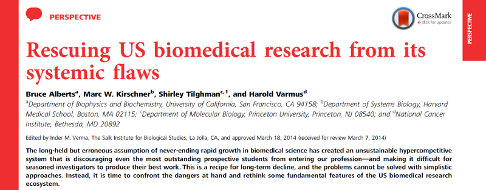

Wer Wissenschaftsblogs liest weiß, die Wissenschaft feiert Erfolge. So ist es schon bemerkenswert, dass auch die erfolgreichsten Wissenschaftler und vielversprechendsten Nachwuchswissenschaftler zunehmend pessimistisch in die Zukunft des von ihnen gewählten Berufs blicken. Dies, die Hintergründe sowie Lösungsvorschläge stellten vier Wissenschaftler im April in der [Zeitschrift PNAS](http://www.pnas.org/content/early/2014/04/09/1404402111.full.pdf+html) vor. Eine Diskussion von der wir in Deutschland lernen können.

Da [mein Beitrag gestern](https://scilogs.spektrum.de/graue-substanz/perspektive-befristung-fuer-arbeitsplaetze-wissenschaftsbereich/) mit dem Hinweis auf die Petition auf viel Resonanz gestoßen ist, er wurde auf facebook allein 158 mal geteilt, sollte ich auch an dieser Stelle auf eine verwandte Diskussion in den USA hinweisen.

Obwohl in den USA die Karrierewege aufgrund von “tenure track” planbarer verlaufen, entstehen mittlerweile auch dort Probleme, die mit denen in Deutschland, die aufgrund der fehlenden akademischen Juniorposition seit jeher bestehen, vergleichbar sind. Das ist bei Lösungen, die wir heute in Deutschland suchen, zu berücksichtigen. Da verschiedene Ursachen zu dem selben Resultat führen können, reicht es nicht, nur die alten Fehler zu beheben.

Alle, die mit Wissenschaft zu tun haben, sollten den ganzen Artikel lesen. Ich will nur einen Punkt herausgreifen, den der betrifft auch alle, die nicht direkt etwas mit der Wissenschaft zu tun haben – wir verschwenden Steuergelder:

> The mismatch between supply and demand can be partly laid at the feet of the discipline’s Malthusian traditions. The great majority of biomedical research is conducted by aspiring trainees: by graduate students and postdoctoral fellows. As a result, most successful biomedical scientists train far more scientists than are needed to replace him- or herself; in the aggregate, the training pipeline produces more scientists than elevant positions in academia, government, and the private sector are capable of absorbing. Consequently a growing number of PhDs are in jobs that do not take advantage of the taxpayers’ investment in their lengthy education.

