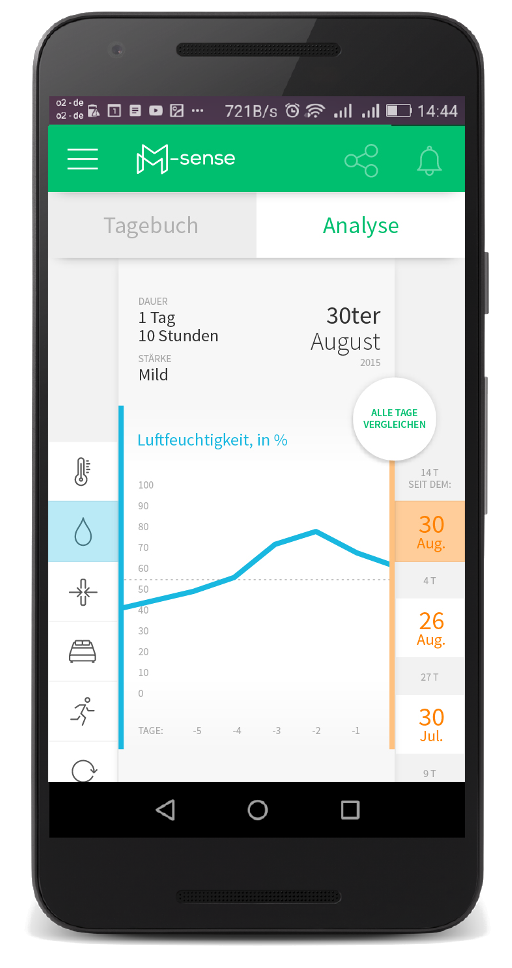
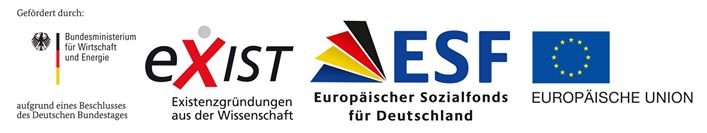

Seit Juni 2015 arbeite ich in einem Innovations- und Technologietransfer-Projekt, das durch das  Bundesministeriums für Wirtschaft und Energie und weiteren Trägern gefördert wird.\* Beim Antrag schrieben wir vor einem Jahr: »*Es ist unser erklärtes Ziel, Betroffenen über diese Anwendung eine Hilfestellung zurück zu einem selbstbestimmten Leben und planbaren Alltag zu bieten.*« Mit »Betroffenen« meinten wir Migräneleidende, was man sicher ahnt, wenn man diesen Blog regelmäßig liest, und mit »Anwendung« meinten wir eine Migräneapp.

M-sense (Entwicklungsstand Mitte 2015)

Das Projekt ist fast vorbei und nach knapp einem Jahr Arbeit haben wir die Migräne-App entwickelt. Sie heißt M-sense. Zum Projekt-Abschluss suchen wir für einen größeren Testlauf von M-sense Testerinnen und Tester. Anfang Mai wird M-sense im Google Play Store in einer ersten Testversion online stehen. Bis zu 200 Migräneleidende können kostenlos einen Testzugang bis Ende Juni bekommen. Wer mitmachen will, schick eine Email an ([kontakt@m-sense.de](mailto:kontakt@m-sense.de)) mit drei kurzen Informationen:

* Wer (Name und etwas zu Migränegeschichte).
* Warum (eine kurze Begründung)
* Email Adresse (die, mit man im Play Store angemeldet ist)

Unter den Interessierten wählen wir 200 aus, die eine Einladung bekommen.

## Nachtrag am 1.10.2016

Mittlerweile ist die geschlossene Testphase beendet und M-sense steht offen im [Google Play Store](https://play.google.com/store/apps/details?id=com.newsenselab.android.msense&hl=de).

## Disclaimer

∗Zurzeit forsche ich [u.a.](https://scilogs.spektrum.de/graue-substanz/author/dahlem/) an der Humboldt Universität zu Berlin, das genannte Innovations- und Technologietransfer-Projekt ist ein dort angesiedeltes [EXIST-Gründerstipendium](http://www.exist.de/DE/Programm/Exist-Gruenderstipendium/inhalt.html) um Gründungsideen zu realisieren. Die Idee von M-sense stammt von vier Freunden (inklusive mir) aus den Bereichen Hirnforschung, Mensch-Technik-Interaktion und Data Science, von denen drei durch EXIST gefördert werden. Zusammen haben wir die *Newsenselab GmbH* als Nachfolgerin des Technologietransfer-Projekts gegründet.

Das EXIST-Gründerstipendium ist ein Förderprogramm des Bundesministeriums für Wirtschaft und Energie und wird durch den Europäischen Sozialfonds kofinanziert.
