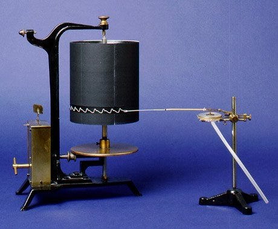
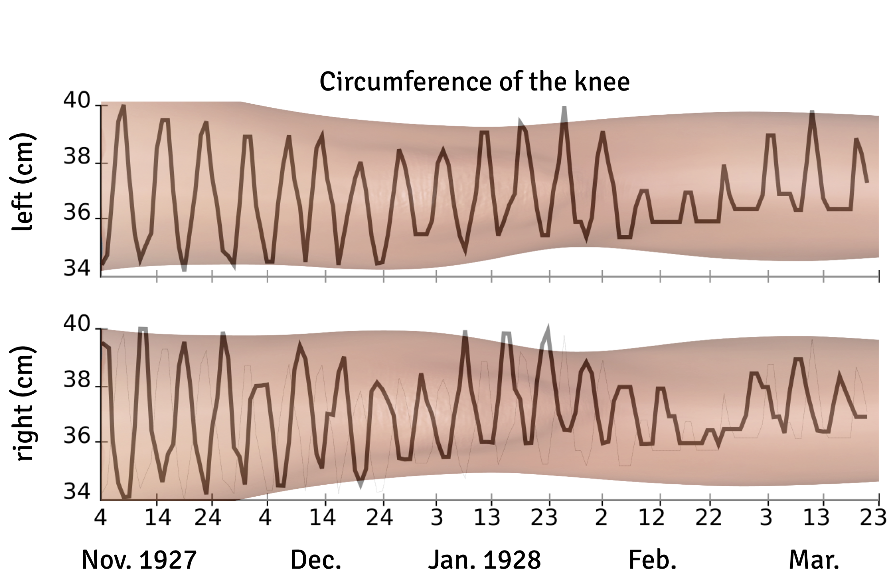

Die heutige Smartphone-Technologie ermöglicht einen einfachen Zugang zu Vitaldaten und Daten des Lebensstils. Dies wird der größte Technologiesprung in der Medizin seit der Erfindung des Kymographen sein.

In einem ersten Schritt werden die gewonnenen Daten in ein Computermodell möglicher Gesundheits- und Krankheitszustände assimiliert, so dass in einem zweiten Schritt eine zustandsabhängige therapeutische Intervention unter kontinuierlicher Überwachung des Gesundheitsprozesses erfolgen kann.

Dieses Verfahren der „Datenassimilation“ wird in jedem modernen Handbuch der Regelungstechnik beschrieben. Es ist heute die Methode, mit der ein Flugzeug mit Autopiloten landen kann; dies geschieht in Echtzeit ohne menschliches Zutun. Und morgen ist es die Methode, mit der chronische Krankheiten ohne Ärztin oder Arzt behandelt werden können. Dieses Verfahren unterscheidet sich grundlegend von neuronalen Netzen, mit deren Hilfe autonome Autos das Fahren lernen. Der Unterschied besteht darin, dass das erforderliche personalisierte Computermodell möglicher Gesundheits- und Krankheitszustände von Einstellungen eines Arztes abhängen kann.

## Beobachtung von Gesundheit und Krankheit im Zeitverlauf

Der Kymograph (Wellenschreiber) war das erste Gerät, das einen physiologischen Prozess beobachten konnte, indem es ihn in Echtzeit in kartesischen Koordinaten darstellte. Der Wellenschreiber zeichnete den Blutdruck als Kurve auf Endlospapier, das auf eine sich drehende Trommel gewickelt war. Heute ist der revolutionäre Charakter dieses Geräts nicht leicht zu erkennen. Physiologische Prozesse durch Kurven über die Zeit zu verfolgen, ist ein Konzept, das so weit verbreitet ist, dass wir kaum noch darüber nachdenken.

Ohne den Kymographen gäbe es heute keine Physiologie. Wie ein physiologischer Prozess in eine Funktion von Messwerten umgewandelt werden kann, wurde mit der Erfindung des Kymographen so anschaulich demonstriert, dass das Gerät „die Physiologie aus dem Griff der Anatomie befreite“, wie Uwe Heinemann einmal die Geburtsstunde der Physiologie als eigenständige medizinische Disziplin beschrieben hat.

Ebenso wird die Smartphone-Technologie die Geburtsstunde der digitalen Chronotherapie als eigenständige medizinische Disziplin einleiten. Um die Smartphone-Technologie in das Gesundheitsmonitoring als alltäglichen Teil der Gesundheitspraxis heute zu integrieren, ist ein Verständnis der Beziehung zwischen langsamen Biorhythmen und Gesundheits- und Krankheitszuständen erforderlich. Die Bedeutung langsamer Biorhythmen kann durch die Geschichte, wie Dr. Hobart A. Reimann seine Frau kennenlernte, anschaulich demonstriert werden. 

Diese Geschichte ist zudem lehrreich, weil es Unterschiede zwischen „primärer“ und „sekundärer“ Verwendung von Gesundheitsdaten verdeutlicht. Diese Unterscheidung in der Verwendung ist wichtig, um zu verstehen, warum die Etablierung dieser Technologien länger dauert als nötig. Angesichts der aktuellen Pandemie wird es jetzt wahrscheinlich schneller gehen, weil dies die gesellschaftliche Akzeptanz des kontinuierlichen Gesundheitsmonitorings erhöhen wird.

## Wie Dr. Hobart A. Reimann seine Frau kennenlernte

Die Geschichte der sogenannten „periodischen Krankheiten“ beginnt mit der Geschichte, wie Dr. Reimann seine Frau kennenlernte. Am 4. November 1927 suchte eine Patientin Dr. Reimann auf. Ihr rechtes Knie war stark geschwollen. Dr. Reimann begann, den Umfang ihres geschwollenen Knies zu messen. Er maß auch den Umfang des linken Knies als Referenz.

Knapp 6 cm Unterschied, das muss auch ohne Messung deutlich sichtbar gewesen sein. Dr. Reimann wies seine Patientin an, ihn am nächsten Tag wieder aufzusuchen. Und am Tag danach. An 141 aufeinanderfolgenden Tagen, bis zum 23. März des folgenden Jahres. Jeden Tag maß Dr. Reimann den Umfang der beiden Knie seiner Patientin.

Warum unternahm Dr. Reimann diese Anstrengung, um den Zustand seiner Patientin so genau zu überwachen? Es gibt zwei Antworten. Die eine ist einfach: Dr. Reimann heiratete seine Patientin. Dies erklärt sein anhaltendes Interesse an ihren Knien ganz gut. Die nicht so einfache Antwort ist jedoch, dass Reimann seinen ersten Fall einer Gruppe von Erkrankungen entdeckte, die er für den Rest seines Lebens studieren würde. 41 Jahre später bezeichnet er diese Gruppe als „periodische Krankheiten“.

Es war bekannt, dass bei jungen Frauen in bestimmten Abständen Ergüsse in den Kniegelenken auftreten können. Bereits 1845 wurde in der klinischen Literatur ein solcher Fall beschrieben. Dr. Reimanns verblüffende Beobachtung war etwas Besonderes. Innerhalb von 20 Wochen beobachtete er 19 periodische Schwellungen des rechten Knies und dessen Abklingen auf das Normalmaß innerhalb von etwa einer Woche. Auf der linken Seite passierte das gleiche. Auch hier waren 19 Schwellungen und deren Abklingen zu beobachten. Die Ergüsse der Kniegelenke seiner Patientin waren aber nicht nur periodisch, sondern das rechte und linke Knie hatten eine Phasenverschiebung von genau 180°, d.h. wenn die rechte Seite geschwollen war, war es die linke Seite nicht und umgekehrt.

1968 veröffentlichte Dr. Reimann seine wenig bekannte Arbeit mit dem Titel „Periodische Krankheiten“ (in deutscher Sprache, obwohl Reiman in den USA arbeitete, in Philadelphia am Hahnemann Medical College and Hospital). In diesem Papier beschrieb er eine Gruppe von 10 periodischen Krankheiten mit jeweils unbekannter Ursache, d.h. idiopathische Krankheiten. Er wies darauf hin, dass in der klinischen Literatur nur insgesamt 2.000 Fälle beschrieben worden seien. Der allererste Fall war eine periodische Bauchfellentzündung, die im 17. Jahrhundert beschrieben wurde. Ein weiterer Fall war seine Patientin und Ehefrau mit ihrer intermittierenden Hydrarthrose.

Heute ist das am weitesten verbreitete Beispiel die Migräne. Weltweit sind eine Milliarde Menschen betroffen. Auch wenn der Migränezyklus nicht so regelmäßig erscheint, kann dies durch Überlagerung des Rauschen des Lebensstils erklärt und der zugrundeliegende Rhythms durch das Phänomen der stochastischen Resonanz rekonstruiert werden. Die Dynamik der Migräne erforsche ich als theoretischer Physiker seit fast 30 Jahren und bin fasziniert von der Tatsache, dass wir digitale Therapien, die auf inneren biologischen Uhren beruhen, heute entwickeln können.

## Digitale Gesundheit, die Erkenntnisse liefert, wird unverzichtbar werden

Von allen Bedenken hinsichtlich des Datenschutzes einmal abgesehen, wenn der primäre Anwendungsfall der Nutzung von Gesundheitsdaten hält, was er verspricht, wird diese Nutzung unverzichtbar werden. Sobald Erkenntnisse über die individuelle Gesundheit unmittelbar zur Therapie beitragen, und darüber hinaus die Versorgung verbessern, wird Smartphone-Technologie in die Gesundheitsversorgung einziehen.

Ich denke an die Aufbruchstimmung in der neurologischen Welt im Jahr 1924, als Hans Berger die erste menschliche Elektroenzephalographie (EEG) aufnahm. Wie mit dem Kymograph kann mit dem EEG ein physiologischer Prozess in Form von Wellen beobachtet werden. Berger entdeckte den Alpharhythmus. Seiner Entdeckung folgten viele andere EEG-Frequenzbänder und ihr Zusammenhang mit Gesundheit und Krankheit wurde erkannt. Das EEG wurde bald für die Diagnose und Überwachung vieler neurologischer Krankheiten unentbehrlich. Darüber hinaus wird das EEG heute auch als therapeutisches Instrument im Neurofeedback eingesetzt.

Wir sollten heute die gleiche Aufbruchstimmung empfinden. Mit der heutigen Smartphone-Technologie werden wir Körperrhythmen erkennen, die von sehr langsamen biologischen Uhren mit Perioden von Tagen bis Wochen, Monaten und Jahren angetrieben werden. Mit anderen Worten, wir werden viel mehr periodische Krankheiten aufdecken, die für Chronotherapie zugänglich sind, indem wir einen digitalen Wirkmechanismus mit Datenassimilationsmethoden entwickeln.

Dr. Reimann musste noch einen enormen Aufwand betreiben, um etwas zu erreichen, was heute ein müheloser Teil unseres Alltags sein kann: die tägliche Überwachung unserer Gesundheit.
