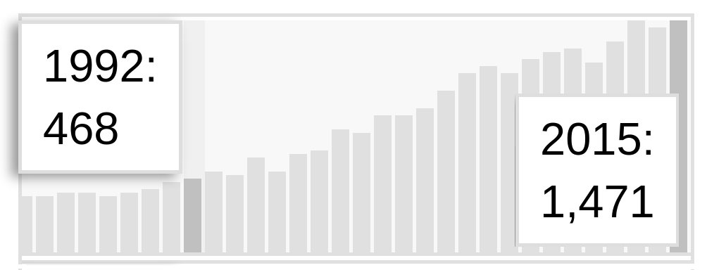

Möchte man sich zu einem wissenschaftlichen Thema Expertenwissen aneignen, ist das Rezept sehr einfach. Fachliteratur suchen, lesen und verstehen.

Suchen, lesen, verstehen. Klingt einfach, ist auch einfach. Allerdings ist es zudem wie mit dem englischen Rasen. Den muss man auch nur säen, gießen und mähen. Das macht man 400 Jahre lang, schon hat man den perfekten englischen Rasen. Das gute bei dem Expertenwissen in der Wissenschaft: 25 Jahre reichen bei einem medizinischen1 Thema vollkommen aus.

## Aktuell 4 aus 38

Bei meiner wöchentlichen Suche durch die aktuelle Migräne-Fachliteratur sind mir vier aus diesmal 38 Veröffentlichungen besonders aufgefallen: über den Herzschlag in der Nacht bei Migräne [1], über ausgelöste elektrische Phänomene im Gehirn [2], über die kognitive Verhaltenstherapie [3] und über den Übergang von der Kinder- und Jugendlichen- in die Erwachsenenmedizin [4].

Das sind vier interessante Themen. Vier ist etwas mehr als der wöchentliche Durchschnitt. Über diese vier würde ich morgen normalerweise etwas bloggen. Allerdings bin ich morgen [verhindert](https://scilogs.spektrum.de/graue-substanz/livestream-morgen-breaking-the-wall-of-migrain), so muss die Fachliteratur warten. Zumal es noch einen Rekord gibt, zu dessen Anlass ich diesen Beitrag schrieb. Der Rekord – ich sage gleich, welcher es ist – führte mich zu der Frage, wie viel Zeit ich brauche, um mir einen guten Überblick über die *aktuelle* Fachliteratur zu verschaffen?

Zunächst muss man die Artikel suchen. Die Art des Suchens und Lesens hat sich in den letzten 25 Jahren deutlich verändert. Nur das Verstehen ist letztlich gleichgeblieben.

## Suchen

Wenn man in die Literaturdatenbank Pubmed nach Migräne schaut, findet man zur Zeit im Schnitt täglich 4,6 neue Veröffentlichungen. Ich mache das fast täglich. Sehe ich dann eine besonders interessante Veröffentlichung, wird sie für das Wochenende vorgemerkt. Zugleich schreibe ich die Autorin an, um um einen Vorabdruck als pdf-Datei zu bitten. Denn mehr als eine Zusammenfassung ist meist so aktuell noch nicht verfügbar.

An dieser Stelle sei nun auf den neuen Rekord hingewiesen: Sucht man nach „migraine“ in Pubmed, erscheinen in der heutigen 45. Kalenderwoche schon 1471 Fachpublikationen aus dem Jahr 2015. Der bisherige Jahresrekord lag 2013 bei 1462 Publikationen. 2014 ist Gesamtzahl mit 1419 Publikationen etwas zurückgefallen.

Als ich angefangen habe, regelmäßig die Fachliteratur nach Artikeln über Migräne zu durchsuchen, waren es nur 468 Publikationen. Damals war das Suchen allerdings dennoch deutlich mehr Arbeit.

Anzahl der Fachpublikationen über Migräne von 1984 bis heute.

Immerhin hatte ich 1992 das Glück, an einem Max-Planck-Institut zu arbeiten, dem Max-Planck-Institut für Ernährungsphysiologie in Dortmund (heute für molekulare Physiologie). Mitarbeiter der Max-Planck-Institute konnten seit 1990 wöchentlich sogenannte ASCA-Literaturlisten beziehen – auf Endlos-Lochpapier ausgedrucke Listen mit allen aktuellen Publikationen zu gegebenen Stichwörtern. Bei mir standen die Stichwörter „spreading depression“ und „migraine“ ganz oben darauf.

1992, als ich mit meiner Forschung im Rahmen der Diplomarbeit begann, setzte sich gerade durch, dass eine besondere Welle in der grauen Substanz, die „spreading depression“, bei Migräne mit Aura eine fundamentale Rolle spielt. Auf einer internationalen Migräne-Fachkonferenz in Münster waren etwa die Hälfte der Beiträge über diese Welle und dies bestimmte dann die Wahl meiner Diplomarbeit.

Mein Wissensstand damals zu „spreading depression“ und Migräne: gleich Null. Was ich seitdem dazugelernt habe, ist nächsten Montag in der aktuellen  „[Gehirn & Geist](http://www.spektrum.de/inhaltsverzeichnis/gehirn-und-geist-12-2015/1313188?_ga=1.52830575.672219557.1445165058)“ zu lesen. Dort erscheint mein Artikel zu der Migränewelle. Die [Einleitung](http://www.spektrum.de/magazin/wie-migraeneauren-im-gehirn-entstehen/1369938) des Beitrages ist auf Spektrum zu lesen.

## Lesen

In der Vorlesungszeit oft wöchentlich, sonst in der Regel einmal im Monat, ging es zwischen 1992 bis Mitte 1994 nach Göttingen, wo ich eigentlich noch studierte. Mit im Gepäck waren die aus den ASCA-Literaturlisten ausgewählten Referenzen der mir relevant erscheinenden Publikationen. In der Otto-Hahn-Bibliothek konnte ich einen ersten Blick darauf werden und ggf. die Fachzeitschriften kopieren.

Wohl etwa 500 Paper liegen noch heute in Umzugskisten im Abstellraum neben meinem Büro. Seit vielleicht 15 Jahren drucke ich kaum noch etwas auf Papier aus, sondern verwalte die Fachliteratur als pdf-Dateien. Aktueller Stand: 312 pdf-Dateien über Migräne, 323 pdf-Dateien über Spreading Depression (215 davon zu beiden Themen). Eigentlich sind das recht wenig Dateien. Denn weil ich jetzt sofort alles erstmal auf dem Bildschirm lesen kann, muss ich nur noch die wirklich relevanten langfristig abspeichern. Suchen und lesen wird eigentlich eins.

## Verstehen

Ob man nun Ausdrucke oder digitale Literatur besitzt, lesen und verstehen muss man sie immer noch. Mein erster Physikprofessor, Albrecht Böhm, sagte gleich in der ersten Vorlesung: kopieren ist nicht kapieren. Er legte uns das Mitschreiben ans Herz.

Denn er wusste natürlich, dass Studierende in den Kopieshops Vorlesungsmitschriften kopieren können, statt dass jeder einzeln mitschrieb. Und er reagierte großartig darauf: Er brachte einfach selber für die weit über einhundert Studierenden die mehrseitigen Ausdrucke zu jeder Vorlesungstunde mit und teilte sie vor der Vorlesung umsonst aus, auf Kosten seines Lehrstuhls. Gleichzeitig bat er uns eindringlich, den Ausdruck schon während der Vorlesung mit eigenen Notizen zu ergänzen. Kopieren ist nicht kapieren. Dieses aktive Mitschreiben, wie auch das nachträgliche Abschreiben eines Skripts, verfestigt das gelernte.

Genau darum geht es auch beim Bloggen. Aufzuschreiben, was man meint, verstanden zu haben.

Zwei Dinge werde ich dazu immer wieder gefragt. Kostet das nicht viel zu viel Zeit? Als Wissenschaftler hast du doch gar keine Zeit zum Bloggen.

Das Gegenteil ist richtig. Man muss nicht öffentlich schreiben, das stimmt. Man muss aber viel und regelmäßig schreiben und dabei Inhalte einfach zusammenfassen. Der Unterschied zum Bloggen reduziert sich, was den Zeitaufwand betrifft, nicht nur auf einen Klick. Die Pflege der Kommentare ist auch einwenig Aufwand. Aber man bekommt dafür wertvolle Rückmeldung. Letztlich ist es also vor allem eine Mentalitätsfrage, ob man öffentlich schreibt. Aber auf dem Weg zum Expertenwissen geht kein Weg am regelmäßigen Schreiben vorbei.

Wieso? Suchen, lesen, verstehen. Wo kommt hier das Schreiben? Erst durch das Schreiben überprüft man das Verstehen. Anders gesagt: „Writing is nature’s way of letting you know how sloppy your thinking is“ (Dick Guindon, [hier](http://www.scilogs.com/hlf/writing-for-mathematical-clarity/) gefunden).

Schreibt man, muss man das solange, bis man zumindest selbst denkt, dass man es dem ersten Menschen erklären könnte, den man auf der Straße trifft. Dies ist zweite Frage, die ich immer wieder höre: für wen schreibst du dass alles überhaupt?

Es ist so, wie es der Mathematiker David Hilbert schon sagte:

> Eine mathematische Theorie ist nicht eher als vollkommen anzusehen, als bis du sie so klar gemacht hast, daß du sie dem ersten Manne erklären könntest, den du auf der Straße triffst.

Da ich in Göttingen studiert habe, weiß ich sehr wohl, dass David Hilbert auf der Wilhelm-Weber-Strasse nur wenige Häuser neben Richard Courant wohnte und nur eine Ecke von Hermann Minkowski entfernt. Der erste Mann, den Hilbert auf der Straße traf, war also vielleicht nicht immer der Durchschnittsbürger.

So ähnlich wird es wahrscheinlich hier im Blog sein. Einige der Migränethemen sind für Laien verständlich, andere nicht.

Zurück zur Frage: Wie viel Zeit braucht man, um sich einen guten Überblick über die Literatur zu verschaffen? Etwa 10 Stunden pro Woche. Fünf davon suchen-lesen, fünf verstehen-schreiben.

## Fußnote

1 Ich bin zwar Physiker, habe aber letztlich nie in der klassischen Physik gearbeitet. Meine hier geschilderte Erfahrung bezieht sich auf einen transdisziplinären Bereich. Sich in die theoretische Physik über die Fachliteratur einzuarbeiten, ist völlig anders als bei einem medizinischen oder biologischen Thema. Hier reicht ein einziges gutes Buch und der Verstand. (Das mit dem Verstand ist so eine Sache, man bleibt im Alter sicher klug und wird gar klüger, doch “flexibel” ist der Verstand nicht mehr so ganz. Weswegen viele der Ansicht sind, dass man ab 40 eigentlich keine relevanten Ergebnisse zur Mathematik oder theoretischen Physik mehr beiträgt – siehe bspw. die Regelung zur Vergabe der [Fields-Medaille](https://de.wikipedia.org/wiki/Fields-Medaille) oder [das Interview](https://www.youtube.com/watch?v=8an6x-NLfIc) des neulich verstorbenen Physikers Leo Kadanoff). Bei den Geisteswissenschaften ist es wohl wieder anders.

## Literatur

[1] Matei, D., Constantinescu, V., Corciova, C., Ignat, B., Matei, R., & Popescu, C. D. (2015). Autonomic impairment in patients with migraine. Eur Rev Med Pharmacol Sci, 19(20), 3922-3927. (Link)

[2] Coppola G1, Bracaglia M2, Di Lenola D2, Di Lorenzo C3, Serrao M2, Parisi V4, Di Renzo A4, Martelli F5, Fadda A5, Schoenen J6, Pierelli F2,7. Visual evoked potentials in subgroups of migraine with aura patients. J Headache Pain. 2015 Dec;16(1):92. doi: 10.1186/s10194-015-0577-6. Epub 2015 Nov 2.

[3] Harris P1, Loveman E1, Clegg A1, Easton S2, Berry N3. Systematic review of cognitive behavioural therapy for the management of headaches and migraines in adults. Br J Pain. 2015 Nov;9(4):213-24. doi: 10.1177/2049463715578291.

[4] Young Adults With Headaches: The Transition From Adolescents to Adults.  
O’Brien HL, Cohen JM. Headache. 2015 Oct 31. doi: 10.1111/head.12706. [Epub ahead of print]
