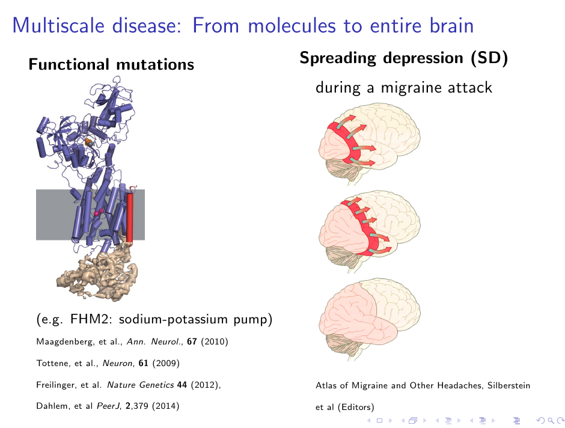

Eine seltene Mutation bei Migräne führt zu Funktionsveränderungen in den Natriumkanälen der Zellmembran.† Dadurch verändert sich die Geschwindigkeit mit der sich der Kanal öffnet und wieder schließt.

Soviel zu den Veränderungen in einem großen Molekül. Was aber passiert daraufhin in einer Gehirnzelle? Was passiert im Nervengewebe? Was im Gehirn als ganzes Organ? Was im Körper? Welche kognitiven Fähigkeiten sind betroffen?

Um erste Antworten zu geben gehen wir mit einem Computermodell vom genetischen Defekt bei Migräne zum Erscheinungsbild der Krankheit: vom Genotyp zum Phänotyp.

## Zellen gleichzeitig über- und untererregt

Eingebunden in die Gehirnzelle führt dieser mutierte Kanal zu Veränderungen der zellulären Funktion, die man sowohl als Übererregbarkeit (hyperexcitability) als auch als Untererregbarkeit (hypoexcitability) interpretieren kann, je nachdem, ob man die Ansprechgeschwindigkeit oder die Feuerfrequenz betrachtet. Dies zeigt ein Vergleich den wir mit unserem Computermodell durchführten in dem wir einmal mit und einmal ohne diese “Mutation” das Verhalten der Gehirnzelle simulierten.

Zunächst kann das auch intuitiv verstanden werden.

Die Ansprechgeschwindigkeit wird schneller, da der Kanal schneller öffnet und die Feuerfrequenz wird langsamer, weil der Kanal langsamer schließt und so einzelne Nervenimpulse (Spikes) ein Plateau ausbilden und den nachfolgenden Spike verzögern. Die Intuition kann aber in komplexen Systemen leicht sich täuschen. Man muss den Mechanismus genau studieren und das Verhalten quantifizieren. Das geht allein mit ausgefeilten Experimenten – oder im Computermodell.

Um Computermodelle mit Daten zu füttern, muss man in jedem Fall erst experimentell etwas messen. In diesem Fall wie sich die beiden Geschwindigkeiten, mit denen sich der Kanal öffnet und schließt, verändern. Das wird mit sogenannten *tail currents* gemacht. Dazu reicht es, diesen Kanal *isoliert* zu vermessen.

Im nächsten Schritt geht es dann darum, aus diesen isolierten Veränderungen eines Bausteins auf Veränderungen im Gebäude zu schließen, also vom Kanal zur Zelle und dann weiter zum Gewebe, Gehirn und Körper.

## Chronische krank: Anfall und anfallsfreie Zeit

Diese Funktionsänderungen im “Gebäude” sind natürlich auch außerhalb einer Migräneattacke vorhanden. Migräne ist eine chronische Erkrankung, die sich nicht auf die Anfälle beschränkt! Wie verändert sich die Verarbeitung im Gehirn bei einem Migräniker?

Folie zum Vortrag in Frankfurt nächste Woche

Psychophysikalische Methoden erlauben Schlussfolgerungen auf die Funktionsänderungen auf der höchsten Ebene, die der Wahrnehmung.

Die Psychologin Dr. Alex Shepherd beschreibt z.B. Unterschiede zwischen Menschen mit und ohne Migräne bei der visuellen Wahrnehmung (*Brain*, **129**,1833, 2006). Diese betreffen nicht die seltene Migräneform mit dieser von uns untersuchten Mutation, doch Shepherds Ergebnisse sind im wesentlichen konsistent mit den Befunden, die wir auch dort erwarten.

Die veränderten Gehirnfunktionen bei Migräne in der anfallsfreien Zeit werden in der Fachliteratur durch Übererregbarkeit, erhöhte Reaktionsfähigkeit und/oder einem Mangel an der sogenannten „intrakortikalen” Hemmung erklärt. Shepherds Ergebnisse haben insbesondere die Übererregbarkeit als eine überhöhte Unterdrückung der intrakortikalen Hemmung hervorgehoben. Kurz gesagt, einem Mangel an Hemmung – doppelte Verneinung bejaht.

Mit psychophysikalischen Methoden kann man jedoch nicht die Brücke vom Verhalten zurück zu der Funktionsweise einzelner Gehirnzellen schlagen. Hier sind es wieder Computermodelle, die helfen zumindest Teilschritte zu gehen.

## Gewebe übererregt trotz neuronaler Stille

Wir haben uns bisher nicht auf die Simulation kognitiver Funktionen in der anfallsfreien Zeit spezialisiert, obwohl das auch ein spannender Weg wäre, sondern auf den Anfall an sich und dessen Eintrittswahrscheinlichkeit. Meine erste Intuition wäre gewesen, dass die entdeckte niedrigere Feuerrate (s.o.) die Eintrittswahrscheinlichkeit eigentlich senkt. Denn die Feuerrate ist meist die entscheidende physiologische Größe im Gewebe, also im sogenannten *neural mass model* oder bei räumlicher Ausdehnung auch als neuronales Feldmodell (*neural fields*) bezeichnet. Diese Intuition ist aber falsch und sie muss es natürlich sein. Die Mutation muss die Eintrittswahrscheinlichkeit erhöhen und genau das tut sie auch im Computermodell.

Das Computermodell hat gezeigt, dass die ambivalente Interpretation von gleichzeitiger Über- und Untererregung auf der unteren Ebene der Gehirnzelle, die sich in gewisser Weise sogar in den psychophysikalisch gemessenen, kognitiven Fähigkeiten widerspiegeln, also auf der höchsten Ebene, sich nicht mehr auf der Zwischenebene des Gewebes zeigt. Wenn es allein um die Anfallswahrscheinlichtkeit geht und die Wiederstandfähigkeit gegenüber Durchblutungsstörungen (transitorische ischämische Attacken) ist die Situation eindeutig. Diese Wiederstandfähigkeit  ist klar vermindert und damit ist die Anregbarkeit einer Attacke erhöht, so dass wir allein von einer Übererregung im Gewebe sprechen können verursacht durch die Mutation. Dabei feuern einzelne Zellen allerdings weniger und sind für eine kurze Zeit von wenigen Minuten sogar vollkommen still.

## Fazit

Dies zeigt sehr schön, dass Charakterisierungen und Konzepte wie “Erregung” und “Hemmung” oder “Über-” und “Untererregung” auf jeder Ebene für jede Funktion eigenständige und wohl definierte Bedeutungen besitzen. Das heißt im Umkehrschluss, es ist absolut keine sinnvolle Aussage zu sagen, Menschen die unter Migräne leiden sind das eine oder das andere. Es kommt auf den konkreten physiologischen Mechanismus und dessen Ebene an, auf die man sich immer mitbeziehen muss. Sonst werden es bloße Worthülsen. Die Brücke zwischen den Ebenen mit mathematischen Methoden zu schlagen und das Zusammenspiel zu enträtseln nennt man Systemmedizin.

Weiterlesen:  
[Dahlem MA, Schumacher J, Hübel N. (2014) Linking a genetic defect in migraine to spreading depression in a computational model. *PeerJ* **2**:e379 http://dx.doi.org/10.7717/peerj.379](http://dx.doi.org/10.7717/peerj.379)

Fußnoten

\*Ja, für die die mitgezählt haben, das ist das dritte Paper im Mai. Über die Zeitschrift PeerJ habe ich schon [berichtet](https://scilogs.spektrum.de/graue-substanz/plos-peerj-erster-vergleich-gewinner/).

†Die Rede ist von der familiären hemiplegischen Migräne (FHM), eine seltene Unterart der Migräne mit Aura. Die hier beschriebene Mutation ist die in dem noch selteneren Untertyp FHM3.
