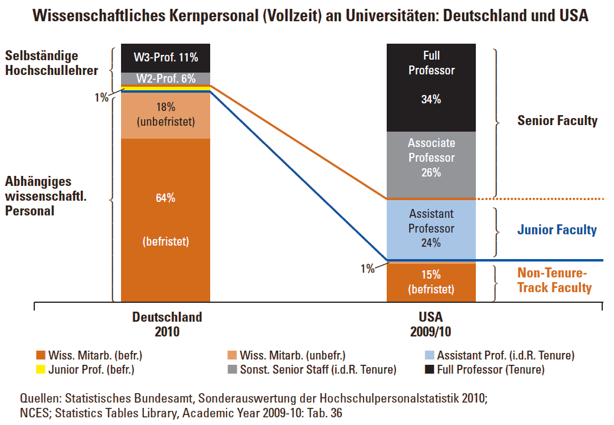

Als der Vorsitzender des Wissenschaftsrates, Wolfgang Marquardt, sagte, dass er „aktuell eine Chance [sieht], dass die Universitäten endlich ernsthaft das Thema Personalentwicklung angehen” [1], las ich wohl zurecht die versteckte Kritik an der Situation in der Vergangenheit. Dass er bisher die Personalentwicklung als unverantwortlich ansieht, lässt Marquardt unausgesprochen. Allein mit seiner Formulierung „eine Chance” deutet er sogleich an, dass in seinen Augen die Universitäten vorher gar keine Wahl hatten, als sich eben nicht ihrer Verantwortung zu stellen und sich ernsthaft mit dem Thema Personalentwicklung zu beschäftigen. Eine solche Entschuldigung braucht aber nur, wer sich schuldig machte.

Ich denke, es stimmt, allerdings nur zur Hälfte. Die Universitäten bekamen eine Chance vor über 10 Jahren und sie wurde kläglich vertan. Das Defizit in der Personalentwicklung ist also unentschuldbar eine Fehlentwicklung. Es gehört zu der ehrlichen Auseinandersetzung, dass man dies so offen kritisiert. Was hätten die Universitäten tun müssen? Nichts was man nicht sowieso an Universitäten tut: umdenken. Das sollte an Universitäten doch nicht schwer fallen, zumindest sollte es Wissenschaftlern leichter fallen als Politikern, möchte man meinen. Das Umdenken, um das es an den Universitäten geht, betrifft einem Systemwandel der Personalstrukturen verschiebt und so mit einer kostenneutralen Lösung zu mehr Professuren führt. Allein kostenneutral schien nicht nur nicht attraktiv, es war wohl geradezu höchst unattraktiv, denn bei einem solchen Nullsummenspiel gewinnt der Nachwuchswissenschaftler was der etablierte Professor verliert.

Zunächst nochmal zurück: Worum geht es in dem Interview?

**Perspektive als Gefahr der Personalentwicklung**

Es geht um die Umsetzung des amerikanischen Weges zu unbefristeten Tätigkeiten (tenure) und dem sogenannten Tenure Track-Modell, also dem Weg (track) dahin. Es geht damit indirekt auch um das deutsche Gesetz über befristete Arbeitsverträge in der Wissenschaft, das Wissenschaftszeitvertragsgesetz, kurz WissZeitVG. Das WissZeitVG sollte die Befristung von Arbeitsverträgen mit wissenschaftlichem (und künstlerischem) Personal einschränken. Es bleibt dabei zahnlos, da es gefahrlos umgangen werden kann. Die Gefahr wäre was gewesen? Der Nachwuchswissenschaftler gewinnt mit einer Dauerstelle eine Perspektive. Das Hochschulen allen Ernstes dies als Gefahr einstufen, ist die Perfidie ihre Personalentwicklung. (Dazu habe ich schon genug geschrieben, zuletzt [hier](https://scilogs.spektrum.de/blogs/blog/graue-substanz/2013-01-20/wisszeitvg-immer-krank-und-nicht-einmal-tot).)

Nicht nur ein Interview, ein [ganzes Heft der Zeitschrift “Forschung und Lehre”](http://www.forschung-und-lehre.de/wordpress/Archiv/2013/ful_01-2013.pdf) widmet sich dem Tenure Track und gibt recht differenzierte Antworten auf die Frage, ob dies der Königsweg zur Professur sei. Er ist es nicht, zumindest nicht ohne Anpassung an das deutsche Wissenschaftssystem, so kann man es knapp zusammenfassen.

Es geht aber um mehr als den Weg zur Professur. Es geht um nichts weniger als „eines der größten Defizite des deutschen Wissenschaftssystems [zu] beheben” so erklärt es Wolfgang Marquardt zurecht. Und weiter: „Die Wege zur Professur müssen transparent und auch für internationale Interessenten einschätzbar sein. Außerdem müssen an Hochschulen Rahmenbedingungen geschaffen werden, um diesen Transformationsprozess zu ermöglichen.”

**Umdenken in den Fakultäten**

Dann folgt nahtlos der für mich zentrale Teilsatz des Interviews: „Neben einem Umdenken in den Fakultäten bedarf die Etablierung eines Tenure Track-Systems zusätzlicher Stellen.” Fast hätte man es überlesen. Umdenken in den Fakultäten. Warum? Weil die Wege zur Professur bisher weder transparent noch einschätzbar sind. Das soll an Rahmenbedingungen geknüpft sein. Fehlende Rahmenbedingungen – so das denn stimmt – sind da keine Entschuldigung.

Für mich ist das Umdenken in den Fakultäten der Kernpunkt. Denn dieser Punkt kann nur eins bedeuten. Nämlich dass im Prinzip diese zusätzlichen Stellen auch kostenneutral geschaffen werden können. Schmerzen mal nicht als Kosten betrachtet. Es müssen nämlich nicht unbedingt *zusätzliche* Stellen geschaffen werden, also mehr vollzeitbeschäftigtes wissenschaftliches Personal. Sondern *neue* Professorenstellen die auch auf Kosten des bisher abhängigen wissenschaftlichen Personals geschaffen werden können. Wenn man bereit ist umzudenken. Mehr kostet es nicht, vorhandene Haushaltsstellen für wissenschaftliche Mitarbeiter zu einem geringen Teil vom Mittelbau aufgewertet in den Oberbau zu verschieben.

**Neue Instrumente folgen sind aber nicht notwendige Rahmenbedingungen**

An dieser Stelle gehört eins erwähnt. Umdenken an den Fakultäten kann allein zwar reichen. Doch isoliert wird es zu anderen Problemen führen. Weswegen eine Verbesserung des deutschen Wissenschaftssystems – wieder kostenneutral – zusätzlich ein Umdenken in der Politik braucht. Eine Grundgesetzänderung, die das Kooperationsverbot endlich kippt. Das ist aber keine Entschuldigung nicht voranzugehen. Dass das Kooperationsverbot zwischen Bund und Ländern langfristig gekippt werden muss, wird in diesem Zusammenhang klar, wenn man bedenkt, dass ein großer Teil des abhängigen wissenschaftlichen Personals vom Bund über Drittmittel finanziert ist. Werden Haushaltsstellen von wissenschaftliche Mitarbeiten zu einem Teil vom Mittelbau in den Oberbau verschoben, sind andere Instrumente als allein Drittmittel gefragt, diese Stellen flexibel zu ersetzen.

Klingt Umdenken an den Fakultäten also leichter als es ist? Zumindest wurde es leichter gemacht. Mehr Professoren weniger abhängiges wissenschaftliches Personal, so hieß das Rezept, das in Form der Juniorproessur von der Politik vor zehn Jahren in die Hochschulen getragen wurde. Oder, worauf Marquardt hinweist, ursprünglich vom Wissenschaftsrat kam, der „seinerzeit ganz einfach von ‚Nachwuchsprofessuren`“ sprach. Dieses Rezept wurde zur leichteren Umsetzung von einem temporären und selektiven Aufheben des Kooperationsverbot zwischen Bund und Ländern begeleitet. Diese Aufhebung nannte man etwas blumig, weil es um mehr ging, Exzellenzinitiative. Man nahm was kam, nur die Chance Personalstrukturen zu modernisieren haben die allermeisten Hochschulen nicht ergriffen. Den Optimismus von Marquardt würde ich gerne teilen, doch mir scheint, dass heute die Rahmenbedingen eher wieder schlechter sind.

**Der Staat als Arbeitgeber verantwortungslos?**

Kann man denn wirklich die Personalentwicklung ohne eine solche Strukturreform als verantwortungslos bezeichnen? Das wäre bemerkenswert, denn wir reden vom Staat als Arbeitgeber. Prof. Ulrich Preis (Universität zu Köln), der einst mit an der Ausgestaltung des WissZeitVG gearbeitet hat, spricht genau diesen Vorwurf deutlicher als Wolfgang Marquardt an. Als Sachverständiger im Ausschuss des Deutschen Bundestages sagte er, dass sein „Wissenschaftszeitvertragsgesetz […] viele zweckkonforme Beschäftigungen [ermöglicht]“ und “dass es eher die Frage ist der unverantwortlichen […] Handhabung als des Rechtsrahmens” sei. Ich bin mir sicher, wirklich jeder Nachwuchswissenschaftler würde aus eigener Erfahrung dem Staat als seinen Arbeitgeber in Sachen Verantwortung eine beschämende Note erteilen.

Das kostenneutrale Umdenken von Stellen hin zu mehr Verantwortung ist in einer Graphik zum wissenschaftlichen Kernpersonal ins Auge springend illustriert.

Sie stammt von dem Soziologen Prof. Reinhard Kreckel. Mein erster Blogbeitrag „[Werd‘ erst mal flügge – Karrieremodelle in der Wissenschaft](https://scilogs.spektrum.de/blogs/blog/graue-substanz/2010-06-24/karrieremodelle-in-der-wissenschaft)”, er ist mittlerweile drei Jahre alt, zeigte diese Graphik schon in einer ersten Version. Das Umdenken der Fakultäten, von dem Marquardt spricht, kann nur heißen, die Anteile des wissenschaftlichen Kernpersonals zu verschieben, hin zu mehr selbstständigen Hochschullehrern.

**Studierende. Wo sind sie geblieben?**

Mein Vorwurf an die Universitäten ist nicht allein an die Gruppe der Hochschullehrer und an die Verwaltung adressiert. Was ist mit Studentinnen und Studenten. Wo sind sie geblieben? Verkürzt dargestellt hat in den 1970er Jahren ihr Schlachtruf „Unter den Talaren – Muff von 1000 Jahren” mit dazu beigetragen den neuen Karriereweg der W2-Professur (damals C3) zu schaffen. Immerhin heute mit 6% (s. Graphik oben) eine wesentliche Säule. Wie? Auf Kosten einer Verschiebung der Assistenten vom Mittelbau in den Oberbau zu einer Art Associate Professur. Auch wenn es um die Aufarbeitung der Rolle im „Dritten Reich” ging, wäre ohne den massiven Studentenprotest nicht das Klima für ein Umdenken in Form dieser Veränderung der Hochschulstruktur vorhanden gewesen. Was ist geschehn? Wo bleibt der Protest heute?

**Wissenschaftliche Praxis**

Könnten heute die Studierenden nicht wenigstens für ihre ureigenen Interessen kämpfen? Sie würden doppelt von mehr Professoren und weniger abhängigen wissenschaftlichen Personal profitieren. Es sind ihre angeblichen Betreuer, die völlig überlastet ihre Betreuungsaufgaben an abhängiges wissenschaftliches Personal delegieren. Die wiederum werden am Ende allerdings weder die Verantwortung tragen noch die Benotung durchführen. So kommen minderwertige Master- und Doktorarbeiten zustande. Von Plagiaten zu schweigen. Zum Zweiten geht es um die Zukunftsperspektiven derjenigen Studierenden, die eine Hochschulkarriere ins Auge fassen.

Lesen wir mal die Empfehlungen der Kommission „[Selbstkontrolle in der Wissenschaft](http://www.dfg.de/download/pdf/dfg_im_profil/reden_stellungnahmen/download/empfehlung_wiss_praxis_0198.pdf)”, Vorschläge zur Sicherung guter wissenschaftlicher Praxis. Die Forderungen dort haben „unmittelbare Folgen für die optimale bzw. die maximale Größe einer Arbeitsgruppe. Eine Leitungsfunktion wird leer, wenn sie nicht verantwortlich in Kenntnis aller dafür relevanten Umstände wahrgenommen werden kann. Die Leitung einer Arbeitsgruppe verlangt Präsenz und Überblick.” Anders formuliert: mehr Professoren weniger abhängiges wissenschaftliches Personal sichert gute wissenschaftliche Praxis.

Zusammengefasst: das deutsche Wissenschaftssystem braucht eine verantwortliche Personalpolitik, die am Ende allen zugute kommt.

Die bisher wenigen Professoren werden entlastet und können sich mehr dem widmen, wofür sie eigentlich eingestellt wurden. Ein Tipp: Verwalten große Lehrgebiete war es nicht.

Der Nachwuchs bekommt Verantwortung und vor allem eine abschätzbare Perspektive, was nicht gleich eine risikofreie Zukunft bedeutet muss.

Die Studierenden werden von dem Personal betreut, von dem sie meist auch zuvor schon betreut wurden. Nur nun offiziell. Sie haben damit eine verlässlichere weil auch Verantwortung tragende Betreuung.

Das Rezept für all dies ist einfach: mehr Professoren weniger abhängiges wissenschaftliches Personal.

**Literatur**

[1] Forschung und Lehre, 1/13, „*Die Universitäten brauchen* *mehr Hochschullehrer, Fragen an den Vorsitzenden des Wissenschaftsrates*”, Seite 16.

© 2013, Markus A. Dahlem, [CC-BY-SA.](http://creativecommons.org/licenses/by-sa/2.0/deed.de)
