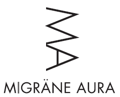
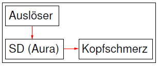
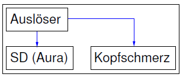
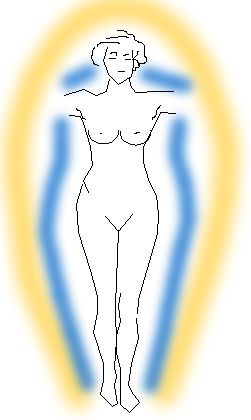

Die *Aura* ist nichts weiter als ein unglücklich gewählter Begriff für eine Gruppe neurologischer Symptome der Migräne.

Als neurologisches Symptom bezeichnen wir in der Regel Reiz- und Ausfallerscheinungen, auch positive und negative Symptome genannt für Reiz bzw. Ausfall der Sinneswahrnehmung. Beispiel: Sie sehen was, was nicht wirklich in Ihrem Gesichtsfeld vorhanden ist. Das ist ein positives neurologisches Symptom. Oder Sie sehen was nicht, was wirklich in Ihrem Gesichtsfeld vorhanden ist. Das wäre ein negatives neurologisches Symptom, oft bekannt als „blinder Fleck“.

Ein anderes Beispiel: Sie spüren, dass etwas Ihre Hand entlang krabbelt, obwohl nichts Ihre Hand entlang krabbelt, ein positives neurologisches Symptom; Sie spüren nichts Ihre Hand entlang kabbeln, obwohl gerade ein fetter Käfer Ihre Hand entlang krabbelt, ein negatives neurologisches Symptom, ein Taubheitsgefühl.

Ich könnte so mit mehr als 500 konkreten Beispielen weiter machen, wenn ich die Fallsbeispiele, die Klaus Podoll und ich auf den Seiten der Migraine Aura Foundation gesammelt haben, abdecken wollte. Das ist aber nicht meine Absicht, denn genau dafür gibt es ja diese Website schon.

  
*Logo der Migraine Aura Foundation.*

**Verläuft die Auraphase meist unbemerkt oder symptomfrei?**

Mich interessiert, ob jede Migräneattacke mit einer Auraphase einhergeht. Das ist eine seit einigen Jahren viel diskutierte Frage, die unter anderem in dem PLoS MEDICINE Artikel mit dem Titel *[The Migrainous Brain: What You See Is Not All You Get?](http://www.plosmedicine.org/article/info%3Adoi%2F10.1371%2Fjournal.pmed.0030404)* kritisch beleuchtet wurde [1].

Wenn dies so wäre, wenn jede Migräneattacke mit einer Auraphase einherginge, dann bliebe die Aura in den weitaus meisten Fällen unbemerkt. Denn nur ca. 20% der Migränefälle werden zur Zeit als [Migräne mit Aura](http://www.ihs-klassifikation.de/de/02_klassifikation/02_teil1/01.02.00_migraine.html) diagnostiziert. Die anderen Fälle gelten bisher als [Migräne ohne Aura](http://www.ihs-klassifikation.de/de/02_klassifikation/02_teil1/01.01.00_migraine.html) (von einigen diagnostischen Sonderfällen mal abgesehen).

Die Hypothese der klinisch stillen Aura (*clinically silent aura*) mag zunächst verwundern. Warum sollen Menschen, die unter Migräne leiden ohne offensichtliche Aura nun vielleicht doch eine Auraphase haben, eine die sie nur nicht bemerken? Klingt zunächst abwegig.

Wenn wir über die Symptome sprechen, gehen wir allerdings das Problem vom falschen Ende an. Wir müssen die Krankheitsursache betrachten. Die Aura wird von der *spreading depression* verursacht, ein nicht minder unglücklich gewählter Begriff, den ich daher als SD abkürze.

SD ist eine Welle neuronaler Entladung, die als Störungszustand majestätisch langsam mit nur wenigen Millimetern pro Minute die Hirnrinde durchschreitet. Vergleichen wir diese Ausbreitungsgeschwindigkeit mit der der normalen Kommunikation zwischen Nervenzellen (~100 m/s), ist das Verhältnis ähnlich unterschiedlich wie das Verhältnis der Geschwindigkeiten Schall zu Licht. SD ist also ein neuronales Phänomen eigener Art.

Da die Aura und somit die SD meist 30 Minuten vor dem Beginn der Kopfschmerzen auftritt, ist allein aus diesen zeitlichen Ablauf die Frage angebracht, ob SD die anschließenden Kopfschmerzen verursacht.

  
*Ein noch unbekannter Auslöser triggert eine SD, die wiederum die Kopfschmerzen verursacht.*

Da aber in 80% der Migränefälle gar keine Aura auftritt, wurde das bisher kaum in Betracht gezogen. Sondern angenommen, ein noch unbekannter Auslöser könnte beides, sowohl die SD als auch – allerdings mit einiger Verzögerung – die Kopfschmerzen auslösen.

 *Ein Auslöser kann beides: Aura und (verzögert) Kopfschmerzen verursachen.*

Von der Seite der Krankheitsursache scheint die Frage „*Verläuft die Auraphase meist unbemerkt oder symptomfrei?*“ gar nicht mehr so abwegig. Denn die Frage ist nicht, ob wir Symptome haben, die wir dann doch nicht haben. Sondern schlicht: Kann SD durch die Großhirnrinde schleichen, ohne dabei neurologische Reiz- und Ausfallerscheinungen zu verursachen oder könnten solche Symptome häufig nicht bemerkt werden?

Symptomsfreiheit und das nicht Bemerken sind unterschiedliche mögliche Erklärungen, die beide auch getrennt zutreffen könnten. Also Erklärungen für die sogenannte SD-Theorie der Migräne. Diese wurde zum Beispiel auch im Oktoberheft 2009 der Zeitschrift Spektrum der Wissenschaft im Artikel [Migräne – leider keine Einbildung](http://www.wissenschaft-online.de/artikel/1005451) von den Kollegen David W. Dodick und J. Jay Gargus näher beschrieben (kostenfreie Leseprobe).

Meine Forschung betrifft dies unmittelbar, denn es könnte sich am Ende herausstellen, dass die Frage warum SD keine Symtome auslöst, damit zu tun hat, wie weit SD sich als räumliche Welle ausbreitet. Also ob es eine kritische Grösse des neuronalen Ausfalls gibt, der nicht mehr komplensiert werden kann. Mein [vorangegangender Beitrag](http://www.brainlogs.de/blogs/blog/graue-substanz/2010-08-23/das-gehirn-ist-ein-torus) beschreibt einen meiner Ansätze, dies in der gefurchten Hirnrinde mit mathematischen Modellen zu studieren.

Auch in einem aktuellen Überblickartikel mit dem Titel *„Cortical Spreading Depression Triggers Migraine Attack: Pro*“ wird die These der unbemerkten Aura aufgeworfen [2]. Insbesondere werden neue Erkenntnisse zusammengefaßt, die Hinweise liefern, wie SD die Kopfschmerzen triggern kann. Für die Entwicklung zukünftiger Therapieansätze ist diese Frage wichtig. Aus dieser Arbeit von Cenk Ayata habe ich auch die netten schematischen Darstellungen (oben), die in ihrer Schlichtheit jeder Diskussion über die  *klinisch stille Aura* eine gewissen Nüchternheit abverlangen.

Peter Goadsby schreibt in [1] in diesem Sinne:

>  More research will provide the answer, and certainly the question is tractable.

**Literatur**

[1] Goadsby PJ (2006) [The Migrainous Brain: What You See Is Not All You Get?](http://www.plosmedicine.org/article/info%3Adoi%2F10.1371%2Fjournal.pmed.0030404) PLoS Med 3(10): e404. doi:10.1371/journal.pmed.0030404

[2] Cenk Ayata, Cortical Spreading Depression Triggers Migraine Attack: Pro, *Headache*, **50**,72 (2010)

**Fußnote**

Für die, die der Aura als esoterisches Phänomen nachtrauern, gibt es weitere schlechte Nachrichten. Schon 1966 wurde berichtet [5], dass bei einer Migräneaura als positives neurologisches Symptome auch an Kanten ein Leuchten gesehen werden kann („[Corona phenomenon](http://www.migraine-aura.org/content/e27891/e27265/e26585/e48971/e49016/index_en.html)„). Alles also nur eine Migräne, denn diese gibt es sogar ohne Kopfschmerz.

[5] [Klee A, Willanger R](http://www.ncbi.nlm.nih.gov/entrez/query.fcgi?cmd=Retrieve&db=pubmed&dopt=Abstract&list_uids=5331608). Disturbances of visual perception in migraine. Acta Neurol Scand 1966; 42: 400-414.
