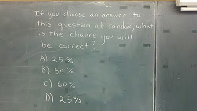

Das [Problem mit Dornröschen aus dem Beitrag im Oktober](https://scilogs.spektrum.de/blogs/blog/graue-substanz/2011-10-27/dornroeschens-ueberzeugung) habe ich mir nicht selbst ausgedacht. Es ist ein teils heftig diskutiertes Beispiel, das in seiner Urform „*The Absent-Minded Driver*“ hieß und von den beiden Wirtschaftswissenschaftlern Michele Piccione und Ariel Rubinstein im Rahmen einer Spieltheorie mit  unvollständiger Erinnerung (*imperfect recall*) untersucht wurde [1]. In Wikipedia ist es als *[Sleeping Beauty problem](http://en.wikipedia.org/wiki/Sleeping_Beauty_problem)* aufgeführt.

Manche erinnert es an das Ziegenproblem (engl: *Monty Hall problem*) mit den drei Türen, aber da gibt es im Wesenskern eigentlich wenig Gemeinsamkeiten. Beide werden aber zumindest klarer, wenn man sie radikal erweitert, also eine Million Türchen sich denkt bzw. Dornröschen eine Million mal aufweckt (*Extreme Sleeping Beauty*).1

Ich fand das Problem gut, weil hier einerseits die Lage doch recht einfach ist. Die Münze ist fair und fällt in 50% der Fälle auf Kopf. Andererseits aber eine Diskussion über andere Herangehensweisen als die über den [frequentistischen Wahrscheinlichkeitsbegriff](http://de.wikipedia.org/wiki/Frequentistischer_Wahrscheinlichkeitsbegriff "Frequentistischer Wahrscheinlichkeitsbegriff"), der Wahrscheinlichkeit als relative Häufigkeit interpretiert, motiviert wird, ohne gleich zu tief einzusteigen in den bayesschen Wahrscheinlichkeitsbegriff, der Wahrscheinlichkeit als Grad persönlicher Überzeugung interpretiert. Möchte Dornröschen nicht gerne Unrecht haben, sollte sie Zahl sagen, denn sie wird ja eventuell dies zweimal gefragt (und würde dann zweimal falsch antworten, wenn sie Kopf wählt).

Hier ist noch eine Knobelei, die diesmal weniger philosophisch angehaucht ist:2

Wenn Sie eine Antwort zu dieser Frage zufällig wählen, wie hoch ist Ihre Chance richtig zu liegen?

A) 25%

B) 50%

C) 60%

D) 25%

Vorschläge bitte in den Kommentaren.

Das passt auch auf ein Kärtchen und lässt sich auf jede Silvesterparty mitnehmen und dem netten Gegenüber in die Hand drücken. (Mein Tipp: gleich fünf Kärtchen anlegen, wenn man auf eine große Party allein geht.)

Einen gute Rutsch!

**Fußnote**

1 Dornröscchen 1 Milion mal zu wecken, hat  übrigens Nick Bostrom angeblich ertmals vorgeschlagen, einer der Gründer von Humanity+ (ehemals World Transhumanist Association)  eine Bewegung, die eine Veränderung der menschlichen Spezies durch den Einsatz technologischer Verfahren befürwortet, womit wir nahe an der Migräne und deren Thearie sind, aber das ist ein Thema für einen anderen Blogbeirag.

2 Gefunden habe ich das bei [Ed Yong](http://plus.google.com/u/0/106952974709619007593), einem Wissenschaftbloger (Blog:  [Not Exactly Rocket Science](http://blogs.discovermagazine.com/notrocketscience)) auf Google+.

**Literatur**

[1] Michele Piccione & Ariel Rubinstein, [On the Interpretation of Decision Problems with Imperfect Recall](http://dx.doi.org/doi:10.1006/game.1997.0536), *Games and Economic Behavior*, **20**, 3-24, 1997
