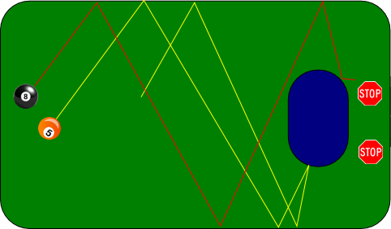
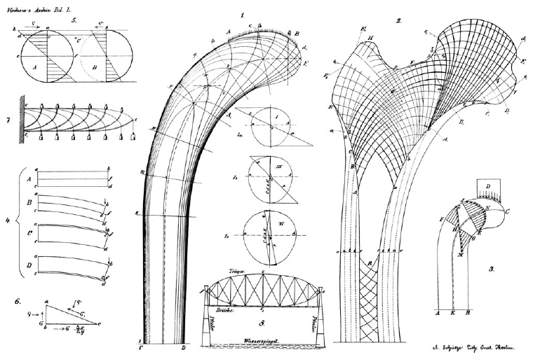

Oft höre ich dieses oder jenes Gen sei die Ursache, das Gen ist die zentrale Stellschraube, das Gen sei gar der Mechanismus. Gen hier. Gen dort. Ferner höre ich Umweltfaktoren seien die Ursache.  

Vielleicht bleibt einem auch nicht mehr, wenn unbedarft darauf vertraut wird jeden Kausalzusammenhang wie eine Leiter absteigen zu können. Denn schon macht man sich gar nicht mehr erst daran, an diese Mühe Schritt für Schritt auch wirklich hinabzusteigen. Man schlussfolgert einfach pauschal, was wohl am Anfang stehen könnte – nein, was angeblich dort stehen *muss*: Gene oder Umweltfaktoren. Erklären lässt sich mit beidem jedoch eigentlich nichts ohne einem Mechanismus zu nennen. Ohne diesen gibt es in der Regel1 nicht einmal einen plausiblen Verdacht für die ein oder andere mögliche Ursache.

Es geht mir nun nicht nur um Migräne sondern allgemein um Krankheitsursachen. Wir könnten auch über „Ursache und Mechanismus der Entstehung des erworbenen Plattfusses“ reden, so der Titel eines Buches von Georg Hermann von Meyer (1815-1892), der „nebst Hinweisung auf die Indikationen zur Behandung desselben“ gleich im Untertitel das eigentliche Ziel der Erforschung von Ursache und Mechanismus anspricht, die Behandlung von Krankheiten. Gerade mit diesen Ziel vor Augen ist die Ursache weniger entscheidend als der Mechanismus.

  
Illustrationen statischer Kräfte eines Knochens und Kran-ähnlicher mechanischer Strukturen [1].

Auch bei neurologischen Krankheiten ist der Mechanismus einer Erkrankung das eigentlich Fundamentale und auch dort nützen mechanische Beispiele zumindest der Anschauung im übertragenen Sinn. Was aber erst im nächsten Beitrag genauer beleuchtet wid.

**Inflation ist ein dynamisches Phänomen.**

Google weiß welche Ursachen uns vor allem interessieren. „*Die Ursache ist*“ tippte ich neulich ein. Schon bekam ich Vorschläge:

Sucht man in den Resultaten, ergibt sich grob folgendes Bild. Bluthochdruck wird u.a. gerne auf äußere Faktoren wie Ernährung zurückgeführt, Haarausfall auf die Gene und Müdigkeit kommt u.a. mit altersbedingten Veränderungen. In unserer älter werdenden Gesellschaft wird in der Tat neben den Genen und den Umweltfaktoren auch das Altern immer öfter als Ursache für Krankheiten genannt, nicht für Migräne, die nimmt eher ab mit dem Alter, aber man denke an Altersepilepsie als Beispiel.

**Dort ist es viel zu finster.**

Im Gegensatz dazu steht die Inflation, sie ist ein dynamisches Phänomen und wird auf ein Wechselspiel von Nachfrage und Angebot zurückführt (ok, hier müssen „die Politiker“ oder „die Banker“ auch schon mal als Ersatz im Sinne einer Ein-Gen-Krankheit herhalten1). Mir scheint aber, dass gerade bei Krankheiten das *außer Kontrolle geraten* eines Wechselspiels von Kräften kaum eine Rolle in der öffentlichen Wahrnehmung als mögliche Ursache spielt.

In wirtschaftlichen, gesellschaftlichen und zwischenmenschlichen Systemen hingegen ist Dynamik und deren mögliche Fehlfunktionen nach nur minimalen Veränderungen als Ursache etabliert. Vielleicht weil man meint, in den Sozialwissenschaft könne auf etwas schwammige Begriffe nicht verzichtet werden. Das wäre ein Irrtum, denn unter Dynamik versteht man exakte mathematische Methoden. Die eigentlich Frage ist vielmehr, wie genau wir das betrachtete soziale oder organische System schon verstehen, um es theoriegeleitet erforschen zu können. Nur weil das meist noch nicht der Fall ist, werden einfache Erklärungsmodelle gesucht.

> **Nein, nicht hier, sondern dort hinten – aber dort ist es viel zu finster.**

Dies lässt Paul Watzlawick in seiner „Anleitung zum Unglücklichsein“ den Betrunkenen antworten, als ihn ein Polizist bei der Suche nach seinem Hausschlüssel helfen will und dieser fragt, ob der Mann denn sicher sei, den Schlüssel hier verloren zu haben.

Wer also für Krankheiten allein Erklärungsmodelle2 in Form einer Leiter zum Ursprung ohne jegliche Dynamik kennt, gibt sich dem Wunsch nach leicht verständlichen Antworten hin und bekommt letztlich meist gar keine Antwort. Man findet den Schlüssel nie.

 Funktioniert so der Körper?

  
 Auf der Suche nach einer Ursache.

Es folgt noch ein Beitrag, wie man einen Organismus und dessen Erkrankungen dynamisch auffassen kann, als einen geschlossenen Regelkreis, der zur Geburt fixierte Stellschrauben in Form seiner Gene hat und auch von außen ständig Einwirkungen bekommt. Beides jedoch nicht Ursache von Krankheiten sein muss sondern nur Risikofaktor bzw. Auslöser ist. Während die eigentliche Ursache als eine systemimmanenten Eigenschaft des Regelkreises verstanden werden muss.

*Dieser Beitrag ist Teil einer Serie.*

1. [Schmerzen ohne Ursache](https://scilogs.spektrum.de/blogs/blog/graue-substanz/2012-07-17/schmerz-ohne-ursache)
2. Ursache und Mechanismus [deiser]
3. Dynamische Krankheiten [ausstehend]
4. Billard und Intermittenz [ausstehend]

**Fußnoten**

1Ausnahmen von dieser Regel mögen monogenetische Erkrankung („Ein-Gen-Krankheiten“) sein. Bei diesen kann man sich meist recht sicher sein, ohne den Mechanismus zu kennen, dass das Gen auch eine Ursache ist und nicht Risikofaktor. Diese Krankheiten sind aber eher selten. Zugunsten der Sympathisanten linearer Kausalketten ohne jegliche Dynamik will ich zugeben, dass konkrete Fälle sogar bei Migräne bekannt sind. Wobei auch hier noch nicht alle Schritte des Ursache-Wirkungsverlaufes vollständig verstanden sind. Es gibt drei sehr seltene Formen der familiären hemiplegischen Migräne (FHM) oder CADASIL, eine monogen vererbte Schlaganfallerkrankung, die auch mit migräneartige Kopfschmerze einhergeht.

(Cadasil steht für zerebrale autosomal-dominante Arteriopathie mit subkortikalen Infarkten und Leukenzephalopathie.)

2 Das psychosomatische Erklärungsmodell von Krankheit will ich nicht weiter erwähnen außer um vorweg zu sagen, dass ich dazu nichts kommentieren will. – Natürlich hat die Psychosomatik ihre Berechtigung auf einer anderen Beschreibungsebene von der ich zu wenig verstehe. Noch andere Modelle? Über esotherische Erklärungsmodelle in der Medizin kann man sinnvoll schweigen.

**Literatur**

[1] Skedros JG, Brand RA. Biographical sketch: Georg Hermann von Meyer (1815-1892). *Clin Orthop Relat Res*. **469**,3072-6. (2011)

**Bildquelle**

Leiter im Einstieg zu den Gewölben unter dem Sockel des ehemaligen Kaiser-Wilhelm-Nationaldenkmals ([Wikipedia](http://da.wikipedia.org/wiki/Fil:Berlin_-_Kaiser-Wilhelm-Nationaldenkmal_-_Gew%C3%B6lbe_7.jpg))

© 2012, Markus A. Dahlem
