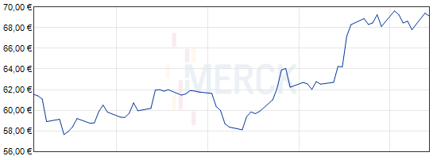

**Beispiel 1**

In meinen letzten Beitrag schrieb ich über [Gepants gegen Migräne](http://www.brainlogs.de/blogs/blog/graue-substanz/2010-08-17/gepant). Gepants sind eine neue Wirkstoffgruppe zu denen der Wirkstoff Telcagepant gehört, der in einer Phase III getestet wird. Also kurz vor der Markteinführung steht. Telcagepant wird von Merck entwickelt. Könnte es sein, dass ich Aktien von Merck besitze? Will das jemand wissen? Geht das jemanden etwas an?

Immerhin, ich äußere mich in meinem Blog öffentlich als Wissenschaftler.

Im Vergleich ein Statement, das andere Wissenschaftler machen mussten, die sich ebenso öffentlich allerdings in einem Forschungsbeitrag in einer Zeitschrift zu Telcagepant äußerten.

> TWH and JK are employees of Merck and own stock or stock options in Merck. MDF has received grants and consultancy or industry support from Almirall, Coherex, Colucid, Eisai, GlaxoSmithKline, Linde, MAP, Medtronic, Menarini, Merck, Minster, Pfizer, and St Jude, and independent support from NWO, NIH, European Community FP6, Biomed EC, the Dutch Heart and Brain Foundations, and LUMC. His spouse owns stock in Merck. DWD has received honoraria from and has consulting agreements with Allergan, Pfizer, Merck, GlaxoSmithKline, Endo, OrthoMcNeil, Coherex, MAP, Neuralieve, Addex, Solvay, Eli Lilly, Neuraxon, Minster, HS Lundbeck, and Kowa, and has research grants from AstraZeneca, Medtronic, St Jude, and Advanced Neurostimulation Systems, and independent support from NINDS and Mayo Clinic. PW has received grant, consultancy, or industry support from Allergan, Forest, GlaxoSmithKline, Merck, Minster, OrthoMcneil, Pfizer, and Wyeth.

Welche Verbindungen habe ich zu Merck oder einen anderen Pharmaunternehmen? Nun ist es schon etwas anderes, ob ich Daten oder eine Meinung veröffentliche. Aber ist dieser Unterschied wesentlich, wenn es um einen potentiellen Interessenkonflikt geht?

   
 *Sitze ich beim Bloggen vor dieser Graphik?*

**Beispiel 2**

Wie am obigen Beispiel ersichtlich, müssen in Zeitschriften auch industrielle und staatliche Fördermittel angegeben werden. Staatliche tauchen oft auch in einer Danksagung auf, müssen aber erwähnt werden.

Ich bin als Projektleiter an einem geplanten Sonderforschunsgbreich (SFB) beteiligt. Fördersumme ca. 6 Millionen. Der SFB wird in wenigen Tagen begutachtet von der Deutschen Forschungsgemeinschaft (DFG). Zu diesem Zeitpunkt kann ich mich nicht im Detail äußeren, aber doch soviel: in meinen Teilprojekt soll auch die transkranielle Magnetstimulation (TMS) bei Migräne erforscht werden.

Ich habe bei SciLogs vier mal über dieses Thema gebloggt: [Magnetschlag auf Hinterkopf](http://www.brainlogs.de/blogs/blog/graue-substanz/2010-05-11/magnetschlag-auf-hinterkopf) und [Das Wo und Wann der Neuromodulation](http://www.brainlogs.de/blogs/blog/graue-substanz/2010-03-02/neuromodulation) und in zwei englischsprachigen Blogbeiträgen. Sollte ich die geplante SFB-Förderung angeben?

Ich denke, das ist nicht notwendig – mache es aber trotzdem gerne hiermit. (Auch wenn nun keiner diese Blogbeiträge liest, kann jeder sich denken, dass dort nicht zu lesen sein wird, dass das Thema TMS und Migräne Unfug ist. Nichts wäre nun aber falscher, als die Vermutung, dass ich meine wissenschaftlichen Überzeugungen verbiege oder gar Tatsachen bewusst verdrehe. Das soll aber auch gar nicht mit einen potentiellen Verhaltenskodex unterstellt werden.)

Was aber wäre, ich würde schon gefördert werden? Sollte dies dann, wie bei Veröffentlichungen in Zeitschriften üblich, erwähnt werden?

Mein Blogbeitrag [Ich sehe was, was du nicht siehst](http://www.brainlogs.de/blogs/blog/graue-substanz/2009-12-01/migraenewellen) und [Simulation einer Sehstörung bei Migräne](http://www.brainlogs.de/blogs/blog/graue-substanz/2010-04-08/simulation-einer-sehstoerung-bei-migraene) schrieb ich kurz bzw. parallel zu einem Abschlussbericht zu meiner DFG-Sachbeihilfe, in der diese Forschung im Zentrum stand. Den Beitrag [Killerwellen vom Ozean ins Gehirn](http://www.brainlogs.de/blogs/blog/graue-substanz/2009-11-12/killerwelle) schrieb ich im Zusammenhang mit einem mittlerweile [geförderten BMBF Projekt im Bernstein Zentrum](http://www.bccn-berlin.de/Research/Projects_II/Branch_B/B2/).

Ich habe immer erwähnt, dass ich in Blogbeiträgen Zweitverwertung betreibe. Nach der Erstverwertung hat bisher niemand gefragt.

**Beispiel 3**

Ich bin Gründer der Migraine Aura Foundation (MAF). Muss ich das angeben? Oder, um ein allgemeines Beispiel zu nehmen, Blogger X ist in einer politischen Vereinigung aktiv, dies ist aber nicht unbedingt öffentlich sichtbar. Des weiteren nehme ich an, dass X ehrenamtliche tätig ist. Sollte er das angeben?

Ich denke nein, den es besteht kein Interessenskonflikt! Blogger X kann wie er will sich politisch und gesellschaftlich betätigen und es ist allein seine Sache, ob er verschiedene seiner Interessen verknüpfen will und dies bekannt macht oder nicht. Solange Blogger X nicht finanziell von einer Tätigkeit abhängt, die in einem unmittelbaren Zusammenhang mit einer anderen steht, sehe ich kein Problem. Aber was, wenn dem nicht so ist und ein finanzielles Interesse im möglichen Konflikt zu seinem Blog steht?

**Schlussfolgerung**

Ich denke es gibt Fälle, in denen ein Interessenkonflikt fairerweise angegeben werden sollte. Doch bewusst habe ich viele Fragen unbeantwortet gelassen. Meine Schlussfogerung laute, dass ein Verhaltenskodex diskussionswürdig ist! Gerade in der Zeit, in der Wissenschaftsblogs noch in den Kinderschuhen stecken.

Meine Beispiele sind nicht vollständig. So sollten Blogger, die sich zu medizinischen Themen äußern, sich einem noch schärferen Verhaltenskodext, der z.B. von der [HON](http://www.hon.ch/home1_de.html) vorgegeben wird, unterstellen. Dieser sollte in meinen Augen bei SicLogs eingehalten werden. Viel weiter muss SciLogs vielleicht gar nicht gehen, denn SciLogs ist bisher eine recht lose und heterogene Gemeinschaft.

Sollte ein Portal entstehen, dass sich auf Wissenschaftler beschränkt, denke ich, dass ähnliche Standards wie bei Zeitschriften unbedingt notwenig sind. Denn sonst werden diese "Conflict of Interest"-Aussagen beim direkten "reach out" umgangen, da der Journalist als kritischer Mittler fehlt. Das darf nicht ein Nebeneffekt – ja vielleicht sogar Triebfeder – dieser ansich guten Entwicklung der Wissenschaftsblogs sein.

Und noch was: Ein Verhaltenskodex kann nur innerhalb von Blogportalen eingefordert werden. Ein verbindlicher Standard für alle Wissenschaftsblogger ist schlicht unrealistisch.

Ein transparenter Verhaltenskodex könnte ein entscheidender Vorteil von einem Blogportal sein. Warum sonst bilden wir eine Gemeinschaft?

#### Nachtrag (19. 8.)

**Entwurf: Verhaltenskodex für Wissenschaftblogger als Diskussionsgrunglage**

Dieser Entwurf legt die deutsche Kurzfassung der [8 ethischen Prinzipien](http://www.hon.ch/HONcode/Webmasters/Conduct_de.html) [des HONcodes](http://www.hon.ch/HONcode/Webmasters/Conduct_de.html) zugrunde, an die ich mich seit 2004 auf meiner Website halte und mit der ich bisher gute Erfahrungen gemacht habe.

Diese Prinzipen sind teilweise sehr diskussionsbedürtig, z. B. habe ich kritische Anmerkungen (s. Kommentar 6 bzw. 7) zum Prinzip 1 und 2 gemacht. Weitere Prinzipien folgen ([siehe nun dazu Diskussion im Beitrag "Wissenschaft befördert die Unbildung" vom 28. Okt. 2010](http://www.brainlogs.de/blogs/blog/graue-substanz/2010-10-28/wissenschaft-bef-rdert-die-unbildung)).

1. **Prinzip Sachverständigkeit**  
 Die in diesem Portal wissenschaftbezogenen Aussagen stammen ausschließlich von ausgebildeten und qualifizierten Fachleuten. Sollte Aussage von einem nicht qualifizierten Blogger stammen, wird er klar darauf hinweisen, dass es sich um eine gemäß journalistischen Prinzipien sorgfältig recherchierte Meinungsäußerung handelt.

2. **Prinzip Datenschutz**  
 Das Portal respektiert die Vertraulichkeit der Daten individueller Personen insbesondere Kommentatoren und schützt deren Identität. Die Blogger verpflichten sich, die legalen Anforderungen bezüglich der Vertraulichkeit der Information die in Deutschland gelten, einzuhalten oder zu übertreffen.

3. **Prinzip  Zuordnung**  
 Wo es dienlich ist, werden Informationen durch klare Referenzen bezüglich der Datenquelle abgestützt und nach Möglichkeit durch einen Hypertext-Link mit dieser Quelle verbunden.

4. **Prinzip Offenlegung der Finanzierung**  
 Das Sponsoring dieser Webseite wird deutlich gekennzeichnet, einschliesslich der Identität kommerzieller und nicht-kommerzieller Blogs, die mit finanziellen Mitteln, Dienstleistungen oder Material zum Blog beigetragen haben. Einzelperonen, die als Blogger wissenschaftliche Födermittel erhalten, legen Interessenkonflikte offen, analog zu den gewöhnlichen Anforderungen in peer-review Zeitschriften. Blogger legen Nebeneinkünfte offen, wenn diese in unmittelbaren Zusammenhang mit Inhalten ihres Blogs stehen.
