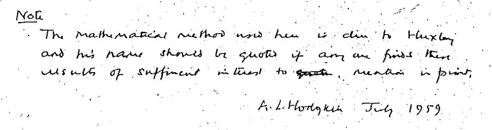

 Es wird einwenig mühselig doch die Kopie einer Kopie reicht, um die Handschrift aus dem Jahr 1959 zu transkribieren.  Es ist eine digitale Kopie einer alten Fotokopie. Nun liegt sie auf meiner Festplatte. Das Original wird entweder irgendwo in den Archiven der amerikanischen Gesundheitsbehörde “*National Institutes of Health*” (NIH) Staub sammeln oder wo immer der Nachlass des Empfängers, Wade H. Marshall, verwaltet wird.

Lange fürchtete ich jede Kopie und das Original des bis heute noch unveröffentlichten Manuskriptes seien für immer verschollen. Der Autor ist der Nobelpreistärger Alan Lloyd Hodgkin (1914 – 1998). Seinen Preis bekam er im Jahr 1963 zusammen mit Andrew Huxley and John Eccles für ein mathematisches Modell und Messungen elektrischer Erregung in einem einzelnen Nerven.

Das unveröffentlichte Manuskript beschreibt ebenfalls ein mathematisches Modell für ein sehr ähnliches Phänomen des Gehirns, nämlich elektro-metabolische Erregung im Geflecht vieler Nerven. Ein Gewebe, das für meinen Blog Pate stand, der grauen Substanz. Und ein Phänomen, das mich in über 20 Jahre Forschung begleitet, die *Spreading Depression*.

Dieses Manuskript beschrieb erstmals quantitativ diese extrem langsame Form der Erregung im Gehirn. Die Langsamkeit besiegelte für lange Zeit das Schicksal der Spreading Depression. Sie ist viel zu langsam, so dass die ausgelösten hirnelektrischen Gleichstrom-Potenziale elektroenzephalographisch von den ebensfalls langsamen Artefakten nicht zu trennen sind. Die metabolische Aktivität wiederum konnte erst im 21. Jahrhundert präzise räumlich vermessen werden.

Hodgkin konnte die klinische Bedeutung der Spreading Depression damals zwar schon erkennen – so z.B. stellt eine Veröffentlichung 1958 den Kontext zur Migräne her, der Autor war Peter M. Milner, ein Mitarbeiter von Donald Hebb. Doch diese und andere heute etablierte Bedeutungen in Zusammenhang mit Schlaganfall waren nichtsdestotrotz damals nur Spekulation. Vielleicht auch deswegen hat Hodgkin sein Manuskript nie selber veröffentlicht.

Heute wissen wir, Hodking  beschrieb in diesem Manuskript quantitativ richtig das wichtigste akut pathophysiologische Phänomen des Hirns. Und das mit mathematischen Methoden, die Huxley entwickelte – auf dessen Erwähnung er im Manuskript explizit wert legt.

> Note
>
> The mathematical method used here is due to Huxley and his name should be quoted if anyone finds these results of sufficient interest to mention in print.

Der Inhalt dieses Manuskript wurde bis heute nur über Dritte veröffentlicht und selbst diese Veröffentlichungen sind leider nur noch sehr schwer zugänglich. Die einzig halbwegs aktuelle Publikation stammt von mir aus dem Jahr 2004, veröffentlicht in der Zeitschrift Annalen der Physik. Ich kannte damals nur ein Buchkapitel aus dem Jahr 1974, in dem das mathematische Modell jedoch ungefähr so ausführlich beschrieben wurde wie im Original.

Wir würden heute gerne das Original veröffentlichen. Es ist ein bedeutendes Zeitdokument der Geschichte der Gehirnforschung.

Zunächst geht damit die Suche nach dem Original los. Denn – so die Hoffnung – es könnten noch nachträglich eingefügte handschriftliche Bemerkungen existieren.

Die Suche startet am Arbeitsplatz von Marshall, dem Hodgkin das Manuskript zusandte. Er war am *National Institute of Mental Health* (NIMH) zunächst Research Fellow bevor er dann 1954 Direktor des neu gegründeten Labor für Neurophysiologie am NIMH wurde. Vor wenigen Wochen erst traf ich auf einer Tagung den Programmdirektor (*Program Chief*) für *Theoretical and Computational Neuroscience* am NIMH, den ich schon viele Jahre kenne. Vielleicht kann er helfen.

Abgesehen von dem Auffinden des Originalmanuskripts muss auch noch geklärt werden, wie es sich mit den Schutzrechten verhält. Das ist mir noch unklar. Laut Wikipedia hatte Hodgkin drei Töchter und einen Sohn. Allerdings ist keineswegs klar, ob der wissenschaftliche Nachlass und dessen weiterer Verwertung überhaupt bei seinen Nachfahren liegt. Aufgrund der Wissenschaftsfreiheit könnten andere Gegebenheiten vorrangig zu beachten sein (s. [hier](https://www.dfn.de/rechtimdfn/rgwb/wissensbasis/wb5/nachlass/)). In den USA ist die Lage sicher nochmal anders als in Deutschland. Dort wird die Wissenschaftsfreiheit meines Wissens aus der freien Meinungsäußerung, d.h. aus der U.S. Verfassung abgeleitet.

Für mich ist das Manuskript einer der Ursprünge meines Forschungsfeldes. Deswegen würde ich es sehr gerne sehen, wenn das Manuskript bald öffentlich zugänglich wird.
