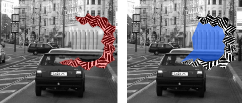

Der nun verurteilte Fahrer – er litt unter Epilepsie nicht Migräne – verlor in Hamburg-Eppendorf vor über einem Jahr die Kontrolle über sein Fahrzeug, fuhr mit geschätzten 100 km/h bei Rot über eine Ampel und landet in einer Menschenmenge. Vier Menschen starben. Der Fahrer erlitt einen epileptischen Anfall während dieser Fahrt. Er hätte mit dem Anfall und somit mit dem Unfall rechnen müssen und ist deswegen der fahrlässigen Tötung für schuldig befunden worden.

In dem [Blogbeitrag](https://scilogs.spektrum.de/blogs/blog/graue-substanz/2012-03-28/autofahren-mit-migraene) zeigte ich anhand von Bildern ähnlichen Gefahren im Zusammenhang mit Migräne auf. Bei Migräne können Gesichtsfeldausfälle (blau) auftreten, die oft unbemerkt bleiben, und zwar gerade dann, wenn es keine zusätzlichen auffälligen Gesichtsfeldstörungen (rot) gibt.

Es entwickelte sich eine interessante Diskussion. Einige Auszüge aus den Kommentaren will ich aus dem gegeben Anlass heute nochmal hervorheben.

> Ich würde sogar sagen, dass es fahrlässig ist, wenn man trotz Aura (weiter)fährt. Dann muss man stoppen und abwarten, bis die Aura vorbei ist!

> Am Anfang der Attacke sehe ich tatsächlich flirrende und flackernde Störungen [rot im Bild oben]. Hält man den Kopf still, fügen sie sich gut ins Sichtfeld ein und verdecken auch was. Bewegt man aber leicht den Kopf, sieht man einerseits, was sie verdecken und fügen sich nicht mehr so recht in die Sicht ein. Das klappt aber auch nur 15-20 Minuten. Dann ist die räumliche Wahrnehmung weg (keine Einschätzung mehr von Entfernungen), das Sichtfeld eingeengt und die Störungen nehmen überhand. Am Ende sieht man nur noch was wie durch ein kleines Loch. Auch verschwinden Körperteile aus der Sicht, Arm, Gesicht und Zunge werden taub und fühlen sich fremd an.

> Ich hatte während dieser Zeit auch mal einen nur kleinen Unfall.  
> Ich bin beim Rückwärtsfahren auf ein geparktes Auto aufgefahren welches ich komplett übersehen hatte.

> Wie richtig bemerkt: oft merkt man es garnicht, oder nur wenn man danach sucht. Oft habe ich Minuten oder gar Stunden vor der Attacke bereits grösserflächige NNS [blinde Flecke im Gesichstfeld (blau im Bild oben)] am „Bildrand“.

© 2012, Markus A. Dahlem
