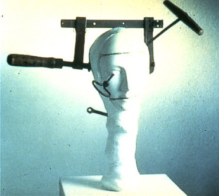

Verlängerter Hals (Partial macrosomatognosia of the neck. Entry to art contest Migraine Images, 1992.) © 2013 GlaxoSmithKline via [Migraine Aura Foundation](http://www.migraine-aura.com/content/e27891/e27265/e26585/e43013/e46020/index_en.html)

Subjektiv nehmen wir sie wahr. Auch wenn wir sie genau dafür nicht halten: für wahr. Visuelle Halluzzzinationen und blinde Flecken, außerkörperliche Erfahrung und Verzerrung des Körperschematas («*Ich stehe buchstäblich neben mir und, ähm, mein Hals ist ein Meter lang*»), Synaesthesia («*Entschuldigung, sind die „e“s nun grün oder nicht?*»), Sprach- oder Sprech-… («*Äh, wie heißt das Wort gleich…  dieser unangenehme Einfluss**, äh, Kaputt sein, beim Fernseher kommt das auch vor, die Fische, die so ähnliche heißen, erzeugen Kaviar, wie ich jetzt darauf komme nur auf das Wort nicht …*»), Déjà vu («*Aber das sagte ich ja bereits, oder?*»), und vieles mehr.

Oft grotesk manchmal subtil, was die subjektive Bewertung letztlich unmöglich macht. Dies sind vereinfachende, ja vergleichsweise blasse Schilderungen (mehr dazu unten). Selbst wenn man jetzt ein Problem beim Lesen hat, ob des grünen „e“s, dieses Problem ist eher gering, verglichen zu dem möglichen Impakt kurzzeitiger sensorischer und kognitiver Störungen (meist) zu Beginn einer Migräneattacke: während der Phase der Migräneaura.

Objektiv können wir bis heute die Ursache dieser Störungen weder mittels Elektroenzephalografie (EEG) messen. Noch können wir präzise über funktionelle Magnetresonanztomographie (fMRT) oder mittels anderer nichtinvasiver bildgebender Methoden das Muster der Störung einfangen. Wo ist die [Fleckologie](https://scilogs.spektrum.de/graue-substanz/bunt-hirn-schra), wenn man sie mal braucht?

Für EEG ist das neuronale Korrelate zu langsam, ein quasi DC-(Gleichstrom)-Potenzial. Mit fMRT sind Erregungsmuster auf der Hirnrindenoberfläche beobachtet worden, [jedoch ist ihre räumliche Lokalisierung aufgrund einer möglicherweise besonderen neurovaskulären Kopplung noch unklar](https://scilogs.spektrum.de/graue-substanz/cortical-spreading-depression-migraene-letzte/).

Gibt es dieses noch unbekannte Muster überhaupt?

Die Wahrnehmung in der Auraphase der Migräne ist so uneinheitlich und schier unerschöpflich vielfältig, dass man kaum dahinter ein und dasselbe neuronale Korrelat vermuten würde. Diese Vielfalt liegt jedoch gar nicht am Erregungsmuster, das die Störung hervorruft, sondern in der funktionellen Spezialisierung der unterschiedlichen Areale der Großhirnrinde, die mit (und trotz!) im Prinzip immer gleicher neuronaler Architektur geschaffen wird.

Nichtlokale Netzwerkeigenschaften bestimmen wahrscheinlich die Struktur und Funktion sensorischer und kognitiver Prozesse. Lokale räumliche Kopplung dagegen, nämlich die Diffusion, steuert die Ausbreitung der neuronalen Störung innerhalb der immer gleichen Hirnrindenarchitektur.

So kann dieses Muster als neuronales Korrelat der Störung sensorischer und kognitiver Funktionen selbst primitiv bleiben. Es steht auf einer Komplexitätsskala der Hirnphänomene weit unten, so dass wir die Chance haben, dieses Muster in einen Computermodell als Reaktionsdiffusionsprozess zu simulieren. Eine Trennung sowohl der Raum- als auch der Zeitskalen von Funktion und dessen Störung um fast fünf Größenordnungen ist dabei die Grundlage dafür, dass uns die Migräneaura Einblicke in [die normale Funktionsweise  sensorischer und kognitiver Prozesse liefert](http://dx.doi.org/10.1046/j.1460-9568.2000.00995.x).

Allerdings stammen nicht alle Symptome bei einer Migräneaura von der Großhirnrinde. [Noch haben wir für Migräne nur eine symptombasierte und leider keine ätiologiebasierte Klassifikation](https://scilogs.spektrum.de/graue-substanz/hirnstamm-aura-im-betatest/). Die Aura kann von Störungen in vier Gebieten des Gehirn ausgehen, zumindest unterteilt man die Verlaufsform „1.2 Migräne mit Aura“ in vier Typen. 

Abschließend sind unten alle auf unserer Website der [Migraine Aura Foundation](http://www.migraine-aura.org/) gelisteten, kurzzeitigen Aurasymptome verlinkt (nur in Englisch verfügbar). In einem weiteren Post wird dann näher auf die mathematische Modellierung mit Reaktionsdiffusionssystemen eingegangen.

## [Transitory aura symptoms](http://www.migraine-aura.com/content/e27891/e27265/e26585/index_en.html)

* [Auditory aura symptoms](http://www.migraine-aura.com/content/e27891/e27265/e26585/e26596/index_en.html)
* [Body image disturbances](http://www.migraine-aura.com/content/e27891/e27265/e26585/e43013/index_en.html)
  + [Size of the body](http://www.migraine-aura.com/content/e27891/e27265/e26585/e43013/e46020/index_en.html)
  + [Mass of the body](http://www.migraine-aura.com/content/e27891/e27265/e26585/e43013/e46067/index_en.html)
  + [Shape of the body](http://www.migraine-aura.com/content/e27891/e27265/e26585/e43013/e46060/index_en.html)
  + [Position of body in space](http://www.migraine-aura.com/content/e27891/e27265/e26585/e43013/e46075/index_en.html)
* [Depersonalization and derealization](http://www.migraine-aura.com/content/e27891/e27265/e26585/e26706/index_en.html)
* [Dreaming disturbances](http://www.migraine-aura.com/content/e27891/e27265/e26585/e48488/index_en.html)
  + [Perception of the pain of nocturnal migraine attacks during dreams](http://www.migraine-aura.com/content/e27891/e27265/e26585/e48488/e48508/index_en.html)
  + [Unusual powerful, vivid or weird dreams associated with migraine headaches](http://www.migraine-aura.com/content/e27891/e27265/e26585/e48488/e48529/index_en.html)
  + [Nightmares associated with migraine headaches](http://www.migraine-aura.com/content/e27891/e27265/e26585/e48488/e48533/index_en.html)
  + [Recurring dreams as migraine aura experiences](http://www.migraine-aura.com/content/e27891/e27265/e26585/e48488/e48543/index_en.html)
  + [Migraine aura symptoms experienced whilst dreaming](http://www.migraine-aura.com/content/e27891/e27265/e26585/e48488/e48573/index_en.html)
  + [Other disturbances of dreaming associated with migraine](http://www.migraine-aura.com/content/e27891/e27265/e26585/e48488/e48634/index_en.html)
* [Felt presences](http://www.migraine-aura.com/content/e27891/e27265/e26585/e50480/index_en.html)
* [Forced reminiscence](http://www.migraine-aura.com/content/e27891/e27265/e26585/e26732/index_en.html)
* [Gustatory aura symptoms](http://www.migraine-aura.com/content/e27891/e27265/e26585/e26771/index_en.html)
* [Language symptoms](http://www.migraine-aura.com/content/e27891/e27265/e26585/e26790/index_en.html)
* [Motor symptoms](http://www.migraine-aura.com/content/e27891/e27265/e26585/e26867/index_en.html)
* [Olfactory aura symptoms](http://www.migraine-aura.com/content/e27891/e27265/e26585/e26871/index_en.html)
* [Other disturbances of higher cortical functions](http://www.migraine-aura.com/content/e27891/e27265/e26585/e26915/index_en.html)
* [Paramnesias](http://www.migraine-aura.com/content/e27891/e27265/e26585/e48650/index_en.html)
  + [Déjà vu](http://www.migraine-aura.com/content/e27891/e27265/e26585/e48650/e48660/index_en.html)
  + [Jamais vu](http://www.migraine-aura.com/content/e27891/e27265/e26585/e48650/e48661/index_en.html)
* [Sleepwalking](http://www.migraine-aura.com/content/e27891/e27265/e26585/e51182/index_en.html)
* [Somatosensory symptoms](http://www.migraine-aura.com/content/e27891/e27265/e26585/e26970/index_en.html)
* [Speech symptoms](http://www.migraine-aura.com/content/e27891/e27265/e26585/e26982/index_en.html)
* [Synaesthesia](http://www.migraine-aura.com/content/e27891/e27265/e26585/e27009/index_en.html)
* [Time perception disturbances](http://www.migraine-aura.com/content/e27891/e27265/e26585/e27105/index_en.html)
* [Visual hallucinations](http://www.migraine-aura.com/content/e27891/e27265/e26585/e49268/index_en.html)
  + [Random form dimension](http://www.migraine-aura.com/content/e27891/e27265/e26585/e49268/e49269/index_en.html)
  + [Line form dimension](http://www.migraine-aura.com/content/e27891/e27265/e26585/e49268/e49327/index_en.html)
  + [Curve form dimension](http://www.migraine-aura.com/content/e27891/e27265/e26585/e49268/e49332/index_en.html)
  + [Web form dimension](http://www.migraine-aura.com/content/e27891/e27265/e26585/e49268/e49333/index_en.html)
  + [Lattice form dimension](http://www.migraine-aura.com/content/e27891/e27265/e26585/e49268/e49334/index_en.html)
  + [Tunnel form dimension](http://www.migraine-aura.com/content/e27891/e27265/e26585/e49268/e50080/index_en.html)
  + [Spiral form dimension](http://www.migraine-aura.com/content/e27891/e27265/e26585/e49268/e50093/index_en.html)
  + [Kaleidoscope form dimension](http://www.migraine-aura.com/content/e27891/e27265/e26585/e49268/e49335/index_en.html)
  + [Complex visual hallucinations](http://www.migraine-aura.com/content/e27891/e27265/e26585/e49268/e50109/index_en.html)
* [Visual illusions](http://www.migraine-aura.com/content/e27891/e27265/e26585/e48971/index_en.html)
  + [Autokinesis](http://www.migraine-aura.com/content/e27891/e27265/e26585/e48971/e48990/index_en.html)
  + [Cinematographic vision](http://www.migraine-aura.com/content/e27891/e27265/e26585/e48971/e49005/index_en.html)
  + [Corona phenomenon](http://www.migraine-aura.com/content/e27891/e27265/e26585/e48971/e49016/index_en.html)
  + [Diplopia](http://www.migraine-aura.com/content/e27891/e27265/e26585/e48971/e49084/index_en.html)
  + [Dysmetropsia](http://www.migraine-aura.com/content/e27891/e27265/e26585/e48971/e49032/index_en.html)
  + [Facial metamorphopsia](http://www.migraine-aura.com/content/e27891/e27265/e26585/e48971/e48996/index_en.html)
  + [Illusory visual splitting](http://www.migraine-aura.com/content/e27891/e27265/e26585/e48971/e49057/index_en.html)
  + [Metamorphopsia](http://www.migraine-aura.com/content/e27891/e27265/e26585/e48971/e49061/index_en.html)
  + [Mosaic illusion](http://www.migraine-aura.com/content/e27891/e27265/e26585/e48971/e48980/index_en.html)
  + [Polyopia](http://www.migraine-aura.com/content/e27891/e27265/e26585/e48971/e49048/index_en.html)
  + [Tilted vision, inverted vision and other forms of illusory rotation](http://www.migraine-aura.com/content/e27891/e27265/e26585/e48971/e49073/index_en.html)
  + [Visual perseveration](http://www.migraine-aura.com/content/e27891/e27265/e26585/e48971/e49110/index_en.html)
* [Visual loss](http://www.migraine-aura.com/content/e27891/e27265/e26585/e49135/index_en.html)
