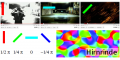

Visuelle Halluzinationen bei Migräne bestehen oft aus geometrischen Zickzackmustern und können durch Fremdaktivierung bestimmter Nervenzellen – Kanten- und Bewegungsdetektoren – erklärt werden. Umgekehrt können flackernde Lichtblitze bestimmter Form diese spezialisierten Zellen im Gehirn überreizen und so erst Migräne auslösen. Welche Reize müssen Betroffene also meiden? Und können andere Reize sogar therapeutisch wirken und eine angehende Reizüberflutung mindern?

Anhand des Hip-hop Musiktitels *Migraine*1 der Gruppe ArtOfficial lässt sich dies – visuelle Trigger (Auslöser), visuelle Halluzinationen und meine Forschung über Therapieansätze mit visuellen Stimulationen bei Migräne – erklären. Es sind drei eng zusammenhängende Probleme: (1) Welche neuronalen Netzwerke lassen Menschen, die unter Migräne leiden, gerade auf bestimmte Lichtreize überempfindlich reagieren? (2) Wie entstehen einfache visuelle Halluzinationen bei Migräne in Form von Zickzackmustern? Und (3) eben jene zentrale Frage, wie eine Attackentherapie, die auf Lichtreizen basiert, erforscht werden könnte.

Eins steht heute schon fest, das oben erwähnte Hip-hop Musikvideo ist therapeutisch perfekt ungeeignet.

In [einem folgenden Beitrag nächste Woche](https://scilogs.spektrum.de/blogs/blog/graue-substanz/2011-10-04/satte-spezialisten-ueberreizen-das-gehirn) werde ich nur zur ersten Frage kommen: Warum reagieren Migräniker auf bestimmte Lichtreize überempfindlich? Es wird ein Beitrag über die rezeptiven Felder spezialisierter Nervenzellen in der Sehrinde und ihre Anordnung zu einer kortikalen Karte *pinwheel map* genannt. Diese Pinwheel Map ist ein weiteres Beispiel der vielen topographischen Karten im Gehirn, von denen wir mit der Somatotopik – besser als Homunculus bekannt  – [gerade erst eine kennengelernt haben](https://scilogs.spektrum.de/blogs/blog/graue-substanz/2011-09-26/der-homunculus-ein-daumenlutscher).

Die folgenden drei Beiträge hängen also auch sehr eng mit dem letzten zusammen, auch wenn aufgrund des Wechsels der Sinnesmodalität, zuvor das Fühlen (somatosensorischer Sinn), jetzt das Sehen (visueller Sinn), der Zusammenhang vielleicht gar nicht unmittelbar erkannt wird. Daher mein Hinweis.

Dem nächsten Beitrag zu visuellen rezeptiven Felder folgt dann Beitrag (2) zur Hip-Hop Neuroscience Fusion, in dem die enge Beziehung zwischen visuellen Triggern und visuellen Halluzinationen erklärt wird. Diese Serie „Visuelle Trigger, Halluzinationen und Therapie“ endet mit einem Ausblick in Beitrag (3) über die wissenschaftlichen Grundlagen, die aus der theoretischen Physik kommen und hineinspielen in die hier aufgeworfene, zentrale klinische Frage zur visuellen Therapie. So steht es oben rechts im Kopf des Blogs unter „Graue Substanz“: Verbindungen zwischen Physik, Neurologie und Medizintechnik, mein Fokusthema.

Da diese Beiträge wahrscheinlich nicht direkt aufeinander folgen, habe ich diesen zur Ein- aber auch zur Überleitung geschrieben. Ich verlinke von hier alle weiteren Beiträge sobald sie online sind.

(1) [Satte Spezialisten überreizen das Gehirn](https://scilogs.spektrum.de/blogs/blog/graue-substanz/2011-10-04/satte-spezialisten-ueberreizen-das-gehirn)

(2) [Kultur optimaler Reizüberflutung](https://scilogs.spektrum.de/blogs/blog/graue-substanz/2011-11-29/kultur-optimaler-reiz-ueberflutung) (aus aktuellen Anlass eingeschoben)

(3) [Wie Licht Migräne auslöst: Hip-Hop Neuroscience Fusion](https://scilogs.spektrum.de/graue-substanz/wie-licht-migraene-ausloest-hip-hop-neuroscience-fusion/)

**Fußnote**

1 Über das Video schrieb ich schon [hier](https://scilogs.spektrum.de/blogs/blog/graue-substanz/2011-05-06/ein-aktuelles-musikvideo-migraine-im-vergleich) als damals *mein* Video von YouTube gesperrt wurde. Diese Serie von Beiträgen ist nicht zuletzt so entstanden. So hat alles sein Gutes.

© 2011, Markus A. Dahlem
