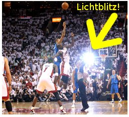
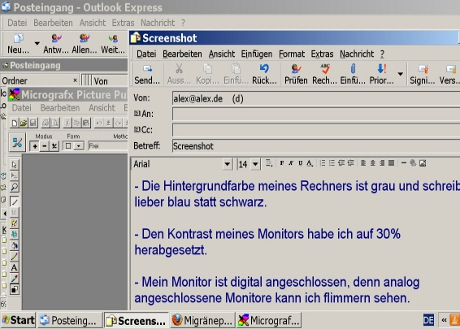
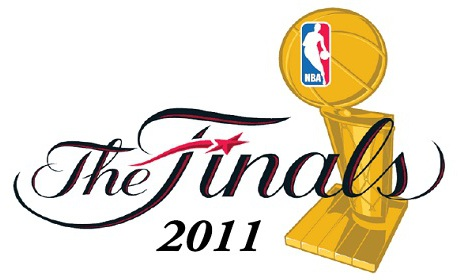

Wird Dirk Nowitzki seinem Gegner in die Augen gucken können und wenn ja, welche Farbe haben sie? An einen bestimmten Gegner, Dwyane Wade von den Miami Heat, hat er schlimme Erinnerungen aus dem NBA Finale 2005/06. Insbesondere das entscheidende 6 Spiel war ein Spiel Nowitzki gegen Wade. Wade gewann und bekam die NBA Finals Most Valuable Player-Trophäe. Nowitzki bekam sein Trauma. Dwyane Wade ist meinen Lesern vielleicht bekannt. Er trug einmal Anfang 2011 eine [stark getönte Sportbrille um die grellen Stadionscheinwerfer abzuschwächen als Migräneprophylaxe](http://www.scilogs.eu/en/blog/gray-matters/2011-01-28/superheros-fight-migraines-wearing-dark-goggles-and-calvin-klein-underwear). Was die Abwehrspieler der Gegner prompt monierten, da sie seine Augenbewegungen nicht sehen konnten. Ein unerlaubter Vorteil – man hat es nicht leicht, wenn man unter visuellem Stress leidet. Statt Brille wird er vielleicht in drei Stunden mit getönten Kontaktlinsen antreten. Um 3:00 ist Anpfiff (d.h. in Miami ist es noch Dienstag der 31. May 21:00 Ortszeit).

  
*Diese Lichtblitze waren nicht Spiel entscheidend, aber Wade (aka* Flash) *war es (s. Nachtrag).*

Bis dahin ist die Versuchung nun groß, zunächst mit einigen Bildern als Beispiel für visuellen Stress diesen Beitrag zu beginnen. Dann aber besteht die Gefahr, dass viele meiner Leser gar nicht weiter lesen. Sie würden vielleicht wollen, könnten aber nicht. Nicht nur grelle Stadionscheinwerfer auch bestimmte Muster erzeugen visuellen Stress. Zum Beispiel ein Schachbrettmuster, das durch weitere kleinere, geschickt gesetzte Quadrate wellenförmig zu wabbern scheint. Oder quergestreifte Balken, die scheinbar keilförmig zulaufen obwohl sie präzise parallel liegen. Solche und andere Bilder, gut bekannt als [optische Täuschungen](http://de.wikipedia.org/wiki/Optische_T%C3%A4uschung), erzeugen auch visuellen Stress und sind im höchsten Grade unangenehm für einige anzusehen. Insbesondere für Menschen, die unter Migräne leiden, sie sind besonders anfällig für visuellen Stress. An dieser Stelle also keine solche Bilder sondern gleich zu der neuen Studie.\*

In einer wissenschaftlichen Publikation, noch aus dem Jahr 2006, werden spezielle Kontaktlinsen bei Kindern untersucht und man fand, dass sie angeblich helfen visuellen Stress zu reduzieren [1]. Dort heißt es:

> *The results suggest that it is possible to measure objective correlates of the beneficial subjective perceptual effects of colored lenses, at least in some children who have a history of migraine or severe headaches.*  
> [Die Ergebnisse legen nahe, dass es möglich ist objektive Korrelate der vorteilhaften, subjektiv wahrgenommenen Auswirkungen von farbigen Linsen zu messen, zumindest bei einigen Kindern, die eine Vorgeschichte mit Migräne oder starken Kopfschmerzen haben.]  
> Übersetzung M.A.D.

Subjektiv wahrgenommene Auswirkungen von farbigen Linsen zu messen ist schwierig. Die Idee solche Kontaktlinsen zu verwenden geht auf die Erfahrung zurück, dass Farbfolien die Wahrnehmung beim Lesen verbessern (Dieser Absatz, zum Beispiel, ist leicht bläulich, wie durch eine blaue Folie gelesen. Lesen Sie ihn schneller?). Lesegeschwindigkeit ist relativ einfach zu erfassen. Kinder, die nun in ihrer Lesegeschwindigkeit von Farbfolien profitierten, bekamen individuell abgestimmte Kontaktlinsen für einen Monat. Sie führten Tagebuch über ihr Schweregefühl der Augenlider, Ermüdung, allgemeines Unwohlsein etc. und auch Kopfschmerzen [2-3]. Es zeigte sich eine Besserung. Trotzdem blieben die Resultate kontrovers. In der neuen Kernspintomographie-Studie [4] vom 26. Mai 2011 heißt es deswegen auch:

> *The mechanisms for these beneficial effects from coloured filters and POTs* [Precision ophthalmic tints] *remain obscure, contributing to controversy surrounding their use.*  
> [Die Mechanismen für diese positiven Wirkungen von Farbfiltern und POTs [präzise ophthalmisch abgestimmte Farbtöne] bleiben im Dunklen, was zur Kontroverse um ihre Verwendung beiträgt.]  
> Übersetzung M.A.D.

Weswegen nun  Kernspintomographie-Daten erhoben wurden, die die zuvor gefundenen Ergebnisse untermauern sollen. Dies gelang auch, zumindest konnte gezeigt werden, dass diese Messdaten weitgehend konsistent zu den Ergebnissen aus den Tagebüchern sind. Ich werde die Studie mir noch etwas genauer anschauen müssen und wahrscheinlich treffe ich den ein oder anderen Autoren diesen Monat in Berlin, auf dem [15. Internationalen Kopfschmerz-Kongress](http://www2.kenes.com/ihc2011/Pages/Home.aspx). Dann vielleicht mehr zu diesem Thema.

Was mich aber besonders freut ist, dass mich eine Leserin, welche schon vorangegangenen [Post-it Tipp](http://www.brainlogs.de/blogs/blog/graue-substanz/2011-05-20/migraeneprophylaxe-am-arbeitsplatz) gab, in einem [weiteren Kommentar](http://www.brainlogs.de/blogs/blog/graue-substanz/2011-05-20/migraeneprophylaxe-am-arbeitsplatz#comment-12781) mich auf diese ganz aktuelle Studie aufmerksam gemacht hat. Eine weitere Leserin wiederum hat mir dieses Bild zugesandt.

Nicht nur getönte Kontaktlinsen helfen, sondern es reduziert schon den visuellen Stress die Farben (Hintergrund und Schrift) am Computer bewusst abzustimmen. Fast alle Programme erlauben individuelle Einstellungen.

Einmal mehr zeigt sich, dass Wissenschaftskommuniktion ein Dialog ist, der beidseitig geführt werden kann und dann auch beidseitig Vorteile bringt. Nur ein Blog kann diese Dynamik entfalten. Dies passt gut zu dem Blogbeitrag bei meiner Nachbarin, von Beatrice Lugger, „[Patienten als Ratgeber von Forschern (I)](http://www.brainlogs.de/blogs/blog/quantensprung/2011-05-27/patienten-als-ratgeber-von-forschern-i)„. Ich freue mich zumindest immer über solche Hinweise.

Wie gesagt, jetzt sind es nur noch knapp zwei Stunden bis zum Anpfiff des ersten NBA Finalspiels. Darf ich ausnahmsweise für Dirk Nowitzki hoffen, dass  Dwyane Wade noch keine Kontaktlinsen trägt? Diesmal wird er wohl sowieso eher auf LeBron James achten müssen, beide könnten die Most Valuable Player-Trophäe bekommen. Wie auch immer, wenn ich morgen aufwache, werde ich wissen was Wade gemacht hat.

Wie gut, dass ich mehr als einen auszeichnen kann: für diesen Monat geht an *Falter* und *Alex* die Most Valuable Kommentator-Trophäe!

**Nachtrag – Ticker zu dem weiteren Verlauf der NBA Finals 2011**

[Dieser Teil wurde in den nächsten Beitrag verschoben](http://www.brainlogs.de/blogs/blog/graue-substanz/2011-06-08/sehnenriss-fieber-oder-doch-lieber-migr-ne).

**Fußnote**

\* Statt Bilder aber doch der [Hinweis auf das „Migraine“ Musikvideo der HipHop Gruppe ArtOfficial](http://www.brainlogs.de/blogs/blog/graue-substanz/2011-05-06/ein-aktuelles-musikvideo-migraine-im-vergleich). In meinen englischen Blogbeittrag (von dort verlinkt) gehe ich auf Dwyane Wade noch genauer ein.

**Literatur**

[1] [Riddell PM, Wilkins A, Hainline L.  
The effect of colored lenses on the visual evoked response in children with visual stress.  
Optom Vis Sci. (2006) 83:299-305.](http://dx.doi.org/10.1097/01.opx.0000216125.83236.af)

[2] Wilkins AJ, Evans BJ, Brown JA, Busby AE, Wingfield AE, Jeanes RJ, Bald J.

Ophthalmic Physiol Opt. 1994 Oct;14(4):365-70. Double-masked placebo-controlled trial of precision spectral filters in children who use coloured overlays.

[3] Lightstone A, Lightstone T, Wilkins A. [Both coloured overlays and coloured lenses can improve reading fluency, but their optimal chromaticities differ.](http://www.ncbi.nlm.nih.gov/pubmed/10645383) Ophthalmic Physiol Opt. 1999 Jul;19(4):279-85

[4] Jie Huang, Xiaopeng Zong, Arnold Wilkins, Brian Jenkins, Andrea Bozoki, Yue Cao  
[fMRI evidence that precision ophthalmic tints reduce cortical hyperactivation in migraine](http://dx.doi.org/10.1177/0333102411409076),  
Cephalalgia 26 May, 2011.

**Link**

Kurze URL zu diesem Beitrag

[http://goo.gl/4yeKN](http://goo.gl/4yeKN "http://www.brainlogs.de/blogs/blog/graue-substanz/2011-06-01/visueller-stress/")

**Bildquelle**

Anpfiff des ersten Finalspiels, Thumbnail zur Illustration von visullem Stress (NBA.de)

Logo der NBA Finals 2011 ([Creative Commons](http://en.wikipedia.org/wiki/en:Creative_Commons "w:en:Creative Commons") [Attribution-Share Alike 3.0 Unported](http://creativecommons.org/licenses/by-sa/3.0/deed.en))
