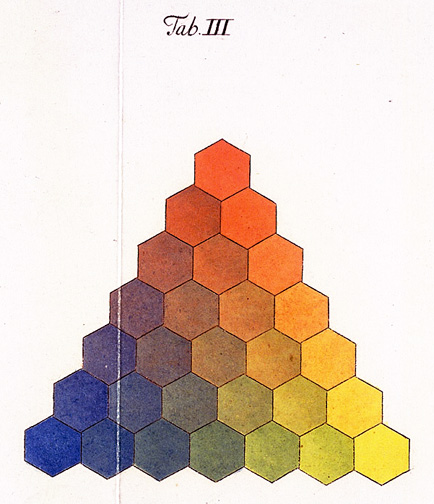

Mein Beitrag [„Wissenschaftsbloggen ist Lobbyismus“](http://www.brainlogs.de/blogs/blog/graue-substanz/2010-09-19/wissenschaftsbloggen-ist-lobbyismus) endete mit dem Hinweis, dass nun die Frage ansteht, was ein Wissenschaftsblog eigentlich ausmacht. „*Autor, Leser oder Thema können bei Wissenschaftsblogs den Kontext zur Wissenschaft herstellen*„, schrieb ich und versprach mehr dazu später. Jetzt ist später. Denn viele versuchen derzeit Wissenschaftsblogs zu verorten, so z.B. der [Berliner Theorieblog-Workshop am 9. April 2011](http://www.theorieblog.de/index.php/2011/04/blogs-in-den-sozialwissenschaften/) oder auch wir in internen und öffentlichen Diskussionen bei den SciLogs.

**Was macht einen Wissenschaftsblog aus – Leser, Autor und Thema?**

Zur Einstimmung drei kritische Fälle in denen Leser, Autor und Thema jeweils isoliert den Kontext zur Wissenschaft herstellen.

*Leser*: Kennen Sie „[Fairspektive mit ver.di](http://fairspektive.de/)„? Ein Blog zum Thema besser arbeiten in der Wissenschaft. Es spricht Wissenschaftler an.[^1] Ein Wissenschaftsblog?

*Autor*: Was wäre, wenn Richard Feynman einen Blog geschrieben hätte – allerdings nur über Aktzeichnen und Trommeln? Ein Wissenschaftler der bloggt? Ein Wissenschaftsblog?

*Thema*: Denken wir uns einen freien Wissenschaftsjournalisten, der seine zunächst für Printmedien geplanten aber nicht angenommen Artikel in ein Blog posted. Ein Wissenschaftsblog? (Als drittes Randbeispiel, könnte auch direkt [Spiegel Online Wissenschaft](https://backend1.spektrum.de/blogs/Spiegel%20Online%20Wissenschaft) dienen. Ein Wissenschaftsblogportal?)

**Ortung muss her: Das Idealtypus-Modell**

Was für den einzelnen Blogger vielleicht nur Orientierungshilfe ist kann für ein ganzes Blogportal langfristig überlebensnotwendig werden: Ortung – Wo steht man. Um diese zu schaffen werden im oben schon zitierten Beitrag „[Blogs in den Sozialwissenschaften](http://www.theorieblog.de/index.php/2011/04/blogs-in-den-sozialwissenschaften/)“ (Berliner Theorieblog-Workshop) Wissenschaftsblogs durch *Idealtypen* verortet.

> Zur Systematisierung kann eine Typologie beitragen, die Cord Schmelzle und Daniel Voelsen (beide [Theorieblog](http://www.theorieblog.de/)) anhand von Blogs in der Politischen Theorie vorstellten. Sie unterscheiden drei Idealtypen von Wissenschaftsblogs – 1) Wissenschaftliches Feuilleton (a la [Crooked Timber](http://www.crookedtimber.org/)), 2) Dienstleistungsblog (a la Tea Soup), 3) „bewusst persönlich gehaltenes“ Tagebuch (a la [The Philosophy Smoker](http://philosophysmoker.blogspot.com/)). Der Theorieblog selbst stellt hierbei eine Mischform dar, wie Cord weiter ausführte.

Auch Elmar Diederichs, der am Theorieblog-Workshop aktiv teilnahm, schlägt uns in seiner abweichenden Meinung idealtypische Konstruktionen zur Unterscheidung vor. Er unterscheidet zwischen *personal* und *non-personal blogs* und teilt letztere nochmal in zwei Kategorien. Mehr dazu in seinem Beitrag „[Scientific or Research Blogging?](http://www.brainlogs.de/blogs/blog/mind-at-work/2011-04-18/scientific-or-research-blogging)“

**Problem des Idealtypus**

Ein Idealtypus läuft immer Gefahr wegen der ihm zugrunde liegenden Überzeichnung abgelehnt zu werden. Aber auch wer begreift, dass dies nur konstruierte Begriffe zur Ordnung der Wirklichkeit sind, kann doch Schwierigkeiten haben Mischformen zu bilden. Was liegt z.B. zwischen binären Kategorien wie *personal* und *non-personal*? Auch das geht für Blogs, denn „*[e]igentlich sind nur posts* personal *oder* non-personal“, wie Elmar anmerkt.

Vom Post zum Blog zum Portal wird die Vorgabe von Idealtypen problematischer. Wenn das Ziel eines Idealtypus es ist in Öffentlichkeit hineinzuwirken und ein anderer Idealtypus innerwissenschaftliche Ziele verfolgt, können dann Blogger, die diese unterschiedlichen Typen anstreben in einem Portal nebeneinander bloggen? Ich denke ja. Idealtypen, so sinnvoll sie für den einzelnen Post sind, bietet für das Online Community Management kaum hilfreiche Messlatten um Portale gut zu strukturieren.

Ich gebe zu, letzten September habe auch ich noch an eine Orientierungshilfe durch Idealtypen gedacht. Jeder Versuch aber einen Zirkel in den Idealtypus zu stechen, eine Kreis zu ziehen und dann zu wissen wo Wissenschaftsblogger in einem gut strukturierten Blogportal nicht heraus treten dürfen, misslang mir. Wohl deswegen habe ich meinen Beitrag vor mir her geschoben.

Heute habe ich den Idealtypus mit dem Zirkel erstochen. Folgendes wurde mir klar – nicht zuletzt auch durch die [anregenden zwei Kommentare von Thomas Rupp](http://www.brainlogs.de/blogs/blog/mind-at-work/2011-04-18/scientific-or-research-blogging#comment-11847) in [Mind at Work](http://www.brainlogs.de/blogs/blog/mind-at-work) –, um den Charakter eines Wissenschaftsblogs zu verorten, ist ein additiver Merkmalsraum besser, der durch Mischen einiger Grundmerkmale den Blog beschreibt.

Setzen wir als ein erstes Grundmerkmal zum Beispiel „*einen engen Fokus haben*„. Manche Blogs haben einen engen Fokus andere nicht. Gegen beide Arten ist nichts zu sagen. Ein anderes Grundmerkmal könnte sein „*stark zu vernetzen*„. Manche Blogs tun dies andere nicht. Auch hier ist dem einzelnen Blog nicht seine Ausrichtung vorzuwerfen, doch für ein Portal gab [Thomas Rupp den Hinweis](http://www.brainlogs.de/blogs/blog/mind-at-work/2011-04-18/scientific-or-research-blogging#comment-11847):

> Wenn in einem Blognetzwerk aber ein Grossteil aneinander vorbeibloggt ist eben kein grosser Reiz da für Laien von SPON zu scilogs z.B. zu wechseln!

Solche und weitere Grundmerkmal bietet also unter Umständen für das Online Community Management hilfreiche Analysemethoden um zunächst die Ausrichtung präzise zu vermessen (dazu mehr Details in folgenden Beitrag) und dann Portale gut zu strukturieren.

**Konkurrenz der Merkmale durch baryzentrische Koordinaten**

So wie nun der RGB-Farbraum (Rot, Grün und Blau) ein additiver Farbraum ist, der Farbwahrnehmungen durch das additive Mischen der drei Grundfarben aufspannt, so können wir mit Grundmerkmalen die Blogosphäre aufspannen.

Dazu führen wir konkurrierende Merkmale ein; nennen wir sie zunächst symbolisch ein rotes, grünes und blaues Merkmal und beschränken diese derart, dass ein Merkmal den Maximalwert 1 nur dann haben kann, wenn die verbleibenden anderen nicht vorhanden sind (null sind). Solche konkurrierenden Koordinaten nennt man auch [baryzentrische Koordinaten](http://de.wikipedia.org/wiki/Baryzentrische_Koordinaten). Die Konkurrenz entsteht hier schon auf der Ebene der einzelen Post nicht aber aber unter den Bloggern selber.

Bei einem Satz vorzugebener Merkmale, kann jeder Blogger auch nachträglich feststellen, wie diese sich auf seine Posts verteilen, wobei die Summe der Kennzahlen konstant 1 sei. Dieser Beitrag hier verortet sich, wenn ich nur die zwei Merkmale *Fokus* und *Netzwerk* habe, bei (0,1), da er nicht zu meinem Fokusthema Migräne gehört (0) und er stark vernetzenden Charakter hat (1). Schon bei drei Grundmerkmalen und z.B. 52 Posts (also 52 Zahlentupel (x,y,z) mit x+y+z=1) bekomme ich für meinen eigenen Blog mit dieser Methode einen guten Überblick, wo ich eigentlich stehe und wie ich über die Zeit dort hinkam.

**Die Wissenschaftsblogverortungsfarbdreiecksmethode**

Ich will ein einfaches Beispiel bringen und in einem folgenden Beitrag die genauen Eigenschaften dieses Werkzeuges zur Verortung erläutern.

Oben gezeigtes Farbdreieck ist ein von Gottfried Wilhlem Leibniz [Georg Christoph Lichtenberg stammder Nachdruck von Tobias Mayers Original](http://en.wikipedia.org/wiki/Color_triangle). (**Nachtrag vom 24.4.**: Ich hatte dies zunächst fälschlich für eine Arbeit von [Gottfried Wilhlem Leibniz](http://de.wikipedia.org/wiki/Gottfried_Wilhelm_Leibniz) gehalten, dessen Werk zumindest Einfluß auf Goethes Farbenlehre hatte.) Wie kann ich nun ein Blog mit Hilfe so einer Farbenlehre verorten? Zunächst ändere ich den Farbraum und tausche gelb mit grün, so dass das heute übliche RGB-Model entsteht. Dann – und das ist nun wesentlich – nehme ich baryzentrischen Koordinaten, eine Beschränkung des ursprünglichen RGB-Farbraums, denn dort können beliebige Kanäle ihren Maximalwert gleichzeitig haben.

Das Merkmal Rot sei nun das schon erwähnte „*einen Fokus haben*„. Würde Leibniz (Ich bleibe nun bei ihm, s. Nachtrag oben) bloggen – Was Sie schmunzeln? 20.000 Briefe mit rund 1.100 Korrespondenten aus 16 Ländern belegen, dass er eine Netzwerker war, [ein Homo societatis](http://de.wikipedia.org/wiki/Homo_societatis), was anderes sind Blogger? – Leibniz würde also bloggen und sein Blog hätte wohl kaum einen Fokus. Er war Universalgelehrter. Der Farbkanal Rot steht bei ihm auf null. Trotzdem können und müssen wir ihn noch verorten und zwar auf der horizontalen Blau-Grün-Achse, die die verbleibenden zwei baryzentrischen Koordinaten, d.h. Merkmal Blau und Merkmal Grün aufspannen. Nehmen wir der einfachheithalber an, beide Merkmale seien zu gleichen Teilen vorhanden, das ist in den Koordinaten der Punkt (0, 0.5, 0.5), sein Blog wäre aquamarin.

Bei mehreren Posts liegen Blogs üblicherweise nicht am Rand aber eben auch nicht in der grauen Mitte. Die erste Analyse mit meiner Methode, deren Grundlage ich noch im Detail erkläre, ergab, dass die Graue Substanz einem dunklen „raspberry rose“ entspricht.

Wie diese Analyse funktioniert, zum Beispiel

* die Relation zueinander auf der Universalgelehrten-Sektion (sagen wir Isaac Newton und Leibniz seien zu verorten)
* was eine Eigenbrödler- und Wiederkäuer-Linie ist
* was der Scheuklappenträger-Punkt
* wo liegt der Sascha-Lobo-Punkt der Wissenschaftsblogosphäre

all dies in [dem folgenden Beitrag](http://www.brainlogs.de/blogs/blog/graue-substanz/2011-04-25/wissenschaftsblogverortungsfarbdreieck) Ihrer dunkelhimbeerrosenfarben Grauen Substanz.

[^1]: Auch ich habe einzelne Beiträge [aus Anlass des Guttenberg-Skandals](http://www.brainlogs.de/blogs/blog/graue-substanz/2011-02-25/die-dissertation-zwischen-auftragsarbeit-und-gesellenstueck), [aber auch schon davor](http://www.brainlogs.de/blogs/blog/graue-substanz/2010-06-24/karrieremodelle-in-der-wissenschaft), überKarrieremodelle und Nachwuchs in der Wissenschaft geschrieben.
