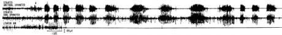
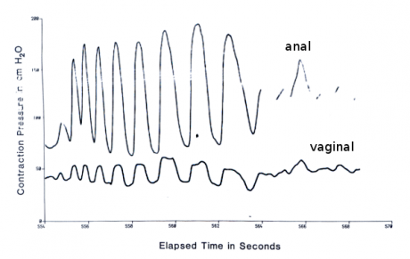

Das wird Thema meiner neuen Vorlesung an der TU Berlin sein. Sie startet diesen Montag von 10:00ct bis 11:45 Uhr ([Karte](http://maps.google.com/maps?f=q&source=s_q&hl=en&geocode=&q=Hardenbergstra%C3%9Fe+36,+Berlin,+Deutschland&sll=52.523405,13.4114&sspn=1.407126,3.348083&ie=UTF8&hq=&hnear=Hardenbergstra%C3%9Fe+36,+Berlin+10623+Berlin,+Germany&z=16) und mehr Details für Studenten [hier](https://sites.google.com/site/nonlindynphymed/)).

   
 *Der Fachmann sieht bei dieser Aufzeichnung eines männlichen Orgasmus das Kennzeichen einer subkritischen Bifurkation [1]*

Der Schwerpunkt dieser Veranstaltung liegt auf der Neurophysiologie und auf neurologischen Erkrankungen, wie z.B. Migräne, Epilepsie und Parkinson. Diese werden als *dynamische Krankheiten* eingeschätzt. Das sind Krankheiten, deren veränderte Rhythmen neuronaler Aktivität mit Hilfe der *Bifurkationstheorie* zumindest teilweise erklärbar wird. Großes Interesse fand diese interdisziplinäre Forschungsrichtung nachdem basierend auf dieser Theorie neue Therapieansätze entwickelt wurden und nun auch getestet werden (s. [hier](http://www.brainlogs.de/blogs/blog/graue-substanz/2010-03-02/neuromodulation)).

In der Vorlesung gibt es aber auch viele Abstecher zu Themen über gesunde Funktionen in anderen Körpersystemen, z.B. eben über den super- und subkritischen Orgasmus, oder auch über Zeitverzögerung in der Regulierung, die für Chaos in unseren Organen sorgt.

  
 *Und nun eine Aufzeichnung des weiblichen Orgasmus: ist er sup- oder superkritisch? Die Vorlesung bringt Klarheit.*

*"From Clocks to Chaos: The Rhythms of Life**"* ist der Titel des Buches [1], dessen Thema ich zentral in der Vorlesung durchgehen werde. Hieraus stammt auch das Beispiel des Orgasmus, allerdings nimmt das Thema dort nur 1 Seite von 200 ein. Die Autoren weisen darauf hin, dass letztlich die Datenlage noch zu dünn sei, und mehr *Experimente* gemacht werden sollten. Wobei ich hier das Thema Biokybernetik nicht auf *Selbst*reglation beschränken würde.

Ein weiteres Buch dieser Autoren, dessen Titel Pate für meinen Vorlesungstitel "Nichtlineare Dynamik in Physiologie und Medizin" stand, ist auch unten aufgeführt [2], so dass der interessierte Leser und die interessierte Leserin auch im Selbststudium – oder gemeinsam im Team – Experiment und Theorie verbinden können.

Wenn Physiologen über *Funktio*n reden, versteht der Physiker oft nur Bahnhof, wo er doch *Dynamik*, insbesondere nichtlineare Dynamik hören sollte. Ein Ziel ist es, eine gemeinsame Sprache zu lernen, die eine interdisziplinäre Forschung erst möglich macht. Denn eine Physikerin möchte ja vielleicht auch mal mit einem Physiologen im Team experimentieren.

Mehr dazu und weiteres auf der [Website](https://sites.google.com/site/nonlindynphymed/) der Vorlesung, die nun im Laufe der Vorlesung weiter mit Inhalt gefüllt wird.

**Literatur**

[1] From Clocks to Chaos: The Rhythms of Life, Leon Glass and Michael C. MacKey, (Princeton Paperbacks)

[2] Nonlinear Dynamics in Physiology and Medicine, Anne Beuter, Leon Glass, Michael C. Mackey, Michele S. Titcombe, (Springer)
