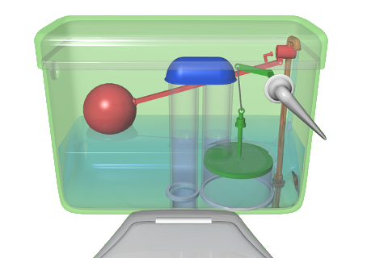
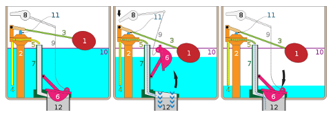
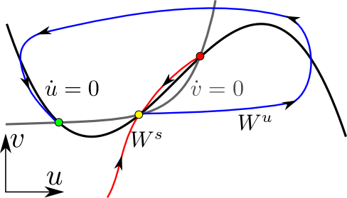
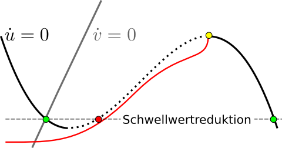

Das Thema Toilettenspülung kam zunächst in den Kommentaren zu [„Kipp-Punkte im Gehirnklima“](https://scilogs.spektrum.de/blogs/blog/graue-substanz/2011-09-12/kipp-punkte-im-gehirnklima) zur Sprache. Heute wird genau erklärt, was ich damit meinte und ich hab‘ dafür auch was neues: den Experten-Kasten für die, die es ganz genau wissen wollen. Zum Auftakt gleich zwei davon. Doch zunächst kommt der Kastenspüler.

  
Ein Kastenspüler ([Wikipedia](http://de.wikipedia.org/wiki/Toilettensp%C3%BClung)).

Migräne gilt so mancher Tageszeitungsbeilage als *Übererregung* des Gehirns. Mit diesem Begriff habe ich meine Schwierigkeiten. Wenn nicht klar definiert ist, was Erregung einer Nervenzelle oder eines Nervenzellverbundes bedeutet, nutzt der Begriff wenig. Übererregung gleich des ganzen Gehirns ist wohl gar nicht sinnvoll zu definieren und wenn es auch als *Metapher* taugt, soll doch wohl eher ein wissenschaftlicher Anstrich suggeriert werden, den wir einfach in gewissen Medien nie vorfinden.

Natürlich kann man den Begriff Übererregung auf der psychischen Ebene statt der physiologischen verwenden ohne die Wissenschaft zu verlassen. Doch diesbezüglich halte ich mich zurück, weil ich mich ungenügend damit auskenne. Mich interessiert die physiologische Erregung, die man klar definieren kann, so wie man die Funktionsweise eines Kastenspülers genau beschreiben kann.

  
Die drei Phasen des Kastenspülers ([Wikipedia](http://de.wikipedia.org/wiki/Toilettensp%C3%BClung)).

Es folgt am Ende ein sehr fundamentaler Teil, der für Nichtfachleute unverständlich sein wird: die erwähnten Experten-Kästen. Verkürzt zusammengefasst: eine Erregung ist eine Antwort auf eine kleine Störung, die man als langen Umweg zurück zum Ausgangspunkt beschreiben kann. Das klingt zwar intuitiv plausibel, doch was genau dahintersteckt ist nicht so leicht zu sehen. Deswegen kommt die Toilettenspülung als anschauliches Beispiel zum Einsatz.

Zunächst gibt es drei Phasen, vor der Störung, in der etwas – egal ob Kastenspüler oder Nervenzelle – nicht erregt ist: Der Ruhezustand. Die Erregungsphase selbst und dann eine Phase der Erholung oder Refraktärität, womit ausgedrückt wird, dass man in dieser Phase unempfindlich gegen neue Störung ist. Was ich oben als „Umweg“ bezeichnete will ich im folgenden „Exkursion“ nennen, es umfasst die letzten beiden Phasen. Die Exkursion ist in irgend einem Sinne größer als die Störung selbst.

Drückt man zum Beispiel beim Kastenspüler sehr kurz und unvollständig den Auslösehebel (8), so dass kaum Wasser entkommt, entleert sich der volle Wasserkasten nicht. Sehr kleine Störungen toleriert das System und kehrt auf direkten Weg zurück in den Ruhezustand. Wird aber der Verschluss (6) kurz vollständig hochgedrückt, bleibt er dort und der Kasten wird vollständig entladen und wieder befüllt, die Exkursion, wir kehren zurück dahin wo wir waren, aber nicht auf direkten Weg.

## Wie anrregend: Integrator oder Resonator?

Es gibt im wesentlichen zwei Arten von erregbaren Systemen, wie schon oben erwähnt ist es wieder egal ob Kastenspüler, Hirn- und Muskelzelle oder Wetter und Klima-Wandel oder welches System auch immer. Selbst die psychische Beschreibung eines Migräneanfalls als Erregungszustand könnte ich in diese zwei Arten einteilen, trotzdem spreche ich selbst, wie gesagt, nur  von der Nervenphysiologie. Kommentare sind aus jeder Richtung willkommen.

Diese zwei Arten nennt man den Integrator und den Resonator. Der Unterschied wird deutlich, wenn man überlegt, wie das erregbare System auf viele kurze, also periodische Störungen reagiert. Macht es die Exkursion nach einer bestimmten Anzahl oder bei einer bestimmten Frequenz?

Man ahnt es, der Integrator integriert (zählt) die Störungen auf und reagiert mit der Exkursion bei einer bestimmten Anzahl. Der Resonator reagiert nur für bestimmte Frequenzen, er bleibt ruhig bei sehr langsam aufeinander folgenden Störungen sowie bei ganz schnellen Störungen. Wer einen Kastenspüler zuhause hat, probiere es aus und schreibe mir, ob es ein Integrator und Resonator ist!

Das Phänomen bei Gehirnzellen kannten schon Hodgkin und Huxley, die den Nobelpreis für die mathematische und experimentelle Beschreibung der Nervenerregung bekamen. Sie nannten Integrator und Resonator zunächst Klasse 1 bzw. Klasse 2 Nervenzelle. So wird bis heute in der Neurophysiologie Erregbarbeit klassifiziert, allerdings oft mit dem Begriff Typ-I- und Typ-II-erregbare Systeme, eine Bezeichnung nach Rinzel und Ermentrout, die ein mathematische Erklärung fanden und letztlich für diese Klassifikationen das theoretische Fundament schafften.

In den folgenden zwei Kästen wird im Jargon erklärt, was es damit auf sich hat. Selbst für Fachleute eine Warnung: es ist sehr knapp beschrieben, so dass ich schon etwas Vorerfahrung in nichtlinearer Dynamik voraussetzte. Gerne können Fragen gestellt werden. Noch etwas komplizierte ist die Frage, ob die Pathophysiologie der Nervenzellen, die eine Migräneaura verursachen, so klassifiziert werden kann. Denn diese Pathophysiologie ist, was ich einen erregbaren Burster nennen würde.

Auch wenn diese Frage offen bleibt, hoffe ich, es wurde halbwegs verständlich, was ich meine, wenn ich von Übererregbarkeit und Migräne hier im Blog spreche.

## Typ-I-erregbar

Erregbare Systeme sind Systeme, deren zugrundeliegenden Bewegungsgleichungen zu einen Phasenraum  führen mit einem global stabilen Fixpunkt (grün) – hier zweidimensional gezeigt mit Variablen u,v . Der Fixpunkt wird nach einer überschwelligen Störung allerdings erst wieder erreicht, nachdem das System eine Exkursion im Phasenraum durchlaufen hat. Diese Schwelle kann auf zwei Arten entstehen, die, wir ahnen es, davon abhängen, ob wir einen Integrator oder einen Resonator haben.

Bei Typ-I existiert ein Sattelpunkt (gelb) als weiterer Fixpunkt im Phasenraum, dessen stabile Mannigfaltigkeit (Ws, rote Trajektorie) eine Separatix bildet, die Schwelle. Die instabile Mannigfaltigkeit des Sattelpunktes (Wu, blau) zwingt das System, wenn es hinter die Separatrix gelangt, auf eine Exkursion im Phasenraum, denn sie bildet eine heterokline Verbindung mit dem stabilen Fixpunkt (Trajektorie gelb->blau), die folglich Umlaufen werden muss.

Type-I entsteht, da der grüne Knoten mit dem gelben Sattel zusammentrifft – Jargon-Modus auf vollen Ausschlag: im Bifurkationspunkt  formt die Zentrumsmannigfaltigkeit dieser Sattel-Knoten-Bifurkation einen invarianten zyklischen Orbit, die Homokline (Ws=Wu für einen Fixpunkt). Man nennt es die “Saddle-node bifurcation on invariant circle“ (SNIC).

## Typ-II-erregbar

Bei Typ-II existiert keine solche Schwelle im Phasenraum im Sinne einer Separatrix.

Aufgrund einer starken Zeitskalentrennung der dynamischen Variablen u und v verdichten sich hier Trajektorien um eine sogenannte Canard-Trajektorie (rot). Diese verläuft durch einen kritischen Punkt (gelb) auf der kubischen Nullkline der schnellen Variablen u, Diese Verdichtung ist derart scharf, dass diese Canard-Trajektorie effektiv wie eine Schwelle wirkt. Allerdings sind graduelle Abstufungen der Amplituden einer Exkursion der Erregungsphase in diesem Typ zumindest im Prinzip beobachtbar. Dagegen sind aber keine beliebig langsamen Feuerraten möglich.

Anhand der Orbitstruktur um ausgezeichnete Trajektorien des nichtlinearen dynamischen Systems erklärt sich also das dynamische Verhalten, ähnlich wie man es in linearen Systemen anhand der ersten Integrale machen kann, nur das bei diesen oft analytische Wege offen stehen und man bei jenen meist numerisch oder mit ströungstheoretischen Methoden näherungsweise rechnen muss.

Welche Bifurkationsstruktur der Übererregung bei Migräne zugrunde liegt, ist eine aktuell offene Frage.

Mit einer besonderen strörungstheoretischen Methoden kommt man zu der Schwellwertreduktion (horizontal gestrichelte Ebene), bei der man die Schwelltrajektorie (egal welchen Typs) auf einen Fixpunkt (rot) reduziert. Diese Gleichung wurde von Hodgkin um 1960 für Spreading Depression aufgestellt, er hat dies allerdings nie publiziert. Sie ist in der Physik heute als Schlögl-Modell bekannt, ein prototypisches Modell auf dem Gebiet der Nichtgleichgewichtsthermodynamik mit vielen Anwendungen, Migräne ist sicher eine der spannendsten davon.

© 2012, Markus A. Dahlem
