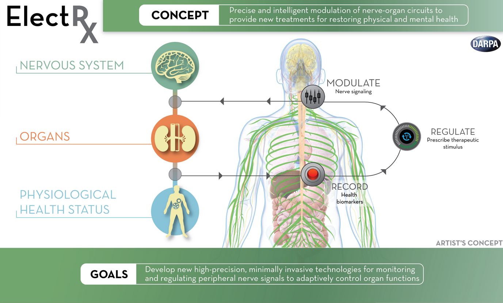
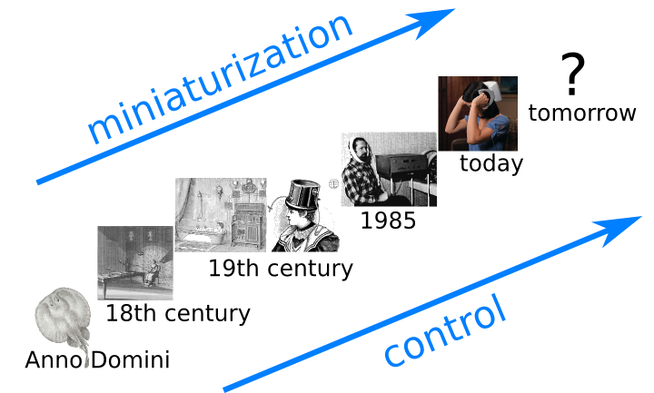

Die [Elektrozeutika](https://scilogs.spektrum.de/graue-substanz/personalisierte-elektrozeutika/) des vorletzen Beitrages und die [Computermodelle für Schmerzentstehung](https://scilogs.spektrum.de/graue-substanz/schmerz-im-computer/) des letzten Beitrages gehen Hand in Hand. Denn Modelle braucht man, um gezielt die Stimulation des Gehirns zu entwerfen, sprich Elektrozeutika zu designen.

Gerade in der Kombination wird es ein schwieriges Thema, zumal weitere Anwendungen hereinspielen, wie z.B. das Verlernen (Extinktionslernen) von krankhaften Angstzuständen.\* Es wäre jedoch falsch, diese Verbindungen der letzten beiden Beiträge nicht einmal extra herauszustellen. Denn die Grenzen der Fantasie liegen ohnehin irgendwo bei schmerz- und angstbefreiten Übersoldaten und der Übertragung des Bewußtseins auf einen Computer, schmerz- und sorgenfrei unsterblich. Ein Funken Wahrheit ist zumindest an dem militärischem Interesse.

## Schmerzforschung

Sicher ist Schmerzforschung ein wichtiges Forschungsfeld. Vom unmessbaren Leid, durch Schmerzen erzeugt, abgesehen, US\$62 Milliarden betragen die monetären Kosten der Schmerzen in den USA pro Jahr ([Lost productive time and cost due to common pain conditions in the US workforce](http://jama.jamanetwork.com/article.aspx?articleid=197628), *Jama*, 2003). Insgesamt werden die Kosten auf eine Billion US-Dollar pro Jahr in den Industrieländern geschätzt. Das allein relativiert die Fördervolumen. Für diese und zusammenhängende Forschung werden sowohl die USA als auch Europa viele hundert Millionen Dollar und Euro ausgeben, über viele Jahre gestreckt.

Gleichzeit verfolgt das Verteidigungsministeriums der USA eigene Interessen. Die DARPA (Defense Advanced Research Projects Agency) arbeitet auch an Elektrozeutika nennt sie allerdings ElectRX (ausgesprochen: “electrics”). Siehe [hier](http://www.forbes.com/sites/federicoguerrini/2014/08/29/darpas-electrx-project-self-healing-bodies-through-targeted-stimulation-of-the-nerves/) und [hier](http://www.huffingtonpost.com/2014/09/26/implant-self-healing-neuromodulation-darpa_n_5869072.html?&ncid=tweetlnkushpmg00000067).

Image credits: DARPA

## Angststörungen und posttraumatische Belastungsstörungen

Das militärische Interesse zeigt einmal mehr, dass [Neuromodulation und Neuro-Enhacement verschmelzen](https://scilogs.spektrum.de/graue-substanz/neuromodulation-und-neuro-enhancement-verschmelzung/) und wir beides nur zusammen diskutieren können. Im Zusammenhang mit Computermodellen ist wichtig zu erwähnen, dass ElectRX von Obama’s BRAIN Initiative gefördert wird. BRAIN will nicht direkt daran arbeiten (und an anderen Fragestellungen einer konkreten Anwendung). Zumindest in der ersten Phase sollen allein die Infrastruktur für diese Art von Forschung bereitgestellt werden. Wie gestern [in der Stuttgarter Zeitung berichtet](http://www.stuttgarter-zeitung.de/inhalt.hirnforschung-in-den-muehlen-der-medien.36d7006c-7f4b-49c7-b0f4-20cb0e6f305b.html), will eigentlich genau das, die Infrastruktur bereitstellen, das europäische Human Brain Projekt auch “nur”.

Natürlich geht es in der militärischen Anwendungen von ElectRX nicht allein um Schmerzen sondern vor allem um das Monitoring und dann Vermeiden von Angststörungen und posttraumatischen Belastungsstörungen. ElectRX (oder Elektrozeutika) ist dabei nur ein anderer Name für Neuromodulation. Neuromodulation zur Behandlung von Angststörungen und posttraumatischen Belastungsstörungen wird vor allem mit vier Methoden diskutiert: Tiefe Hirnstimulation, Vagusnervstimulation, transkranielle Gleichstrom- und Magnetstimulation, siehe z.B. in der Fachzeitschrift der ADAA (Anxiety and Depression Association of America) den Artikel vom März dieses Jahres, der das Ziel beschreibt, mit diesen vier Methoden das Extinktionslernen zu verbessern ([Device-based brain stimulation to augment fear extinction: implications for PTSD treatment and beyond](http://onlinelibrary.wiley.com/doi/10.1002/da.22252/abstract), *Depression and Anxiety*, 2014).

## Von Neuromodulation zu Elektrozeutika und ElectRX

Neuromodulation ist zwar nur ein älterer Name für Elektrozeutika oder ElectRX, doch die neuen Namen sollen die Zukunft betonen, das heißt, Miniaturisierung und bessere Steuerung und Einkopplung der elektromagnetischen Felder ins vegetative Nervensystem und Gehirn.

## Schmerzforschung ist Lern- und Gedächtnisforschung

Bei Angststörungen und posttraumatischen Belastungsstörung geht es um das aktive Verlernen. Es mag zunächst überraschen, aber Schmerzforschung ist auch Lern- und Gedächtnisforschung. Es ist kein Zufall das Roland Melzack, ein Begründer der Gate Control Theory so wie der Theorie einer [Neuromatrix als Schmerzmatrix](https://scilogs.spektrum.de/graue-substanz/die-schmerzmatrix/), Doktorand bei Donald Hebb war, dessen Namen man von der Hebbschen Lernregel kennt. Die Tiermodelle in der Schmerzforschung bei (vor allem chronischer) Migräne folgen Lernparadigm (siehe z.B. [Sensitization and ongoing activation in the trigeminal nucleus caudalis](http://www.sciencedirect.com/science/article/pii/S0304395914001560), *Pain*, 2014) und auch Computermodelle der Schmerzforschung werden diese “kognitive” Richtung einschlagen.

Der Forschungszweig der Neuromodulation überrascht vielleicht im Moment mehr durch gewaltige Förderprogramme, als durch vielfältige Erfolge in der breiten Anwendungen. Tiefe Hirnstimulation bei der Parkinson-Krankheit und das Chochlear-Implantat sind bisher zwar herausragende Beispiele, doch es folgt dann lange nichts. Allein wegen der Forschungsförderung darf man sich Zukunft als aufblühend vorstellen (was in meinem Forschungsblog durchaus geschieht). Computermodelle werden Tiermodelle zum Teil ersetzen können. Computermodelle werden (weiter) zur bessere Gesundheit der Menschheit beitragen. Gleichzeitig sollte man jedoch auch andere Möglichkeiten aufzeigen und in der Öffentlichkeit diskutieren. Computermodelle werden zu Theorien führen, die wahrscheinlich an Tiermodellen neu getestet werden. Und Computermodelle in der Gehirnforschung zielen nicht allein auf grundlegendes Verständnis und medizinische Anwendungen sondern können auch im Bereich des Neuro-Enhancement zur Cyborgisierung der Menschheit beitragen.

## Fußnote

\* Dieser Beitrag ist im Rahmen der Vorbereitung eines Vortrages nächste Woche zu diesem Workshop „[Enhancement durch neurotechnologische Verfahren? Chancen, Risiken, Visionen](https://scilogs.spektrum.de/graue-substanz/workshop-enhancement-verfahren-chancen-risiken/)“ entstanden. Außerdem bereite ich einen eigenen Workshop zu dem Thema vor. Der Beitrag skizziert nur einen ersten Streifzug durch dieses Thema.

†**Offenlegung**:
