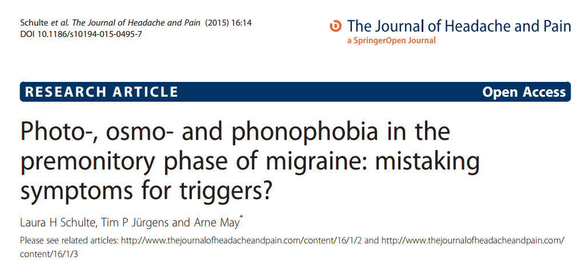

Als wir ein [Kipppunktmodell](https://scilogs.spektrum.de/graue-substanz/gurke-machen-nicht-schwanger/) für Migräne vorschlugen, gab es nur kleinere Studien sowie unzählige Anekdoten. Doch weder mathematische Theorien noch Anekdoten klären empirischen Fragen. Deswegen wurde nun in einer retrospektiven Kohortenstudie mit 1010 Migräne-Patienten nachgeschaut – und es finden sich tatsächlich systematisch Belege, die unsere Hypothese stärken. Sie besagt, dass der Migränezyklus von Kopfschmerz und kopfschmerzfreier Zeit durch schwankende Resilienz (Wiederstandsfähigkeit) gekennzeichnet ist, die das Migränegehirn periodisch auf bestimmte Weise umkippen lässt.

Dieses Umkippen hat klar festgelegte Charakteristiken. Eines davon wurde nun belegt: Wer in der Vorbotenphase beispielsweise lichtscheu, geruchs- oder lärmempfindlich ist, der nennt auch jeweils die sich damit deckenden Auslöser, also Licht, Duftstoffe oder Lärm. Insgesamt wurden 27 verschiedene Vorboten erfasst und nach korrelierenden, vermeintlichen Auslösern gesucht.

## Resilienz und umkippen: das zu Erklärende nicht mit der Erklärung verwechseln

Man täuscht sich leicht und könnte denken, mit der Umschreibung einer „schwankenden Resilienz“ und eines „umkippenden Migränegehirns“ sei schon etwas erklärt. Man würde das zu Erklärende mit der Erklärung verwechseln.1 Leider wird es oft versäumt, Betroffenen und deren Mitmenschen neue Forschung verständlich und nachvollziehbar näherzubringen und stattdessen enden Erklärungsversuche (oft unbemerkt) in solchen für den Laien leeren Metaphern. Nicht selten führt dann die Verwechslung des Fachjargons mit der Alltagssprache sogar zu ganz falschen Vorstellungen.

Zu erklären ist, auf welche Weise die Wiederstandsfähigkeit gegen Auslöser schwankt und zu erklären ist, wie der Anfall entsteht im Rahmen der Kipppunkttheorie. „Resilienz“ und „umkippen“ bzw. „Kipppunkt“ sind Schlagwörter – die allerdings nicht willkürlich gewählt wurden, sondern einem bestimmten Gehalt haben. Sie fußen in einer wissenschaftliche Disziplinen übergreifenden, mathematischen Theorie.

## Schwindende Resilienz und Erreichen eines Kipppunktes

Gesucht wurde in der genannten Studie nicht ein Indikator für die schwankende Resilienz an sich. Deswegen werde ich über den Migränezyklus an anderer Stelle schreiben. Gesucht wurde ein charakteristisches Kennzeichen eines Kipppunktes, das zu einem bestimmten Zeitpunkt im Migränezyklus auftritt.

Eigentlich sind drei Kennzeichen bedeutend. Die Kipppunkt-Theorie sagt zum einen voraus, dass in einer Phase hoher Resilienz vermeintliche Auslöser einfach wirkungslos abprallen (lateinisch *resilire*: ‚zurückprallen‘). Dazu gab es vorher schon eine Studie mit 27 Patienten, die dies vorerst belegt.2

Zweitens sollte in einer Phase niedriger Resilienz letztlich auch der geringste Anlass zur Attacke führen. Mit anderen Worten, im Bereich des Kipppunktes reichen mitunter auch unvermeintbare innere Schwankungen in der Körperphysiologie (Homöostase) aus, um eine Migräneattacke auszulösen. Gleichzeitig würden sich in diesem zeitlichen Bereich, also in der Vorbotenphase vor der Migräneattacke, Symptome mit Auslösern decken und geradezu miteinander *verschmelzen*.

Dazu wurden nun Belege gefunden und in einem folgenden Beitrag liefere ich noch die genauere mechanistische Erklärung dieses Verschmelzenes im Rahmen der Kippunkttheorie nach. Vereinfacht und unvollständig vorab erklärt, kann man sich Vorboten als *innere* Störungen und Auslöser als *äußere* Störungen vorstellen, die beide gleichermaßen, wenn ein Kipppunkt naht, extrem verstärkt werden und ein und dasselbe Netzwerk zum Mitschwingen bringen. Licht-, Geruchs- und Lärmempfindlichkeit sind also durch innere Schwankungen dieses Netzwerkes erzeugte Symptome. Licht, Gerüche und Lärm wirken von außen auf dieses störanfällige Netzwerk.

Die klinischen Daten zeigen einen Zusammenhang zwischen der Anwesenheit bestimmter Symptome in der Vorbotenphase der Migräne und korrespondierenden Auslösefaktoren, z.B. Photophobie als Vorbote und Licht als Auslöser. In einer [retrospektiven Studie](http://de.wikipedia.org/wiki/Retrospektive_Studie) kann man nicht mehr leisten als die Theorie zu stärken. Den Mechanismus belegen kann man nur in einer [prospektiven Studie](http://de.wikipedia.org/wiki/Prospektive_Studie).

Da zumindest die Korrelation von Vorboten und Auslösern der Migräne gefunden wurden, sollte in einem zweiten Schritt nach dem genauen Mechanismus gesucht werden. Ein Kandidat ist dafür die Theorie der Kipppunkte mit ihren sog. dynamisch-vernetzen Biomarkern für Vorboten.3 Aus diesen Biomarkern, so sie denn existieren, ließe sich ein unmittelbarer therapeutischer Nutzen ableiten.

Die neue Studie frei verfügbar ist: [Schulte, Laura H., Tim P. Jürgens, and Arne May. „Photo-, osmo-and phonophobia in the premonitory phase of migraine: mistaking symptoms for triggers?.“ The Journal of Headache and Pain 16.1 (2015): 14.](http://www.thejournalofheadacheandpain.com/content/16/1/14/abstract)

**Fußnoten**

1 Siehe auch [das Interview mit Tania Lombrozo “Gewusst warum”](http://www.spektrum.de/alias/denken/gewusst-warum/1328843) im neuen “Gehirn und Geist” (das vollständige Interview ist hinter einer Bezahlwand). Es wird sehr schon erklärt warum „Warum-­Fragen die Triebfedern des Denkens“ sind und in welche Fallen man tappen kann. Wenn Sie diese Art der Wissenschaftskommunikation, die wirklich Erklärungen bietet und wissenschaftlichen Fakten standhält, im Bereich der Migräneforschung unterstützen wollen, bitte bei Sciencestarter registrieren und einer von schon über 100 “Fans” von “[Migräne Sichtbarmachen](https://www.sciencestarter.de/migraene-website)” werden.

2 Hougaard, Anders, et al. „Provocation of migraine with aura using natural trigger factors.“ Neurology 80.5 (2013): 428-431. Siehe auch den [Nature News Artikel](http://www.nature.com/nm/journal/v19/n9/full/nm0913-1083.html).

3Dahlem, M.A., Kurths J., Ferrari, M.D., Aihara, K., Scheffer, M., May, A., „[Understanding migraine using dynamic network biomarkers.](http://cep.sagepub.com/content/early/2014/09/15/0333102414550108.abstract)“ Cephalalgia (2014): 0333102414550108.
