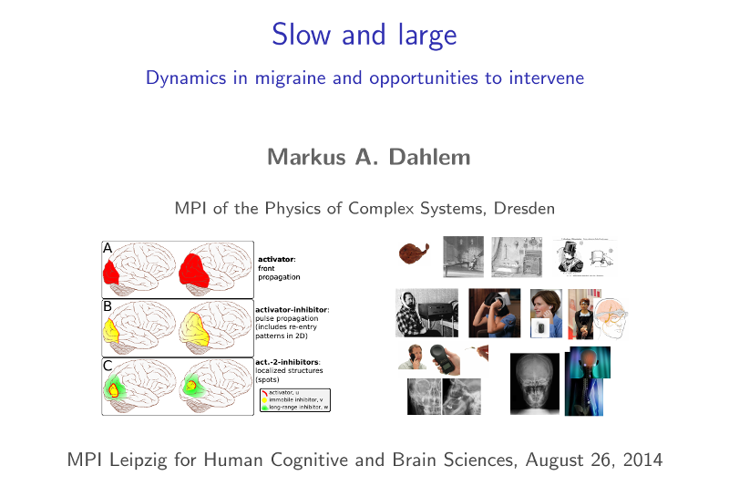

Morgen halte ich am Max-Planck-Instituts für Kognitions- und Neurowissenschaften in Leipzig einen Vortrag. Die Folien gibt es [hier](http://www.slideshare.net/markusdahlem/slow-and-large-dynamics-in-migraine-and-opportunities-to-intervene) vorab. Der Titel lautet (übersetzt): „Langsam und groß: Dynamik während Migräne und Möglichkeiten der Intervention“

Weitere Informationen gibt es [hier](http://www.cbs.mpg.de/events/calendar/00805-1). Der Vortrag ist auf Englisch, Originaltitel und Abstract füge ich unten an.

Der Vortrag besteht aus drei Teilen. Die erst zwei sind sehr kurz, ich führe knapp in einige Grundlagen der Computer gestützten Modellierung der Nervenaktivität  bei Migräne ein sowie in die Modellierung der aktiven Änderungen der Blutgefäße aufgrund von Nervenaktivität.

Im dritten und längsten Teil werden Anwendungen erläutert. Dieser Teil ist wieder dreigeteilt. Zunächst werden individuelle Aktivitätsmuster auf der Hirnrinde bei Migräne und deren Modellierung angeführt. Dann wird die Geschichte der nicht-medikamentösen Behandlungen vorgestellt. Abschließend werden diese zwei Unterteile zusammengeführt und verschiedene Beispiele der nicht-medikamentösen Behandlungen herausgegriffen, die mit Hilfe einer Computer gestützten Modellierung der Nervenaktivität und der Änderungen der Blutgefäße in Zukunft optimiert werden können.

Das Max-Planck-Instituts für Kognitions- und Neurowissenschaften in Leipzig führt übrigens das Blog [NEUROKOGNITION](https://scilogs.spektrum.de/neurokognition/) hier auf SciLogs.

## Slow and large: Dynamics in migraine and opportunities to intervene

Computational methods have complemented experimental and clinical neurosciences and led to improvements in our understanding of the nervous systems in health and disease. In parallel, neuromodulation in form of electrical and magnetic stimulation is gaining increasing acceptance in chronic and intractable diseases. First, we will present models of slow dynamics emerging on large cortical scales controlled by both subcortical networks and neurovascular coupling. The focus is on modeling migraine, though this approach is nested within the wider interest in modeling slow and large-scale dynamics in the brain. The aim is not only to better understand pain conditions and fluctuations in the resting state that causes these conditions but also to identify new opportunities to intervene with medical devices and implantable neuroprostheses. To this end, we then present the relevant state of the art of neuromodulation in migraine and approaches in fusion of both developments towards a translational computational neuroscience.
