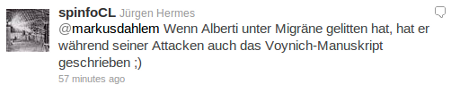
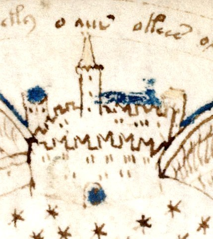
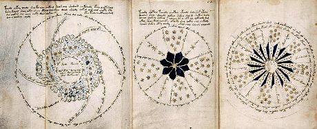

Als Reaktion auf meinen Beitrag „[Aedificium der Stadt Gottes im Gehirn](https://scilogs.spektrum.de/blogs/blog/graue-substanz/2011-12-18/aedificium-der-stadt-gottes-im-gehirn)“ kam prompt der Hinweis von Dierk Haasis auf den Architekten Leon Batista Alberti, was wenige Stunden später in seinen eigenen Blogbeitrag „[Ein wenig Wehrtechnik](https://scilogs.spektrum.de/chrono/blog/con-text/allgemein/2011-12-18/ein-wenig-wehrtechnik)“ mündete. Am Abend las ich dann auf Twitter dies:

Zunächst dachte ich an einen recht beliebig konstruierten Zusammenhang, aber das kam immerhin von Twitter und meine Timeline ist in der Regel exzellent (Danke dafür).

Also schnell mal nachgeschaut. Mit Migräne hat die verschlüsselte Handschrift aus dem 15ten Jahrhundert, das Voynich-Manuskript, zwar nichts zu tun, aber es ist auch so faszinierend. Dachte ich. Was hat Leon Batista Alberti damit zu tun, wollte ich wissen?

Als ich durch den deutschen [Wikipedia-Eintrag](http://de.wikipedia.org/wiki/Voynich-Manuskript) scrollte, sah ich dieses Bild und bekam eine Gänsehaut.

Eine gewisse Ähnlichkeit mit Hildegard von Bingens Zeichnungen des Aedificium, von den Experten ausgehen, dass sie dazu von ihrer Migräneerfahrung inspiriert wurde, springt einem, der sich damit etwas beschäftigt hat, ins Auge. Ingesamt deutlich primitiver ausgeführt, aber einzelne Elemente erinnern unverkennbar an ihr Werk. OK, das Voynich-Manuskript könnte etwas mit Migräne zu tun haben. Nun war ich sozusagen doppelt fasziniert und suchte nach weiteren Informationen.

Nichts davon in dem Wikipedia-Beitrag. Aber das bedeutet nichts. Leider auch keine Suchtreffer für „Voynich migraine“ in PubMed, der medizinischen Datenbank mit mehr als 21 Millionen Artikeln. Was bedeutet das? Ist die These schlichtweg Unfug? Oder ist sie bisher nur niemanden eingefallen? Natürlich mal abgesehen von meiner Timeline bei Twitter. Die weiß sowas.1 Also erst mal googlen, und siehe da, auf Wikipedia gibt es doch was, [im englischen Eintrag](http://en.wikipedia.org/wiki/Voynich_manuscript) findet sich der entscheidende Hinweis:

Kennedy and Churchill use Hildegard von Bingen’s works to point out similarities between the illustrations she drew when she was suffering from severe bouts of migraine—which can induce a trance-like state prone to glossolalia—and the Voynich manuscript. Prominent features found in both are abundant „streams of stars“, and the repetitive nature of the „nymphs“ in the biological section.

The theory is virtually impossible to prove or disprove, short of deciphering the text; Kennedy and Churchill are themselves not convinced of the hypothesis, but consider it plausible. (In the culminating chapter of their work, Kennedy states his belief that it is a hoax or forgery, whilst Churchill, acknowledging the possibility of a synthetic forgotten language, as advanced by Friedman, or forgery to be preeminent theories, concludes that if the manuscript is genuine, mental illness or delusion seems to have affected the author).

Die Autoren sind durchaus selber sehr skeptisch, was die These betrifft, also dass hier Glossolalie (Zungenrede) – im Sinn eines unverständlichen Sprechens – verschriftlicht wurde. Ich weiß nicht, wie gut sich die Autoren Gerry Kennedy and Rob Churchill mit der Migräne mit Aura auskennen. Sie sind Journalisten und keine Wissenschaftler, soweit ich sehen kann [1]. Ich halte ihre These konkret auf Migräne bezogen für durchaus plausibel.

Zunächst: Sprachliches Kauderwelsch kann ein Migränesymptom sein.2 Serene Branson verfiel während ihrer Berichterstattung über die Musikpreise *Grammy Awards* anfang des Jahres in ein unverständliches Kauderwelsch, bevor ihre Reportage abgebrochen werden musste.

In Frage für solche Symptome kommt auch Epilepsie und andere Komplikationen: im Januar erlitt die US-Nachrichtenmoderatorin Sarah Carlson einen solchen, dem oben gezeigten ganz ähnlichen Anfall auch live im Fernsehen.

Einige der seltsamen Spracherlebnisse während der Migräneaura, aus erster Hand geschildert, habe ich im Beitrag „[Darüber spricht man nicht](https://scilogs.spektrum.de/blogs/blog/graue-substanz/2011-08-05/darueber-spricht-man-nicht)“ zusammengestellt.

Weil ich sehr viele solcher Schilderungen kenne, halte ich diese These von Kennedy und Churchill zwar für plausibel. Jedoch nicht unbedingt nur der Art, wie sie es oben im Zitat erklärten, nämlich, dass der Erschaffer des Voynich-Manuskript während der Erstellung durchgängig unter schweren Migräneanfällen gelitten haben könnte – was zu einem tranceartigen Zustand anfällig für Glossolalie führte („suffering from severe bouts of migraine—which can induce a trance-like state prone to glossolalia“).

Die Aura während Migräne ist eine Pseudohalluzination, das „Pseudo“ ist der Tatsache geschuldet, dass der Betroffene im Moment der Aura eigentlich weiß, dass es eine Halluzination ist und er deswegen diese nicht für real hält.

Wer heute diese Aura erlebt, denkt vielleicht, er würde krankhaft verrückt werden, aber er ist dabei nicht notwendigerweise in einem tranceartigen Zustand. Bewusstseinsänderungen sind allerdings möglich. Gegen die Vermutung, dass das Manuskript während der Auraphase geschrieben wurde, spricht auch, dass die Aura in der Regel nicht lange anhält, oft nur 30 Minuten lang. Persistierende Auren über Wochen und sogar jahrelang sind allerdings auch möglich. So betrachtet ist eigentlich alles möglich und diese Theorie zu beweisen oder zu widerlegen ist praktisch unmöglich, wie Kennedy und Churchill schreiben.

Wer im Mittelalter diese Aura erlebt, war wahrscheinlich schneller mit mystischen Erklärungen zur Stelle, was einen Drang zur Verschriftlichung eine völlig andere Motivation und Bedeutung gibt, als es heute der Fall wäre. Auch das muss Spekulation bleiben, aber vielleicht war es Zungenredeschrift als eine persönliche religiöse Praxis, ein Lobpreis zu Gott ohne konkrete Auslegung inspiriert durch vorherige, kurze aphasische Migräneanfälle. Das scheint mir am plausibelsten.

Ich stütze mich mit meiner Annahme zusätzlich auf die Zeichnungen in Wikipedia, die ich teilweise hier zeige. Dies sind weitere Bilder, die mich an Zeichnungen der Migräne-Aura von Hildegard von Bingen und anderen Betroffenen sehr stark erinnern.

Die Zeichnungen sind somit für mich klar der stärkste Hinweis. Da sind visuelle (Pseudo)Halluzinationen gezeigt, deren Entstehung im Gehirn als Musterbildungsprozeß mathematisch heute sehr gut verstanden ist.

Ob das Voynich-Manuskript wirklich eine verschriftlichte migränöse Zungenrede ist und welche weiteren Argumente das Für und Wider dieser These stärken, weiß ich (noch) nicht. Bisher habe ich nur eine erste Spurensuche am 4. Advent gemacht. Dank Twitter.

Für neue Hinweise bin ich weiterhin dankbar.

**Literatur**

Gerry Kennedy, Rob Churchill (2004). *The Voynich Manuscript*. London: Orion.

**Fußnote**

1 Wer jetzt noch nicht versteht, warum Twitter in manchen Aspekten einer reinen Datenbanken überlegen sein kann, sollte sich keinen Account anlegen (und pflegen). Für alle anderen: Twitter hat 300 Million Nutzer und mit  (im Schnitt) vielleicht gerade mal [six degrees of separation](http://en.wikipedia.org/wiki/Six_degrees_of_separation) bekommt man schnell unglaublich viel nützliche Informationen, wenn man ein gutes Netzwerk pflegt.

2 Es fällt auch auf, dass eine Ähnlichkeit zum Fremdsprachen-Akzent-Syndrom besteht, was anekdotenhaft immer mal wider mit Migräne in Verbindung gebracht wird, zu dem es aber auch keine Veröffentlichung in PubMed gibt.

© 2011, Markus A. Dahlem

**Zitieren**

Sie können den Beitrag zitieren.

Markus A. Dahlem. Voynich-Manuskript migränöse Zungenredeschrift?. SciLogs. 2011-12-20. URL:https://scilogs.spektrum.de/blogs/blog/graue-substanz/2011-12-20/voynich-manuskript-migraenoese-zungenredeschrift. Accessed: 2011-12-20. [(Archived by WebCite® at http://www.webcitation.org/644eJdRQ9)](http://www.webcitation.org/644eJdRQ9)
