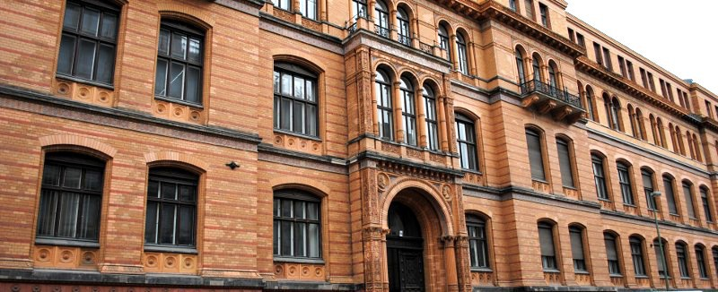
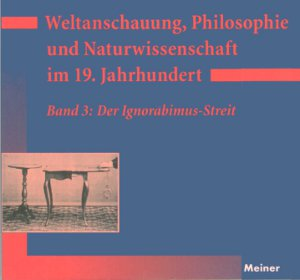
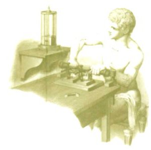
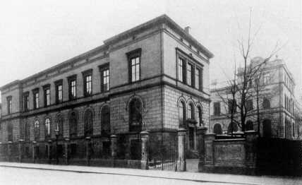
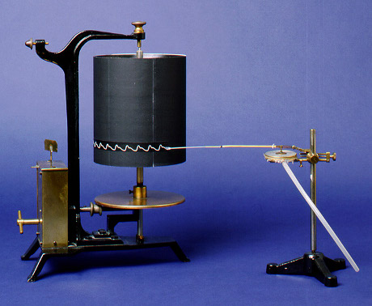
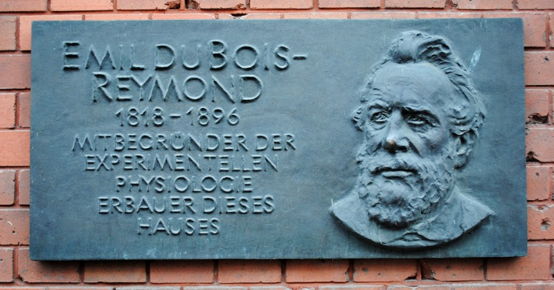

Im Ignorabimus-Streit geht es um die Grenzen der Erkenntnis [1], ausgelöst durch Emil du Bois-Reymonds Rede „Über die Grenzen des Naturerkennens“. Vorgetragen wurde die Rede 1872 auf der 45. Versammlung deutscher Naturforscher und Ärzte in Leipzig. Es geht um Mathematik als universelle Sprache der Wissenschaft und um deren Grenzen. Im dritten Absatz stützt sicht du Bois-Reymond zunächst auf

> Kants Behauptung in der Vorrede zu den Metaphysischen Anfangsgründen der Naturwissenschaft, “*daß in jeder besonderen Naturlehre nur so viel eigentliche Wissenschaft angetroffen werden könnte, als darin Mathematik anzutreffen sei.*”

In seinen folgenden Ausführungen wird du Bois Reymond Kants Aussage weiter verschärfen, um daraus dann resultierend Grenzen aufzuzeigen.

Die Annahme aber, dass es dem Physiologen du Bois-Reymond damals allein um die Grenzen der Erkenntnis ging, verkürzt ein wissenschaftsgeschichtlich interessantes Thema. Bei Debatten um Erkenntnistheorien den wissenschafts*politischen* Kontext mit einzubeziehen, in dem Aussagen zu Grenzen ursprünglich geäußert wurden, eröffnet neue Perspektiven. Darum wird es in diesem Beitrag gehen.

Du Bois-Reymond verstand sich als „Wissenschaftler-Unternehmer“, ein neuer Typ der Bourgeoisie [2]. Als solcher wollte er die Entwicklung der Physiologie weiter voran treiben. Im Allgemeinem soll die Physiologie eigenständig als Teilgebiet der Physik bestehen — als *organische Physik*. Und im Besonderen soll in Berlin ein physiologisches Institut im Stil eines Fabrik-ähnlichen Grossbetriebes entstehen.  Für beides brauchte du Bois-Reymond ein würdiges Labor in einem Neubau.

Nur wenige Tage vor seiner Rede erfüllte sich sein Wunsch — nach einem 14 Jahre anhaltenden und zuvor oft frustrierenden Kampf. Er bekam die notwendige Finanzierung von 1.584.200 Reichsmark durch einen Erlaß des Königs Wilhelm I. zugesprochen [3]. In diesem Kontext ist seine Rede zu verstehen.

  
*Die Geschichte dieses Gebäuses, der „Fabrik“,  führt zur Ignorabimus-Rede.*

Der Blog-Beitrag teilt sich wie folgt. Zunächst wird die Rede zusammengefaßt. Dann wird diese Rede nicht wie oft üblich als „Kapitulationserklärung der Wissenschaft“ interpretiert, sondern als Herausstellung der Physiologie als zukünftiges Schwerpunktthema der Forschung ([Abschnitt I](#Ignorabimus)). Eine historische Rekonstruktion der Physiologie im 19. Jahrhundert wird den Hintergrund dieser Interpretation liefern, nämlich die in Berlin ungenügende Förderung der Physiologie, die den Wissenschaftsunternehmer und -politiker du Bois-Reymond 14 Jahre umtrieb ([Abschnitt II](#Wandel)).

#### I. Ignoramus et ignorabimus — Wir wissen es nicht und wir werden es niemals wissen.

Du Bois-Reymonds Rede beginnt wortgewaltig (siehe z.B. in [4]).

> »*Wie es ein Welteroberer der alten Zeit an einem Rasttag inmitten seiner Siegeszüge verlangen konnte, die Grenzen seiner Herrschaft genauer festgestellt zu sehen, um hier ein noch zinsfreies Volk zum Tribut heranzuziehen, dort in der Wasserwüste[(\*)](#Grenzen_Deutschlands) ein seinen Reiterscharen unüberwindliches Hindernis, und somit eine wirkliche Schranke seiner Macht zu erkennen: so wird es für die Weltbesiegerin unserer Tage, die Naturwissenschaft, kein unangemessenes Beginnen sein, wenn sie bei festlicher Gelegenheit von der Arbeit ruhend die wahren Grenzen ihres Reichs einmal klar sich vorzuzeichnen versucht.*«

Der brillante Anfang wird im Hinblick auf die ungenügende Förderung der Physiologie in Berlin, insbesondere die Wortwahl vom „zinsfreien Volk“, bewertet werden müssen. Die Perspektive richtet sich dabei immer auf die Forschung diesseits (!) der Grenzen unserer Erkenntniss.  Ich folge aber zunächst du Bois Reymonds Gedankenaufbau in seiner Rede. Er kündigt an, „die Grenzen des Naturerkennens aufzusuchen“ wobei „zunächst die Frage, was Naturerkennen sei“, zu beantworten wäre.

Naturerkennen gehört für ihn in den Bereich der „theoretischen Naturwissenschaften“ und ist das „Zurückführen der Veränderungen in der Körperwelt auf Bewegungen von Atomen“, dann, so bemerkt er, fühlt sich unser „Kausalitätsbedürfnis vorläufig […] befriedigt“.

Schon Immanuel Kant setzte Wissenschaft mit der Newton’schen Mechanik gleich. Du Bois-Reymond verschärft nun in Kants Sinn:

> Kants Behauptung in der Vorrede zu den Metaphysischen Anfangsgründen der Naturwissenschaft, “*daß in jeder besonderen Naturlehre nur so viel eigentliche Wissenschaft angetroffen werden könnte, als darin Mathematik anzutreffen sei*” – ist also vielmehr noch dahin zu verschärfen, daß für Mathematik Mechanik der Atome gesetzt wird.  Sichtlich dies meinte er selber, als er der Chemie den Namen einer Wissenschaft absprach, und sie unter die Experimentallehren verwies.

Es folgt eine längere Auseinandersetzung mit Laplace und seiner Fiktion eines Geistes (oder Dämon) als bildhafte Formel für den Determinismus. Dies endet dann in den letzten Schranken des Naturerkennens.

> Das Naturerkennen des Laplaceschen Geistes stellt somit die höchste Stufe unseres eigenen Naturerkennens vor, und bei der Untersuchung über die Grenzen dieses Erkennens können wir jenes zugrunde legen. Was der Laplacesche Geist nicht zu durchschauen vermöchte, das wird vollends unserem in so viel engeren Schranken eingeschlossenen Geist verborgen bleiben.  
> Zwei Stellen sind es nun, wo auch der Laplacesche Geist vergeblich trachten würde weiter vorzudringen, vollends wir stehen zu bleiben gezwungen sind.

Unerkennbar sei zum einen das Wesen von Materie

> Nie werden wir besser als heute wissen, was, wie Paul Erman zu sagen pflegte, „hier“, wo Materie ist, „im Raum spukt“.

Auch spukt es bei den Kräften, die auf Materie wirken, auch sie bleiben unerkennbar.

Zum andern ist das Bewußtsein unerkennbar. Zur Erklärung nimmt du Bois-Reymond diesmal ausführlich Bezug zum Leib-Seele-Problem und gerade diese zweite Schranke traf den Nerv der Zeit und trifft ihn heute vielleicht noch mehr.

Du Bois-Reymond geht hier allerdings mit seinen Argumenten nicht den Weg über einen Dualismus, sondern betrachtet getrennt davon die Frage nach der Erklärbarkeit von Sinneseindrücke.

> Ob wir die geistigen Vorgänge aus materiellen Bedingungen je begreifen werden, ist eine Frage, ganz verschieden von der, ob diese Vorgänge das Erzeugnis materieller Bedingungen sind. Jene Frage kann verneint werden, ohne daß über diese etwas ausgemacht, geschweige auch sie verneint würde.

Das wieder herausstechend und rhetorisch große Finale soll natürlich auch zitiert werden.

> „Gegenüber den Rätseln der Körperwelt ist der Naturforscher längst gewöhnt, mit männlicher Entsagung sein „Ignoramus“ auszusprechen. Im Rückblick auf die durchlaufene siegreiche Bahn trägt ihn dabei das stille Bewußtsein, daß, wo er jetzt nicht weiß, er wenigstens unter Umständen wissen könnte, und dereinst vielleicht wissen wird. Gegenüber dem Rätsel aber, was Materie und Kraft seien, und wie sie zu denken vermögen, muß er ein für allemal zu dem viel schwerer abzugebenden Wahrspruch sich entschließen: „Ignorabimus“.

**Die Rede ist Forschungsprogramm nicht Kapitulation**

Es wäre nun noch viel zu sagen, ging es mir um den Ignorabismus-Streit. Aber wollte du Bois Reymond diesen überhaupt auslösen? Nach meiner Interpretation sind die von ihm aufgeworfenen Fragen und Antworten zur Erkenntnistheorie vor allem ein Indikator für den rasanten wissenschaftlichen Fortschritt.

Du Bois-Reymond zeigt zwar Grenzen auf. Doch wichtiger ist, dass diese Grenzen in weiter Ferne liegen, nahezu unendlich weit. Falls die Wissenschaft das, was vor dieser Grenze liegt, erklären kann, dann ist diese Rede geradezu das Gegenteil von einer „Kapitulationserklärung der Wissenschaft“, welche du Bois-Reymond vorgeworfen wurde (vgl. Andrea Reichenberger, in [1]).

Mit der Zweiteilung seiner aufgezeigten Grenze in das Wesen der Materie und Kräfte einerseits und Wesen des Bewußtseins andererseits, ohne dabei einen Dualismus zu predigen, gibt du Bois-Reymond eine Leitlinie vor, deren primäres Ziel es ist, die wissenschaftlichen Grundlagen an dieser Schnittstelle zu erforschen. Diese Schnittstelle ist die Physiologie. Der Naturforscher soll dort forschen „wo er jetzt nicht weiß, er [aber] wenigstens unter Umständen wissen könnte, und dereinst vielleicht wissen wird“.

Die jährlichen Versammlungen der Gesellschaft Deutscher Naturforscher und Ärzte sind ein in ganz Europa bekanntes Vortrags- und Diskussionsforum. Die Rede ist somit eine Urversion eines Forschungsrahmenprogramm mit dem Schwerpunkt Physiologie. Forschungsrahmenprogramme sind Ankündigungen Forschungsmaßnahmen finanziell zu unterstützen, die politisch für erforderlich gehalten werden.

**Mehr als ein epistemologischer Waffenstillstand**

 Der Sinn den  Ignorabismus-Streit zu führen, soll damit nicht in Frage gestellt werden. Das Buch „Weltanschauung, Philosophie und Naturwissenschaft im 19. Jahrhundert 3: Der Ignorabismus-Streit“ gibt dazu viele interessante Anhaltspunkte [1]. Allerdings schreiben dort die Herausgeber in der Einleitung auch, dass zwar die Rede einschlug „wie eine Bombe … und das Echo der Detonation sollte bis weit ins 20. Jahrhundert hinreichen“, allerdings „ohne daß Du Bois-Reymond es vorausgesehen oder gar beabsichtigt hatte“ [1, Seite 8f].

Was aber du Bois-Reymonds Intention war, bleibt im Ignorabismus-Streit verkannt. Nach meiner Auffassung kann die Intention auch nicht allein in seiner Auffassung zur Erkenntnistheorie gefunden werden. Letzlich referiert du Bois-Reymond in seiner Rede bekannte Probleme zur Erkenntnistheorie und folgt ansonsten weitgehend dem Philosophen Friedrich Albert Lange, der eine friedliche Koexistenz der Naturwissenschaften einerseits, der Philosophie und Religion andererseits in seinem 1966 erschienen Buch „Geschichte des Materialismus“ rechtfertigte. Dass in diese ausgestreckte Hand zum „epistemologischen Waffenstillstand“ nun ein Naturwissenschaftler einschlägt, ist sicher ein wichtiger Punkt (vgl. Andrea Reichenberger in [1]). Allerdings war das keine Neuigkeit. In Berlin zum Beispiel kam ihm sein Kollege, der Pathologe Rudolf Virchow zuvor.

Fortschritt und Krise der Physiologie und deren wissenschaftspolitische Hintergründe gilt es zu verstehen, möchte wir die Intention dieser Rede verstehen. Darum wird es im zweiten Teil gehen.

#### II. Wandel der Physiologie

  
*Du Bois-Reymond als Grieche in seinem „Labor“: die Küche seiner Wohnung.*

Über die Grenzen des Naturerkennens können Wissenschaftler jeder Fachrichtung philosophieren. Epistemische Fragen haben per se nichts mit Physiologie zu tun. Selbst dann nicht, wenn nach der Erklärbarkeit von Sinneseindrücken gefragt wird.

Warum wählte Emil du Bois-Reymond dieses Themas?  Die Wissenschaftsgeschichte der Physiologie liefert eine Antwort. Aus der Person du Bois-Reymonds als Physiologe und Wissenschaftspolitiker wird seine Rede ihren eigentlichen Charakter bekommen.

Zunächst zu den  Fragen, wo stand die Physiologie damals, wie war ihr Ansehen und wie war das Ansehen der Medizin allgemein? Keine dieser Fragen heute gestellt würde eine ähnliche Antwort bekommen.

**Medizin: Aderlass und wenig mehr**

Carl Reinhold August Wunderlich, ab 1850 Ordinarius in Leipzig und einer der Gründer der physiologischen Medizin stellte 1842 fest

> Dagegen haben sich die Physiker, die Physiologen, Mathematiker und vor allem die Philosophen von Profession daran gewöhnt, mit geringschätzigem Mitleid von der Medicin zu urtheilen, und wollen kaum deren Ansprüche als Wissenschaft dulden. Die neusten Tatsachen aus der Geschichte waren nicht gerade geeignet, diese Strömungen zu widerlegen, und eine Wissenschaft, die noch nöthig hat, mit Hahnemann [dem Begründer der Homöopathie, *Anmerkung M.A.D*] und Priessnitz zu kämfen, muß sich’s gefallen lassen, wenn sie noch ziemlich weit von ihrem Ideale erscheint.  
> [5, Seite 13]

Das ist der versöhnliche Ton eines Mediziners zum Ansehen der Medizin im 19. Jahrhundert. Der Chemiker Justus Liebig schrieb von der Arzneikunde als „elende, niederträchtige, miserable Sache“. Weit und breit sahen die Menschen damals die Medizin zumindest mit Skepsis — die sie damals wohl auch verdiente.

**Physik nimmt der  „Lebenskraft“ ihre Lebenskraft**

Das Problem der Medizin, vielleicht ihr Hauptproblem, war die damalige Vorstellung einer ominösen Lebenskraft als Gesundheits- und Krankheitskonzept. Dieses Konzept vertrat zum Beispiel noch du Bois-Reymonds berühmter Lehrer Johannes Müller. Es war ein Konzept, welches in seiner Ungreifbarkeit einer empirischen Forschung im Wege stand. Durch den Wandel der Physiologie hin zur Physik wurde dieses Hindernis Mitte des 19. Jahrhunderts beseitigt.

Fachlich gehörte die Physiologie ursprünglich zur Anatomie. Aus dem Zitat von Wunderlich ist aber vernehmbar, dass die Physiologie schon 1841 nahe bei der Physik und Mathematik stand. Für du Bois-Reymond war die Loslösung der Physiologie Voraussetzung um in einem experimentellen Grossbetrieb das „zinsfreie Volk“ der moderen Physiologie auszukundschaften.

**Anatomie und Physiologie gehen getrennte Wege**

  
*Johannes-Müller-Zentrums für Physiologie der Charité-Universitätsmedizin Berlin.*

Eine kurze historische Rekonstruktion anhand weniger Daten aus Berlin im 19. Jahrhunderts zeigt wie sich die Physiologie von der Anatomie löste. Ich folge hier den Angaben des Johannes-Müller-Zentrums für Physiologie [6].

1810 wirdCarl Asmund Rudolphi als erster Anatom und Physiologe an die neugegründete Berliner Universität berufen. Nach dessen Tod kommt1833 Johannes Müller als Ordinarius für Anatomie und Physiologie. Emil du Bois-Reymond ist sein Schüler. 1851 wird das Physiologischen Laboratoriums als Teil des anatomischen Museums eingerichtet. Dies kennzeichnet in Berlin den ersten Schritt der Loslösung.

Zwei Jahre später (1853) erhält du Bois-Reymond eigene Räume für die selbständige physiologische Forschung. Nochmal zwei Jahre später wird er a.o. Professor für Physiologie. Nach Müllers Tod 1858 steigt du Bois-Reymond zum Ordinarius für Physiologie auf. Die Leitung des von der Anatomie abgetrennten Physiologischen Laboratoriums wird ihm übertragen. Er selbst beantragte diese Abtrennung beim Kultusministerium. Das ist der eigentliche Schritt in eine unabhängige Physiologie in Berlin.

  
*Die am 26. April 1869 neu eröffnete Physiologische Anstalt in Leipzig.*

Es gab vereinzelt Vorläufer dieser Entwicklung aber nur in einer Stadt vollzog sich ähnlich revolutionär die Abtrennung der Physiologie aus der Anatmomie: in Leipzig der Stadt der Ignoramimus-Rede [5, Seite 40]. Ernst Heinrich Weber, Lehrstuhlinhaber für Anatomie und Physiologie, musste sich 1865 auf die Anatomie beschränken um für die Physiologie Carl Ludwig Platz zu machen. Ludwig erhielt zwei Jahre nach seiner Benennung die Zusage für ein neues Gebäude mit modernsten Laboren. Es wurde in nur 10 Monaten Bauzeit fertiggestellt. Ein „Hufeisen von 150 Fuß Seite, zweistöckig“, wie du Bois-Reymond das neue Gebäude seinem Freund und Kollegen Helmholtz beschreibt [7]. Zu diesem Zeitpunkt wartete du Bois Reymond schon seit fast 10 Jahren auf eine ähnliche finanzielle Förderung in Berlin.

Du Bois-Reymond musste sich nach seiner Berufung als Ordinarius 1858 mit Kammern unter dem Dach im Hauptgebäude der Universität und dem Versprechen für einen Neubau zufrieden geben. Viele experimentelle Versuche unternimmt er zuhause in seiner Küche, wie den historischen Versuch der willentlichen Ablenkung einer Magnetnadel (Abbildung oben).

So begann mit der Nachfolge von Müller ein 14 Jahre langer und frustriereder Kampf um einen Neubau des Physiologischen Institut.

**Streit löst sich in der Eskalation**

Die Weiterentwicklung der Physiologie war in Berlin durch völlig unzureichende Labore gehemmt. Und das obwohl Berlin damals fraglos dass Zentrum der Wissenschaft war. Namen wie Weierstraß (Mathematiker), Virchow (Pathologe), und Helmholtz (Physiker) stehen neben dem du Bois-Reymonds Pate dafür.

Die finanzielle Förderung der Naturwissenschaften ging in Berlin einher mit der industriellen Revolution. Zuvor war es keine Selbstverständlichkeit, dass experimentelle Arbeiten Teil des akademischen Unterricht waren. Nun aber fanden naturwissenschaftliche Erkenntnisse über das Experiment oft Anwendung in der industriellen Produktion. In Berlin wird es Werner von Siemens gelingen mit dieser Transferleistung Weltruhm zu erlangen. Aber das Geld für ein neues Institut für Physiologie wurde nicht gewährt, obwohl dieses du Bois-Reymond mehrfach versprochen wurde.

Als einmal mehr die Zusage für ein Physiologisches Institut scheiterte, diesmal an der Frage an welchem Ort das Gebäude entstehen könnte, droht du Bois-Reymond unverhohlen dem Kultusministerium [7]

> Solche Zustände erträgt man eine Zeitlang, wenn man ein bestimmtes Ende voraussieht. Sie werden unleidlich, wenn man sie als hoffnungslos betrachten muß; wenn man Jahr um Jahr der besten Lebenszeit unter immer wiederholten, nie gehaltenen Zusagen verstreichen sieht, wenn man fühlt, wie unter den fortwährenden Hemmungen schließlich auch der ursprünglich regste Eifer erlahmt. Vollkommen unerträglich wird sie, wenn man gleichzeitig an anderen deutschen und ausländischen Universitäten nicht bloß Altersgenossen, sondern seine eigenen Schüler leicht und schnell das erlangen sieht, um dessen Gewährung man hier im angeblichen Mittelpunkt deutscher Wissenschaft immer wieder umsonst bittend sich abmühen muß, gleich als ob man ein Gnadengeschenk für seine Person, und nicht vielmehr den Staat die Befriedigung eines unabweisbaren, allgemeinen anerkannten Bedürfnisses verlangte. Wenn also, wie es nach Eurer Excellenz letzten Äußerung leider den Anschein hat für die Bauarbeiten eines physiologischen Laboratoriums in nächster Zeit keine sicher Aussicht ist so wird es mir zur Pflicht gegen mich selbst, so bald wie möglich solcher Lage mich zu entziehen. Sollte es dazu kommen, daß ich meine hiesige Anstellung aufgebe, so werde ich mit Ruhe dem Urtheil des gelehrteren Deutschlands über diesen Schritt entgegensehen. Ich sage es ungern: aber zum Glanze der Berliner Universität wird es nicht beitragen, wenn aus solchen Gründen, die nicht unbekannt bleiben werden, ein Lehrer sich genöthigt sieht, ihr den Rücken zu kehren […]

Die hier vorgenommene Unterstreichung stammt vom Kultusministerium. Ein Hinweis welche Passage offensichtlich Eindruck machte.

Du Bois-Reymond weist auch in diesem Schreiben darauf hin, unmittelbar dem obigen Zitat vorhergehend, dass er kaum noch Zeit findet für die Kindeserziehung und ganz im Dienste der Wissenschaft steht.

> Um nicht über gelehrten Geschäften ganz aufzuhören ein Gelehrter zu sein, führe ich seit Jahren die aufreibende Lebensweise, daß ich am frühen Morgen nach dem Laboratorium wandere und dort den Tag in völliger Trennung von den Meinen verlebe, indem ich erst Abends speise. So vergehen oft Tage, ohne dass ich meine jüngeren Kinder zu Gesicht bekomme, und meine Mitwirkung an der Erziehung der älteren ist so gut wie Null.

Gerade solche persönlichen Hinweise zeigen seine Gemütslage. Oder sollen dies zumindest dem Anschein nach tun, denn du Bois-Reymond war ein brillanter Rhetoriker. Er wird diesmal gehört werden.

Parallel reicht die Universitätsleitung am 17. Juni 1872 eine Immediat-Eingabe an Wilhelm I. Sie befürchtet nicht nur du Bois-Reymond sondern auch Hermann von Helmholtz in Berlin zu verlieren.  Am 26. Juli, nur wenige Tage vor der Ignorabimus-Rede erfüllte sich du Bois-Reymonds Wunsch. Er bekam die notwendige Finanzierung von 1.584.200 Reichsmark durch einen Erlaß des Königs Wilhelm I. zugesprochen.  Dies entspricht ca. 7% der Kosten für das Reichtagsgebäude.

  
*Kymographion mit „Papier ohne Ende“ konnte nur in moderen Arbeitsräumen betrieben werden.*

Mehrfach hat du Bois-Reymond seine Lage mit der des in Leipzig lehrenden, zwei Jahre älteren Physiologen Carl Ludwig verglichen. Ludwig ist außerhalb Berlins der Fahnenträger einer organischen Physik. Ludwigs Bedeutung unterstreicht Uwe Heinemann, heute Nachfolger von du Bois-Reymond in Berlin: „[Die] Anschaulichkeit, wie sich ein physiologischer Prozess in eine Messwertfunktion umsetzt, [gelang] in so einmaliger Weise dem Physiologen Carl Ludwig mit seiner Erfindung des Kymographions 1846, [und löste] … die Physiologie aus der Umklammerung der Anatomie“ [6]. Mehrfach hat du Bois-Reymond zuvor die Physiologische Anstalt zu Leipzig besucht und sah sein Berliner „Königlich-Physiologisches Laboratiorium“ als „Gespött Leizigs“ [7].

Nun endlich am 26. Juli 1972 weiß du Bois-Reymond, dass auch er ein würdiges Labor erhalten wird. Mit diesem Wissen bereitet er seine Rede vor für die 45. Versammlung deutscher Naturforscher und Ärzte in Leipzig.

  
*Die Gesellschaft Deutscher Naturforscher und Ärzte wurde u.a. geprägt von Alexander von Humboldt, Emil Du Bois-Reymond und Justus von Liebig*

**Das „zinsfreie Volk“ der  Physiologie**

Die Rede manifestiert Bois-Reymonds wieder errungene Vormachtstellung als Physiologe. Wie am Ende von Abschnitt I ausgeführt, symbolisiert sie den rasanten Fortschritts der Wissenschaften und ist zugleich Ziellinie eines Forschungsprogramms für die Physiologie. In diesem letzteren Sinne, wird meist die Entdeckung einer Grenze der Erkenntnis zu bewerten sein, wenn sie von Wissenschaftlern formuliert wird, die nicht als Vertreter der Epistemologie sprechen sondern ihres eigenen (begrenzten oder auch als unbegrenzt erkannten) Fachgebiets, dessen zinsfreies Volk sie zu erkunden sich anschicken.

Das Wort „zinsfreie“ darf nicht wörtlich verstanden werden.  „[P]raktische Anwendung der Wissenschaft, ihre Dienstbarmachung für technische Zwecke“ sind für du Bois-Reymond ansich keine akademische Betätigung.

> Insofern diese Anwendung dem, der sich ihr mit Erfolg widmet, Reichtum, Macht und Ansehen sichert, wird sie ohne Schaden sich selbst überlassen, und Bedarf sie keiner ihr vom Staat bereiteten Stätte.

So kommentiert er Werner von Siemens Aufnahme 1874 in die Berliner Akademie [2].

Du Bois-Reymond hat nun eine Stätte für die Gewinnung wissenschaftlicher Erkenntnis, deren Grenzen er in Leipzig in eine fast unendliche Ferne verbannt.

**Literatur**

[1] Weltanschauung, Philosophie und Naturwissenschaft im 19. Jahrhundert 3: Der Ignorabismus-Streit: Band 3,  von Kurt Bayertz, Myriam Gerhard und Walter Jaeschke (Herausgeber)

[2] Wissenschaft in Berlin. Von den Anfängen bis zum Neubeginn nach 1945, von Hubert Laitko et al. Dietz Verlag Berlin 1987.

[3] Wissenschaft in der Maschinenstadt. Emil Du Bois-Reymond und seine Laboratorien in Berlin, Sven Dierig, Wallstein Verlag, 2002

[4] Lust an der Erkenntnis Triumph und Krise der Mechanik, Karl von Meyenn, Piper 1990.

[5] Emil du Bois-Reymond, Biographien hervorragender Naturwissenschaftler, Techniker und Mediziner, Band 54, (Broschiert) von Peter W. Ruff im BSB B.G. Teubner Verlagsgesellschaft, Leipzig, (1. Januar 1981)

[6] Marginalien zur Geschichte des Physiologischen Instituts in Berlin, [Webseite](http://physiologie.charite.de/geschichte/kurzuebersicht_der_geschichte/) des Johannes-Müller-Zentrum für Physiologie in Berlin &  Katalog der Historischen Instrumentensammlung an der Charité.

[7] ‚Jede Experimentalwissenschaft braucht ein Laboratorium‘. Emil du Bois-Reymond als Wissenschaftsunternehmer, von Sven Dierig, in  Historische Instrumentensammlung an der Charité, Seite 73-81.

(\*) **Fußnote**

Daan Wegener setzt die Eröffnung der Ignorabimus-Rede in einen weiteren politischen Kontext. Die Vereinigung Deutschlands und dessen Grenzen wird verglichen mit der Vereinigung der Physik mit der Physiologie zur organischen Physik. Die Grenzen jener Vereinigung wird im ersten Absatz der Ignorabimus-Rede durch die Wasserwüste (der Rhein, der Elsaß-Lothringen abgrenzt) symbolisch angesprochen.

siehe: Wegener, Daan, [*Science and Internationalism in Germany: Helmholtz, Du Bois-Reymond and Their Critics*,](http://www3.interscience.wiley.com/journal/122665545/abstract) Centaurus **51**, 265 (2009)
